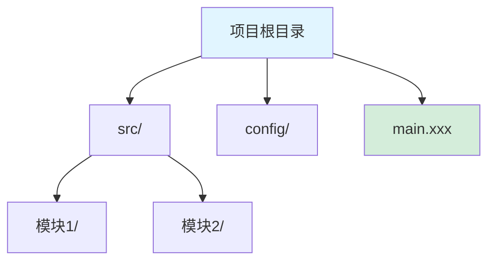

# 框架指引模板

> 使用此模板创建新的框架指引文件，确保所有框架指引的结构和风格保持一致。

---

## 文件头部元数据（必需）

在每个框架指引文件的开头添加以下 YAML front matter：

```yaml
---
tags: [语言1, 语言2, 框架名称, 类别]
language: 主要语言
category: 框架类别
recommended_version: 推荐版本范围
features: ["特征1", "特征2", "特征3"]
---
```

**字段说明**：
- `tags`：用于搜索和标签云的标签数组
  - 语言标签：`rust`, `go`, `python`, `javascript`, `dart`
  - 框架标签：框架名称（小写）
  - 类别标签：`desktop`, `frontend`, `web-api`, `cross-platform`
- `language`：框架的主要编程语言（首字母大写）
- `category`：框架类别（Desktop Framework / Frontend Framework / Web API Framework / Cross-Platform Framework）
- `recommended_version`：推荐使用的版本范围（如 "≥ 2.0"）
- `features`：框架特征关键词数组，用于增强识别鲁棒性
  - 技术特征：`async`, `webview`, `no-vdom`, `compile-time`
  - 功能特征：`swagger`, `middleware`, `hot-reload`
  - 性能特征：`performance`, `lightweight`
  - 替代关系：`electron-alternative`

**示例**：
```yaml
---
tags: [rust, desktop, tauri, webview]
language: Rust
category: Desktop Framework
recommended_version: "≥ 1.5"
---
```

---

## 文档结构（必需）

每个框架指引文件应包含以下章节：

### 1. 框架概述

简要介绍框架的定位、特点和适用场景。

**包含内容**：
- 框架是什么
- 核心特点和优势
- 与同类框架的对比（一句话）
- 适用场景

**示例**：
```markdown
## 框架概述

XXX 是一个使用 YYY 语言构建 ZZZ 应用的框架。相比同类框架，它具有特点 A、B、C。
```

### 2. 项目结构识别

**关键文件/目录表格**：

| 文件/目录 | 说明 | 识别标记 |
|-----------|------|----------|
| `config.json` | 配置文件 | 框架识别 |
| `main.xxx` | 入口文件 | 代码入口 |

**典型项目结构**：
使用代码块展示典型的项目目录结构。

**Mermaid 图示（推荐）**：
使用 Mermaid 图表展示项目结构，提升可读性。



**Mermaid 图示规范**：
- 使用 `graph TD` 创建从上到下的流程图
- 根节点使用 `fill:#e1f5ff` 蓝色背景
- 入口文件使用 `fill:#d4edda` 绿色背景
- 重要目录使用不同颜色区分
- 节点名称使用简短描述

### 3. 版本兼容性说明（新增）

**推荐版本**：
- 推荐版本范围（如 "≥ 1.5"）
- 推荐的依赖版本（如 "React ≥ 18"）

**已知不兼容场景**：
- 框架版本 X 不兼容操作系统 Y
- 框架版本 X 不兼容依赖 Z

**迁移注意事项**：
- 从旧版本升级时需要注意的事项

**示例**：
```markdown
## 版本兼容性说明

### 推荐版本
- 框架版本：≥ 1.5
- 后端语言：Rust ≥ 1.70
- 前端框架：React ≥ 18

### 已知不兼容场景
- Tauri v1.x 不兼容 macOS 14+
- Rust 1.68 以下版本不支持某些特性

### 迁移注意事项
- 从 Tauri v1 迁移到 v2 需要重新配置 `tauri.conf.json`
```

### 4. 文档生成要点

提供生成各类文档的具体指导。

**必选内容**：每个文档类型必须包含的内容
**可选内容**：根据项目情况决定是否包含
**代码示例**：提供实际的代码或配置示例

---

## 更新 index.md（新增框架时必需）

当添加新框架时，需要更新 `references/frameworks/index.md`：

### 1. 添加到分类表格

在对应的分类表格中添加框架条目：

```markdown
| [XXX](#xxx) | 语言 | 技术 | 特点 |
|------|---------|---------|------|
| [新框架](#新框架锚点) | 语言 | 技术 | 特点 |
```

### 2. 添加到快速搜索

在对应的搜索分类中添加：

```markdown
**语言 + 类别** → [新框架](#新框架锚点)
```

在项目特征搜索中添加：

```markdown
**特征** | **框架**
--------|--------
`文件名` | [新框架](#新框架锚点)
```

### 3. 添加框架详情

在"框架详情"章节添加新框架的详情：

```markdown
<a id="新框架锚点"></a>

### 新框架名称

**概述**：框架简介...

**关键文件/目录**：
- `文件1` - 说明
- `文件2` - 说明

**版本兼容性**：
- 推荐版本：≥ X.Y
- 已知不兼容：场景 A、场景 B

**详细指南**：[新框架-guide.md](新框架-guide.md)
```

### 4. 更新框架对比表（如果需要）

如果新框架需要与现有框架对比，更新对应的对比表格。

---

## 添加回溯链接（必需）

在每个框架指引文件的顶部添加返回索引的链接：

```markdown
# XXX 框架指南

[🔙 返回框架索引](./index.md)
```

---

## 框架分类参考

| 类别 | 说明 | 示例 |
|------|------|------|
| **Desktop Framework** | 桌面应用框架 | Tauri、Wails |
| **Frontend Framework** | 前端框架 | Svelte、SolidJS |
| **Web API Framework** | Web API 框架 | FastAPI、Gin |
| **Cross-Platform Framework** | 跨平台框架 | Flutter |

---

## 文件命名规范

- 格式：`<框架名称>-guide.md`
- 命名规则：全部小写，使用连字符分隔单词
- 示例：`tauri-guide.md`, `fastapi-guide.md`

---

## 锚点命名规范

- 格式：`<框架名称>`（全部小写，无连字符）
- 示例：`<a id="tauri"></a>`, `<a id="fastapi"></a>`

---

## 最佳实践

1. **一致性**：确保所有框架指引的风格和结构一致
2. **简洁性**：避免冗长的描述，重点突出关键信息
3. **示例性**：提供实际的代码和配置示例
4. **可读性**：使用表格、列表、代码块等格式提高可读性
5. **准确性**：确保所有信息准确无误，定期更新

---

## 检查清单

在创建新框架指引时，检查以下项目：

- [ ] 添加了 YAML front matter 元数据
- [ ] 包含了所有必需章节（概述、项目结构、版本兼容性、文档生成要点）
- [ ] 更新了 `index.md` 的分类、搜索、详情部分
- [ ] 添加了回溯链接
- [ ] 文件命名符合规范（小写 + 连字符）
- [ ] 锚点命名符合规范（小写，无连字符）
- [ ] 版本兼容性说明完整
- [ ] 提供了实际的代码示例
- [ ] 格式清晰可读（使用表格、列表、代码块）

---

## 完整示例

参考 `tauri-guide.md` 查看完整的框架指引示例。
