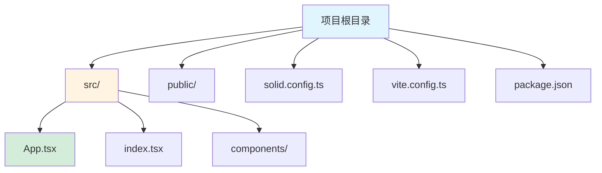
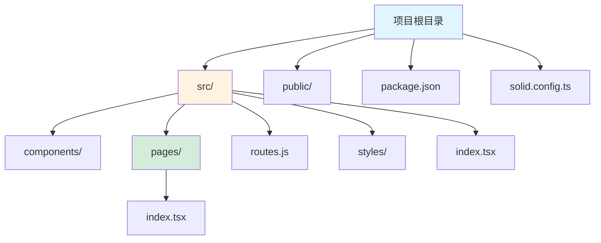
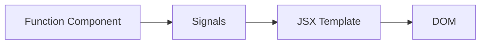

# SolidJS 框架指南

[🔙 返回框架索引](./index.md)

## 框架概述

SolidJS 是一个基于细粒度响应式的响应式 UI 库，语法类似 React JSX，但性能更优。它没有虚拟 DOM，直接响应真实 DOM 的变化。

## 项目结构识别

### 关键文件/目录

| 文件/目录 | 说明 | 识别标记 |
|-----------|------|----------|
| `solid.config.ts` | Solid 配置文件 | 框架识别 |
| `solid.config.js` | JavaScript 配置文件 | 框架识别 |
| `package.json` | 包含 `solid-js` 依赖 | 框架识别 |
| `*.tsx` | Solid TSX 组件文件 | 组件识别 |
| `*.jsx` | Solid JSX 组件文件 | 组件识别 |
| `vite.config.ts` | Vite 构建配置 | 构建工具 |
| `src/App.tsx` | 根组件 | 入口文件 |
| `src/index.tsx` | 入口文件 | 入口文件 |

### 典型项目结构

**纯 Solid 项目**：



**SolidStart 项目**：



## 版本兼容性说明

### 推荐版本
- SolidJS 版本：≥ 1.8
- SolidStart 版本：≥ 1.0（如果使用）
- TypeScript 版本：≥ 5.0

### 已知不兼容场景
- SolidJS 早期版本（< 1.0）API 有重大变化
- 某些 React 库可能在 SolidJS 中无法直接使用
- SolidStart 的某些功能需要 Node.js ≥ 18

### 迁移注意事项
- SolidJS 1.x 到 2.x 有少量 breaking changes
- 建议使用 TypeScript 以获得更好的类型支持

## 文档生成要点

### 1. README 生成

**必选内容**：
- Node.js 环境要求
- 项目类型说明（纯 Solid 或 SolidStart）
- 安装步骤：
  - `npm create solid my-app`
  - 或使用 SolidStart：`npm create solid@latest`
  - 运行 `npm install` 和 `npm run dev`
- 开发命令说明
- 构建命令说明

**响应式说明**：
- Solid 使用细粒度响应式信号（signals）
- 使用 `createSignal` 创建响应式变量
- 使用 `createMemo` 创建派生值
- 使用 `createEffect` 创建副作用

### 2. 组件文档生成

Solid 组件使用 JSX 语法，类似 React。

**组件格式示例**：

```tsx
import { createSignal } from 'solid-js'

function Counter() {
  const [count, setCount] = createSignal(0)
  
  return (
    <div>
      <h1>Count: {count()}</h1>
      <button onClick={() => setCount(c => c + 1)}>Increment</button>
    </div>
  )
}

export default Counter
```

**组件文档应包含**：
- Props 说明（函数参数）
- 返回的 JSX 结构
- 事件处理器（onClick, onSubmit 等）
- 使用的 signals 和 effects

### 3. 路由文档（SolidStart）

SolidStart 使用文件系统路由，类似 Next.js。

**路由格式示例**：

```tsx
// src/pages/index.tsx
export default function Home() {
  return <h1>Home</h1>
}

// src/pages/about.tsx
export default function About() {
  return <h1>About</h1>
}
```

**API 路由**：

```tsx
// src/routes/api/data.ts
import type { APIEvent } from 'solid-start/api'

export async function GET({ request }: APIEvent) {
  return new Response(JSON.stringify({ message: 'Hello' }), {
    headers: {
      'Content-Type': 'application/json'
    }
  })
}
```

## 特殊注意事项

1. **细粒度响应式**：Solid 没有虚拟 DOM，直接操作真实 DOM
2. **Signals**：使用 `createSignal` 创建响应式变量，不是 `useState`
3. **JSX 语法**：与 React 类似，但行为不同
4. **SolidStart**：提供文件系统路由和服务端渲染（SSR）

## Mermaid 图表示例

### 组件结构



### 响应式数据流

```mermaid
graph TB
    A[createSignal] --> B[getter/setter]
    B --> C[读取值 signal()]
    B --> D[设置值 setCount()]
    D --> E[DOM 更新]
    
    style A fill:#f9f,stroke:#333
    style B fill:#bbf,stroke:#333
    style C fill:#bfb,stroke:#333
```

---

**参考资源**：
- [SolidJS 官方文档](https://www.solidjs.com/)
- [SolidStart 文档](https://start.solidjs.com/)
