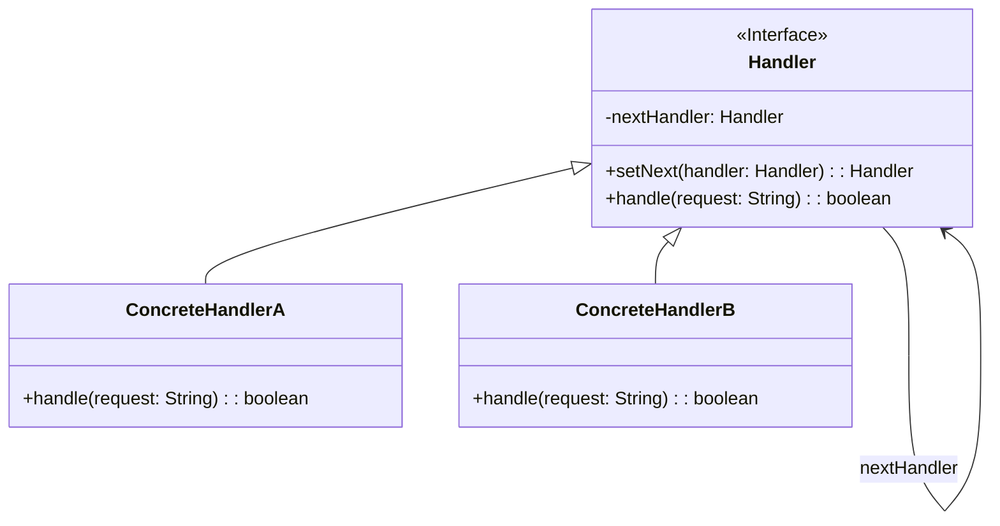

# 责任链模式 (Chain of Responsibility Pattern)

## 定义

使多个对象都有机会处理请求，从而避免请求的发送者和接收者之间的耦合关系。将这些对象连成一条链，并沿着这条链传递请求，直到有一个对象处理它为止。

## 特点

- 将请求沿链传递
- 多个对象可处理同一请求
- 发送者和接收者解耦

## 适用场景

- 有多个对象可以处理同一个请求，具体哪个对象处理由运行时决定
- 在不明确指定接收者的情况下，向多个对象中的一个提交请求
- 可动态指定一组对象处理请求

## 优点

- 降低耦合度
- 增强了给对象指派职责的灵活性
- 可以方便地增加或修改处理请求的类

## 缺点

- 不能保证请求一定被接收
- 系统性能将受到一定影响
- 代码调试时不太方便，可能会造成循环调用

## 生活隐喻

> 晚上去上英语课，为了好开溜坐到了最后一排，哇，前面坐了好几个漂亮的MM哎，找张纸条，写上「Hi,可以做我的女朋友吗？如果不愿意请向前传」，纸条就一个接一个的传上去了。

## UML图

## 实现要点

1. 定义处理器接口
2. 每个处理器知道下一个处理器
3. 无法处理时传递给下一个处理器

## 相关设计原则

- 单一职责原则
- 开闭原则

## 与其他模式的关系

- **命令模式**：可以用命令对象发起请求
- **装饰器模式**：两者都使用递归组合
