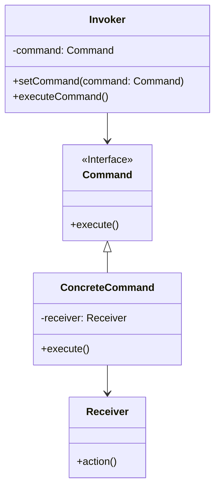

# 命令模式 (Command Pattern)

## 定义

将一个请求封装为一个对象，从而使你可用不同的请求对客户进行参数化；对请求排队或记录请求日志，以及支持可撤销的操作。

## 特点

- 将请求封装成对象
- 分离调用者和接收者
- 支持撤销和重做

## 适用场景

- 系统需要将请求调用者和请求接收者解耦
- 系统需要在不同的时间指定请求、将请求排队和执行请求
- 系统需要支持命令的撤销和恢复
- 系统需要将一组操作组合在一起

## 优点

- 降低了系统耦合度
- 新的命令可以很容易添加到系统中去
- 可以比较容易地设计一个命令队列和宏命令
- 可以方便地实现对请求的撤销和恢复

## 缺点

- 可能导致某些系统有过多的具体命令类

## 生活隐喻

> 俺有一个MM家里管得特别严，没法见面，只好借助于她弟弟在我们俩之间传送信息，她对我有什么指示，就写一张纸条让她弟弟带给我。这不，她弟弟又传送过来一个COMMAND。

## UML图

## 实现要点

1. 定义命令接口
2. 具体命令封装接收者和动作
3. 调用者持有命令对象
4. 接收者执行实际操作

## 相关设计原则

- 开闭原则
- 单一职责原则

## 与其他模式的关系

- **组合模式**：可以组合多个命令
- **备忘录模式**：可以实现撤销功能
- **责任链模式**：可以用责任链处理命令
