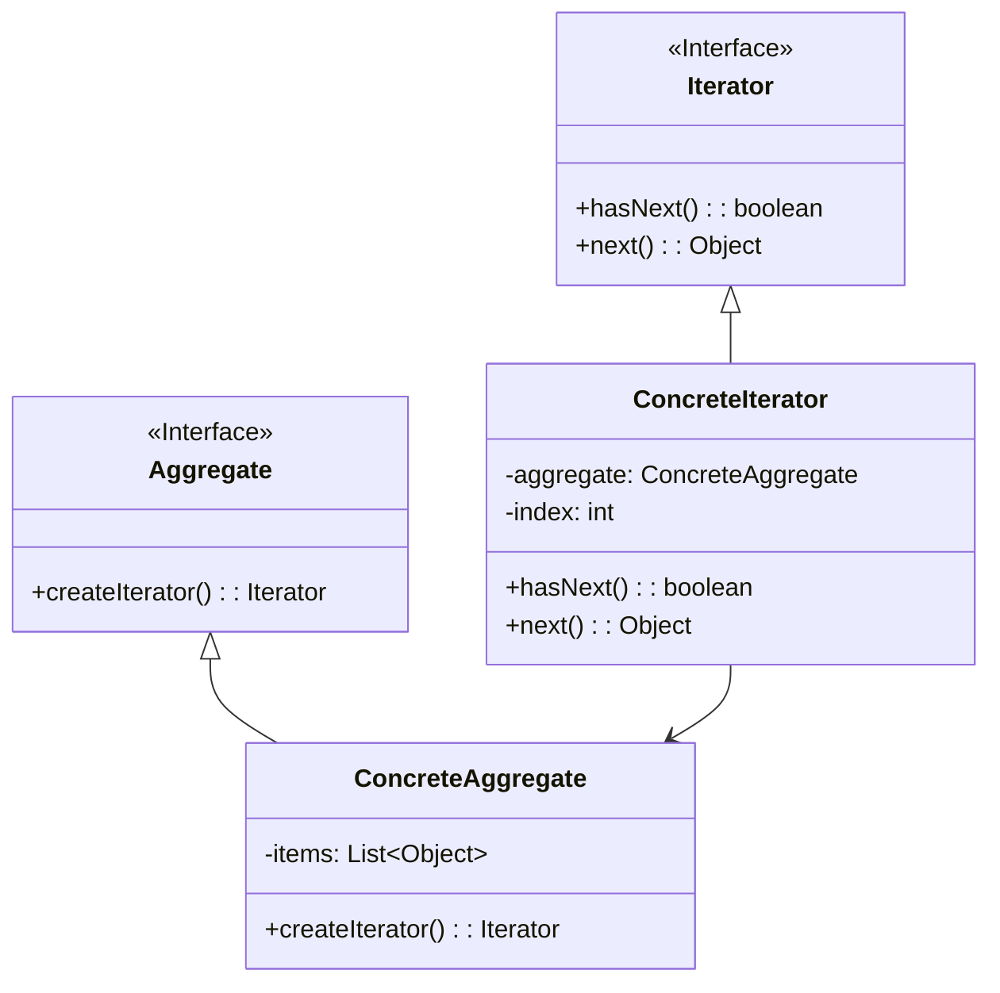

# 迭代器模式 (Iterator Pattern)

## 定义

提供一种方法顺序访问一个聚合对象中的各个元素，而又不需要暴露该对象的内部表示。

## 特点

- 统一遍历接口
- 不暴露聚合内部结构
- 支持多种遍历方式

## 适用场景

- 访问一个聚合对象的内容而无需暴露它的内部表示
- 支持对聚合对象的多种遍历
- 为遍历不同的聚合结构提供一个统一的接口

## 优点

- 支持以不同的方式遍历一个聚合对象
- 迭代器简化了聚合类
- 在同一个聚合上可以有多个遍历
- 增加新的聚合类和迭代器类都很方便

## 缺点

- 增加了系统的复杂性
- 对于比较简单的遍历，使用迭代器方式较为繁琐

## 生活隐喻

> 我爱上了Mary，不顾一切的向她求婚。Mary：「想要我跟你结婚，得答应我的条件」。我：「什么条件我都答应」。Mary列出了她的条件清单，我逐一满足，直到她说完所有条件。

## UML图

## 实现要点

1. 定义迭代器接口
2. 聚合对象提供创建迭代器的方法
3. 迭代器维护遍历状态

## 相关设计原则

- 单一职责原则
- 开闭原则

## 与其他模式的关系

- **组合模式**：常与迭代器模式一起使用遍历树形结构
- **工厂方法模式**：聚合对象使用工厂方法创建迭代器
