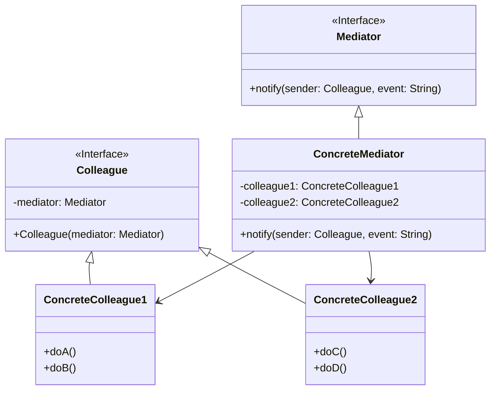

# 中介者模式 (Mediator Pattern)

## 定义

用一个中介对象来封装一系列的对象交互。中介者使各对象不需要显式地相互引用，从而使其耦合松散，而且可以独立地改变它们之间的交互。

## 特点

- 集中管理对象间通信
- 减少对象间的直接依赖
- 多对多变一对一

## 适用场景

- 一组对象以定义良好但是复杂的方式进行通信
- 想要定制一个分布在多个类中的行为，而又不想生成太多的子类
- 对象间的通信很复杂，产生混乱的依赖关系

## 优点

- 降低了类的复杂度，将一对多转化成了一对一
- 各个类之间的解耦
- 符合迪米特原则

## 缺点

- 中介者会庞大，变得复杂难以维护

## 生活隐喻

> 四个MM打麻将，相互之间谁应该给谁多少钱算不清楚了，幸亏当时我在旁边，按照各自的筹码数算钱，赚了钱的从我这里拿，赔了钱的也付给我，一切就OK啦，俺得到了四个MM的电话。

## UML图

## 实现要点

1. 定义中介者接口
2. 同事类持有中介者引用
3. 中介者协调各同事类的交互

## 相关设计原则

- 迪米特法则
- 单一职责原则

## 与其他模式的关系

- **外观模式**：外观模式简化接口，中介者模式处理对象间通信
- **观察者模式**：中介者可以使用观察者模式实现
