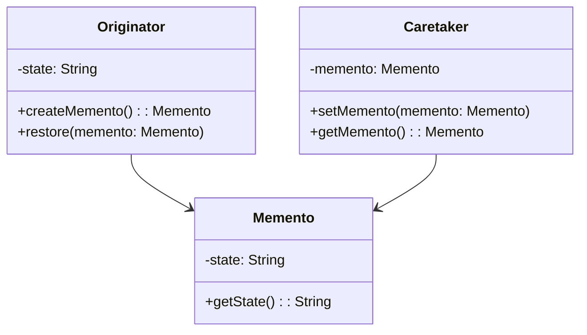

# 备忘录模式 (Memento Pattern)

## 定义

在不破坏封装性的前提下，捕获一个对象的内部状态，并在该对象之外保存这个状态。这样以后就可将该对象恢复到原先保存的状态。

## 特点

- 保存和恢复对象状态
- 不破坏对象封装性
- 外部存储对象状态

## 适用场景

- 需要保存和恢复数据的相关状态场景
- 提供一个可回滚的操作
- 需要监控的副本场景
- 数据库连接的事务管理

## 优点

- 给用户提供了一种可以恢复状态的机制
- 实现了信息的封装
- 不破坏对象封装的前提下，捕获对象状态

## 缺点

- 消耗资源，如果类的成员变量过多，势必占用比较大的资源
- 每一次保存都会消耗一定的内存

## 生活隐喻

> 同时跟几个MM聊天时，一定要记清楚刚才跟MM说了些什么话，不然MM发现了会不高兴的哦，幸亏我有个备忘录，刚才与哪个MM说了什么话我都拷贝一份放到备忘录里面保存。

## UML图

## 实现要点

1. 原发器创建备忘录存储状态
2. 备忘录存储原发器状态
3. 负责人保存备忘录，但不能操作备忘录内容

## 相关设计原则

- 封装原则
- 单一职责原则

## 与其他模式的关系

- **命令模式**：可以使用备忘录模式实现撤销功能
- **原型模式**：原型模式可以替代备忘录模式
