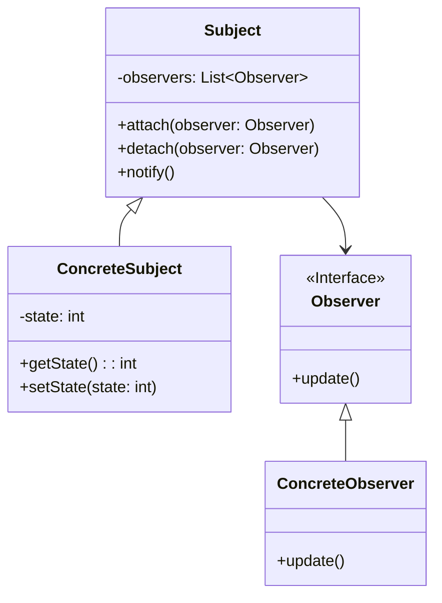

# 观察者模式 (Observer Pattern)

## 定义

定义对象间的一种一对多的依赖关系，当一个对象的状态发生改变时，所有依赖于它的对象都得到通知并被自动更新。

## 特点

- 一对多的依赖关系
- 自动通知更新
- 松耦合设计

## 适用场景

- 当一个抽象模型有两个方面，其中一个方面依赖于另一个方面
- 当对一个对象的改变需要同时改变其他对象，而不知道具体有多少对象有待改变
- 当一个对象必须通知其他对象，而它又不能假定其他对象是谁

## 优点

- 观察者和被观察者是抽象耦合的
- 建立一套触发机制

## 缺点

- 如果一个被观察者对象有很多的直接和间接的观察者，将所有的观察者都通知到会花费很多时间
- 如果在观察者和观察目标之间有循环依赖的话，观察目标会触发它们之间进行循环调用，可能导致系统崩溃

## 生活隐喻

> 想知道咱们公司最新MM情报吗？加入公司的MM情报邮件组就行了，tom负责搜集情报，他发现的新情报不用一个一个通知我们，直接发布给邮件组，我们作为订阅者（观察者）就可以及时收到情报啦。

## UML图

## 实现要点

1. 主题维护观察者列表
2. 观察者订阅/取消订阅主题
3. 主题状态变化时通知所有观察者

## 相关设计原则

- 开闭原则
- 依赖倒转原则

## 与其他模式的关系

- **中介者模式**：中介者封装了对象间的通信
- **单例模式**：主题对象可以是单例
