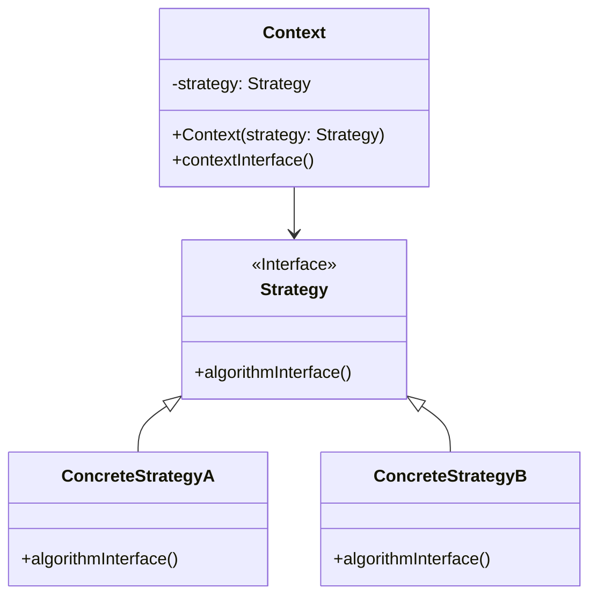

# 策略模式 (Strategy Pattern)

## 定义

定义一系列的算法，把它们一个个封装起来，并且使它们可相互替换。策略模式让算法的变化独立于使用算法的客户。

## 特点

- 封装算法族
- 算法可互换
- 客户端独立于算法变化

## 适用场景

- 如果在一个系统里面有许多类，它们之间的区别仅在于它们的行为
- 一个系统需要动态地在几种算法中选择一种
- 如果一个对象有很多的行为，不使用恰当的模式，这些行为就只好使用多重的条件选择语句来实现

## 优点

- 算法可以自由切换
- 避免使用多重条件判断
- 扩展性良好

## 缺点

- 策略类会增多
- 所有策略类都需要对外暴露

## 生活隐喻

> 跟不同类型的MM约会，要用不同的策略，有的请电影比较好，有的则去吃小吃效果不错，有的去海边浪漫最合适，单目的都是为了得到MM的芳心，我的追MM锦囊中有好多Strategy哦。

## UML图

## 实现要点

1. 定义策略接口
2. 具体策略实现算法
3. 上下文使用策略接口

## 相关设计原则

- 开闭原则
- 依赖倒转原则

## 与其他模式的关系

- **状态模式**：策略模式是状态模式的孪生兄弟
- **简单工厂模式**：策略模式可以使用工厂模式创建策略对象
