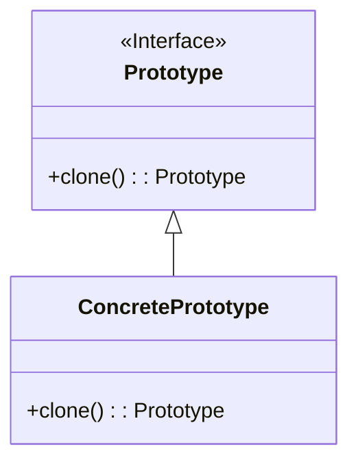

# 原型模式 (Prototype Pattern)

## 定义

通过复制现有的实例来创建新的实例。

## 特点

- 使用原型实例指定创建对象的种类
- 通过复制这些原型创建新的对象
- 不需要知道对象的创建细节

## 适用场景

- 当要实例化的类是在运行时刻指定时
- 当创建新对象成本较大时
- 当系统要独立于产品的创建、构成和表示时
- 对象结构复杂且需要频繁使用

## 优点

- 性能提高（减少创建对象的开销）
- 逃避构造函数的约束
- 动态增加或减少产品类
- 产品类不需要事先确定的等级结构

## 缺点

- 每一个类都必须配备一个克隆方法
- 配备克隆方法需要对类的功能进行通盘考虑
- 深拷贝与浅拷贝需要妥善处理

## 生活隐喻

> 跟MM用QQ聊天，一定要说些深情的话语了，我搜集了好多肉麻的情话，需要时只要copy出来放到QQ里面就行了，这就是我的情话prototype了。

## UML图

## 实现要点

1. 实现Cloneable接口（Java）或定义clone方法
2. 注意深拷贝与浅拷贝的区别
3. 考虑克隆方法的性能影响

## 相关设计原则

- 依赖倒转原则
- 迪米特法则

## 与其他模式的关系

- **工厂方法模式**：原型模式可以替代工厂方法模式
- **备忘录模式**：备忘录模式使用原型来保存和恢复状态
