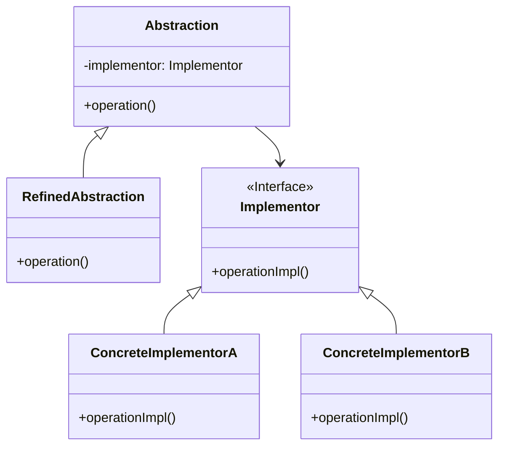

# 桥接模式 (Bridge Pattern)

## 定义

将抽象部分和它的实现部分分离，使它们都可以独立的变化。

## 特点

- 分离抽象和实现
- 两者可以独立扩展
- 用组合代替继承

## 适用场景

- 当一个类存在两个独立变化的维度，且这两个维度都需要进行扩展时
- 当一个系统不希望使用继承或因为多层次继承导致系统类的个数急剧增加时
- 当一个系统需要在构件的抽象化角色和具体化角色之间增加更多的灵活性时

## 优点

- 分离抽象接口及其实现部分
- 提高了系统的可扩展性
- 实现细节对客户透明
- 符合合成复用原则

## 缺点

- 增加了系统的理解与设计难度
- 需要正确地识别出系统中两个独立变化的维度

## 生活隐喻

> 早上碰到MM，要说早上好，晚上碰到MM，要说晚上好；碰到MM穿了件新衣服，要说你的衣服好漂亮哦，碰到MM新做的发型，要说你的头发好漂亮哦。不要问我「早上碰到MM新做了个发型怎么说」这种问题，自己用BRIDGE组合一下不就行了。

## UML图

## 实现要点

1. 识别并分离抽象和实现两个维度
2. 使用组合关系连接抽象和实现
3. 两个维度可以独立变化

## 相关设计原则

- 合成复用原则
- 开闭原则

## 与其他模式的关系

- **适配器模式**：都是为了协调两个不兼容的接口，但桥接模式是预先设计，适配器是事后补救
- **策略模式**：桥接模式中的实现部分可以使用策略模式
