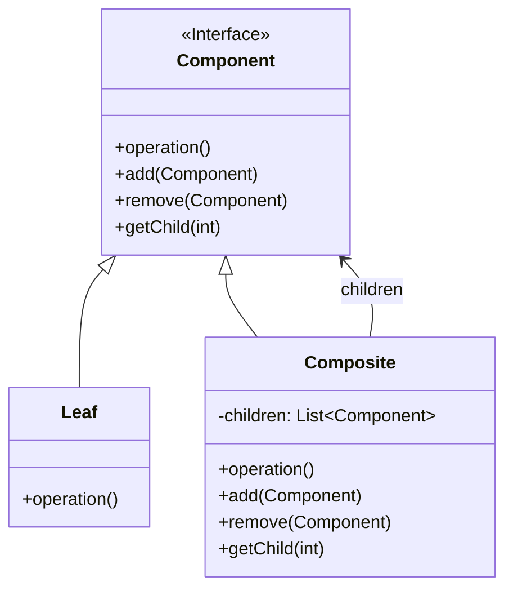

# 组合模式 (Composite Pattern)

## 定义

将对象组合成树形结构以表示"部分-整体"的层次结构。组合模式使得用户对单个对象和组合对象的使用具有一致性。

## 特点

- 树形结构表示整体-部分关系
- 一致对待单个对象和组合对象
- 递归组合

## 适用场景

- 当想表示对象的部分-整体层次结构时
- 当希望用户忽略组合对象与单个对象的不同，统一地使用组合结构中的所有对象时

## 优点

- 高层模块调用简单
- 节点自由增加
- 可以一致地使用组合结构和单个对象

## 缺点

- 在层次结构太深时，设计会变得复杂
- 不容易限制组合中的构件

## 生活隐喻

> Mary今天过生日。「我过生日，你要送我一件礼物。」「嗯，好吧，去商店，你自己挑。」「这件T恤挺漂亮，买，这条裙子好看，买，这个包也不错，买。」「喂，买了三件了呀，我只答应送一件礼物的哦。」「什么呀，T恤加裙子加包包，正好配成一套呀，小姐，麻烦你包起来。」

## UML图

## 实现要点

1. 定义组件接口，包含通用操作
2. 叶节点实现组件接口
3. 组合节点包含子组件列表

## 相关设计原则

- 单一职责原则
- 开闭原则

## 与其他模式的关系

- **装饰模式**：都可以用来添加功能，组合模式强调结构，装饰模式强调功能
- **迭代器模式**：常与组合模式一起使用遍历树形结构
- **访问者模式**：可以对组合结构中的元素进行操作
