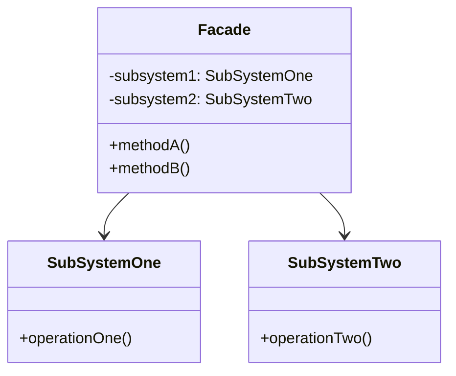

# 外观模式 (Facade Pattern)

## 定义

为子系统中的一组接口提供一个一致的界面。外观模式定义了一个高层接口，这个接口使得这一子系统更加容易使用。

## 特点

- 简化复杂系统的接口
- 提供一个统一的访问点
- 减少子系统间的依赖

## 适用场景

- 当要为一个复杂子系统提供一个简单接口时
- 客户程序与抽象类的实现部分之间存在着很大的依赖性
- 当需要构建一个层次结构的子系统时

## 优点

- 减少系统相互依赖
- 提高灵活性
- 提高了安全性

## 缺点

- 不符合开闭原则，如果要改东西很麻烦，继承重写都不合适

## 生活隐喻

> 我有一个专业的Nikon相机，我就喜欢自己手动调光圈、快门，这样照出来的照片才专业，但MM可不懂这些，教了半天也不会。幸好相机有Facade设计模式，把相机调整到自动档，只要对准目标按快门就行了，一切由相机自动调整。

## UML图

## 实现要点

1. 了解子系统的功能
2. 设计简化的统一接口
3. 处理子系统间的交互

## 相关设计原则

- 迪米特法则（最少知道原则）
- 单一职责原则

## 与其他模式的关系

- **单例模式**：外观对象通常是单例
- **抽象工厂模式**：可以用来创建子系统对象
- **中介者模式**：外观模式简化接口，中介者模式处理对象间通信
