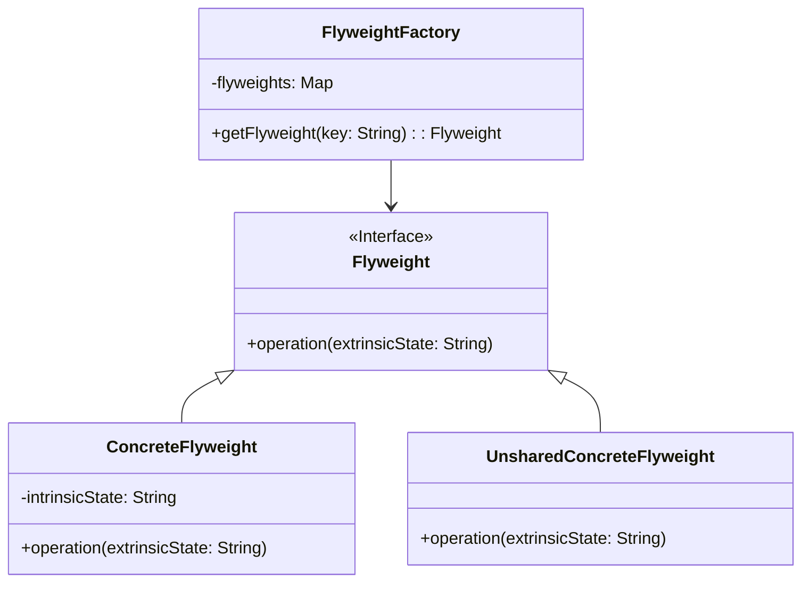

# 享元模式 (Flyweight Pattern)

## 定义

运用共享技术有效地支持大量细粒度的对象。

## 特点

- 共享对象以减少内存使用
- 区分内部状态和外部状态
- 工厂管理共享对象

## 适用场景

- 系统有大量相似对象
- 这些对象耗费大量内存
- 这些对象的状态中的大部分都可以外部化
- 如果删除对象的外部状态，可以用相对较少的共享对象取代很多组对象

## 优点

- 大幅度减少内存中对象的数量
- 降低内存占用
- 提高性能

## 缺点

- 使系统变得更加复杂
- 需要分离出内部状态和外部状态
- 外部状态具有固有化性质，不应该随内部状态的变化而变化

## 生活隐喻

> 每天跟MM发短信，手指都累死了，最近买了个新手机，可以把一些常用的句子存在手机里，要用的时候，直接拿出来，在前面加上MM的名字就可以发送了。共享的句子就是Flyweight，MM的名字就是提取出来的外部特征。

## UML图

## 实现要点

1. 识别内部状态（可共享）和外部状态（不可共享）
2. 创建享元工厂管理共享对象
3. 客户端负责维护外部状态

## 相关设计原则

- 单一职责原则
- 开闭原则

## 与其他模式的关系

- **单例模式**：享元工厂通常是单例
- **组合模式**：享元模式可以与组合模式结合使用
- **状态模式**：状态对象可以设计成享元
