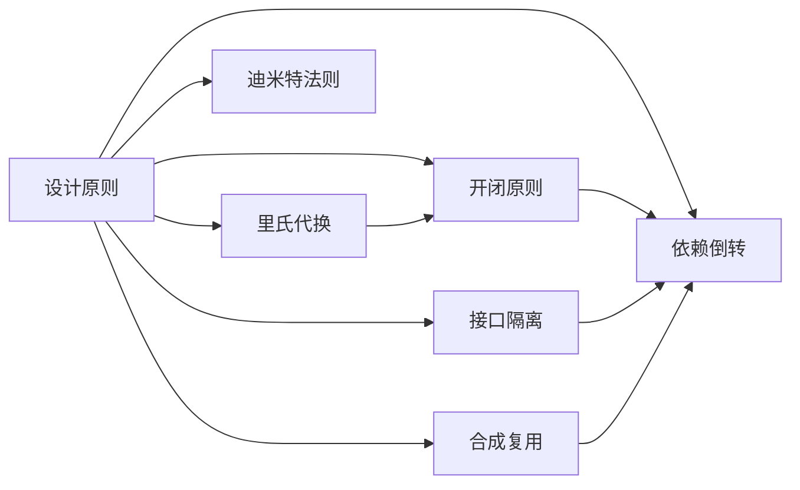

# 设计原则

设计模式建立在面向对象设计的六大原则之上，这些原则是设计模式的核心思想。

---

## 六大设计原则

### 1. 开闭原则 (Open Close Principle)

**定义**：对扩展开放，对修改关闭

**核心思想**：
- 软件实体（类、模块、函数等）应该对扩展开放，对修改关闭
- 当需求变化时，应该通过扩展来实现变化，而不是修改已有的代码

**实现方式**：
- 使用抽象类或接口
- 依赖抽象而非具体实现
- 使用策略模式、模板方法模式等

**示例**：

```python
from abc import ABC, abstractmethod

class Shape(ABC):
    @abstractmethod
    def draw(self):
        pass

class Circle(Shape):
    def draw(self):
        print("绘制圆形")

class Rectangle(Shape):
    def draw(self):
        print("绘制矩形")

# 扩展：添加新形状而不修改现有代码
class Triangle(Shape):
    def draw(self):
        print("绘制三角形")
```

---

### 2. 里氏代换原则 (Liskov Substitution Principle)

**定义**：所有引用基类的地方必须能透明地使用其子类的对象

**核心思想**：
- 子类可以扩展父类的功能，但不能改变父类原有的功能
- 子类必须能够替换父类出现在父类能够出现的任何地方

**注意事项**：
- 子类必须实现父类的抽象方法
- 子类可以有自己的个性
- 覆盖或实现父类的方法时输入参数可以被放大
- 覆盖或实现父类的方法时输出结果可以被缩小

**违反示例**：

```python
class Bird:
    def fly(self):
        print("鸟会飞")

class Penguin(Bird):
    def fly(self):
        raise Exception("企鹅不会飞")  # 违反里氏原则
```

**正确示例**：

```python
class Bird:
    def move(self):
        print("鸟会移动")

class FlyingBird(Bird):
    def fly(self):
        print("会飞的鸟会飞")

class Penguin(Bird):
    def swim(self):
        print("企鹅会游泳")
```

---

### 3. 依赖倒转原则 (Dependence Inversion Principle)

**定义**：高层模块不应该依赖低层模块，两者都应该依赖其抽象

**核心思想**：
- 针对接口编程，不针对实现编程
- 依赖抽象而不依赖具体

**实现方式**：
- 每个类尽量提供接口或抽象类
- 变量的声明类型尽量是接口或抽象类
- 任何类都不应该从具体类派生
- 尽量不要覆写基类的方法

**示例**：

```python
# 错误：依赖具体实现
class Switch:
    def __init__(self, lamp):
        self.lamp = lamp  # 依赖具体的 Lamp 类
    
    def turn_on(self):
        self.lamp.on()

class Lamp:
    def on(self):
        print("灯开了")

# 正确：依赖抽象
from abc import ABC, abstractmethod

class Switchable(ABC):
    @abstractmethod
    def on(self):
        pass

class Switch:
    def __init__(self, device):
        self.device = device  # 依赖抽象接口
    
    def turn_on(self):
        self.device.on()

class Lamp(Switchable):
    def on(self):
        print("灯开了")

class Fan(Switchable):
    def on(self):
        print("风扇开了")
```

---

### 4. 接口隔离原则 (Interface Segregation Principle)

**定义**：使用多个隔离的接口，比使用单个庞大的接口要好

**核心思想**：
- 客户端不应该依赖它不需要的接口
- 类间的依赖关系应该建立在最小的接口上

**优点**：
- 降低耦合性
- 提高灵活性
- 提高内聚性

**示例**：

```python
# 错误：过于庞大的接口
class Worker(ABC):
    @abstractmethod
    def work(self):
        pass
    
    @abstractmethod
    def eat(self):
        pass
    
    @abstractmethod
    def sleep(self):
        pass

# 正确：拆分为多个接口
class Workable(ABC):
    @abstractmethod
    def work(self):
        pass

class Eatable(ABC):
    @abstractmethod
    def eat(self):
        pass

class Sleepable(ABC):
    @abstractmethod
    def sleep(self):
        pass

class Robot(Workable):
    def work(self):
        print("机器人工作")
    # 不需要实现 eat() 和 sleep()
```

---

### 5. 迪米特法则 (Demeter Principle)

**定义**：一个对象应该对其他对象有最少的了解

**核心思想**：
- 又称最少知识原则 (Least Knowledge Principle)
- 只与你的直接朋友通信，不跟陌生人说话
- 朋友：当前对象本身、当前对象的成员对象、当前对象创建的对象、当前对象的参数等

**优点**：
- 降低耦合
- 提高类的复用性

**示例**：

```python
# 错误：违反迪米特法则
class Teacher:
    def __init__(self, student):
        self.student = student

class Student:
    def __init__(self, head):
        self.head = head

class Head:
    def get_hair(self):
        return "黑色"

teacher = Teacher(Student(Head()))
hair = teacher.student.head.get_hair()  # 链式调用，违反迪米特法则

# 正确：遵循迪米特法则
class Teacher:
    def get_student_hair(self):
        return self.student.get_hair()

class Student:
    def __init__(self, head):
        self.head = head
    
    def get_hair(self):
        return self.head.get_hair()

hair = teacher.get_student_hair()  # 只与直接朋友通信
```

---

### 6. 合成复用原则 (Composite Reuse Principle)

**定义**：尽量使用对象组合，而不是继承来达到复用的目的

**核心思想**：
- 优先使用对象组合/聚合，而不是继承
- 组合：强关联，生命周期一致
- 聚合：弱关联，生命周期不一致

**优点**：
- 降低耦合
- 增加灵活性
- 避免类爆炸

**示例**：

```python
# 错误：过度使用继承
class Bird:
    def fly(self):
        print("飞")

class Sparrow(Bird):
    pass

class Eagle(Bird):
    pass

# 如果添加"会说话的鸟"，需要修改继承结构

# 正确：使用组合
class FlyBehavior:
    def fly(self):
        print("飞")

class TalkBehavior:
    def talk(self):
        print("说话")

class Bird:
    def __init__(self, fly_behavior=None, talk_behavior=None):
        self.fly_behavior = fly_behavior
        self.talk_behavior = talk_behavior
    
    def perform_fly(self):
        if self.fly_behavior:
            self.fly_behavior.fly()
    
    def perform_talk(self):
        if self.talk_behavior:
            self.talk_behavior.talk()

# 灵活组合
sparrow = Bird(FlyBehavior())
parrot = Bird(FlyBehavior(), TalkBehavior())
```

---

## 原则之间的关系



**优先级排序**：
1. **开闭原则**：最高优先级，所有原则的最终目标
2. **依赖倒转原则**：面向对象设计的核心
3. **单一职责原则**：其他原则的基础
4. **里氏代换原则**：继承复用的基石
5. **接口隔离原则**：降低耦合
6. **迪米特法则**：降低耦合
7. **合成复用原则**：替代继承

---

## 如何应用

### 设计流程

1. **识别需求**：明确系统的功能和变化点
2. **应用原则**：
   - 首先考虑单一职责原则
   - 使用接口隔离原则定义清晰的接口
   - 使用依赖倒转原则解耦模块
   - 使用合成复用原则代替继承
   - 使用里氏代换原则确保继承正确
   - 使用迪米特法则降低耦合
   - 最终实现开闭原则

### 代码审查清单

- [ ] 类的职责是否单一？
- [ ] 接口是否拆分合理？
- [ ] 是否依赖抽象而非具体？
- [ ] 继承关系是否合理（符合里氏原则）？
- [ ] 类之间的耦合是否最低？
- [ ] 能否通过扩展而非修改实现新功能？

---

## 参考资料

- 《设计模式：可复用面向对象软件的基础》（GoF）
- 《敏捷软件开发：原则、模式与实践》（Robert C. Martin）
- SOLID 原则
