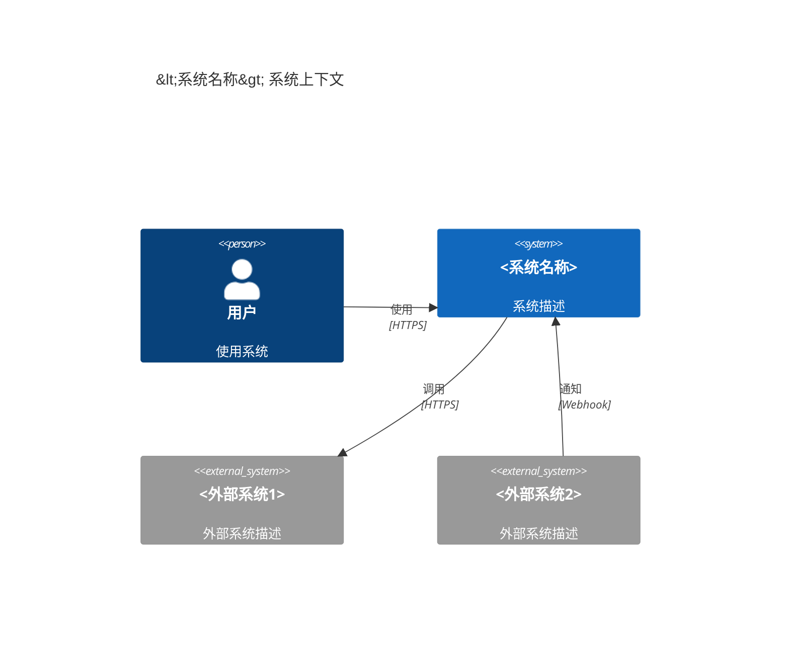
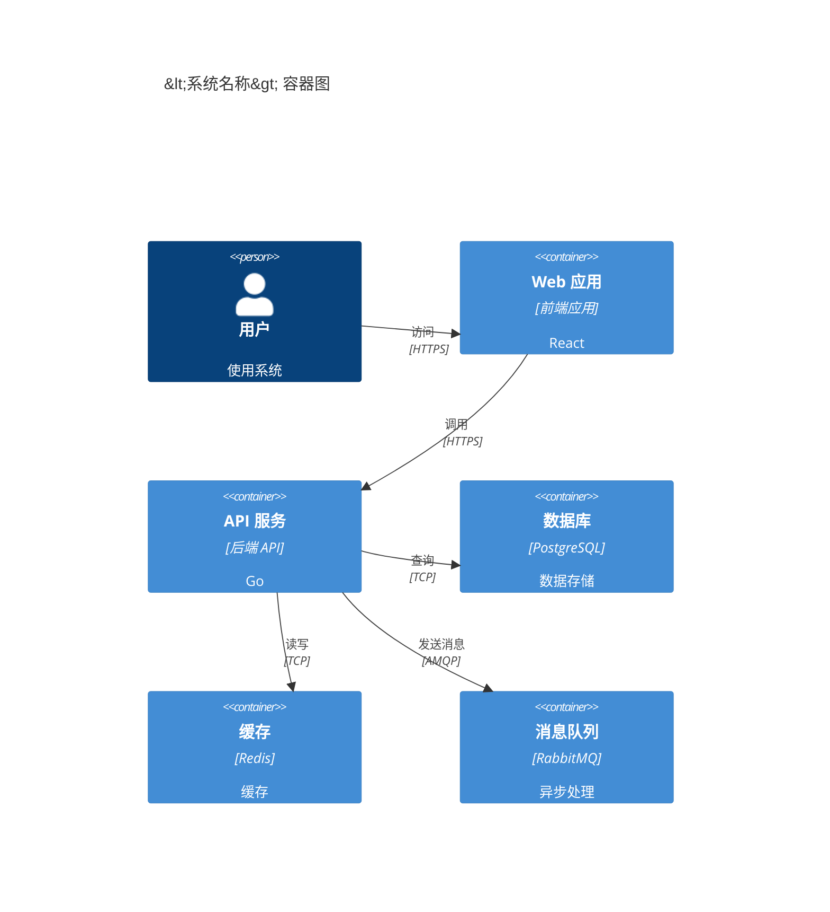
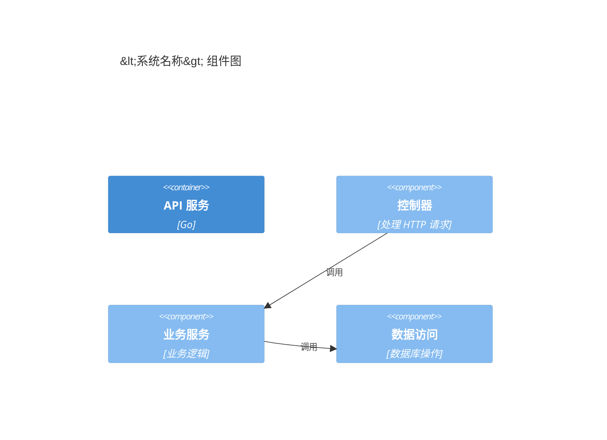
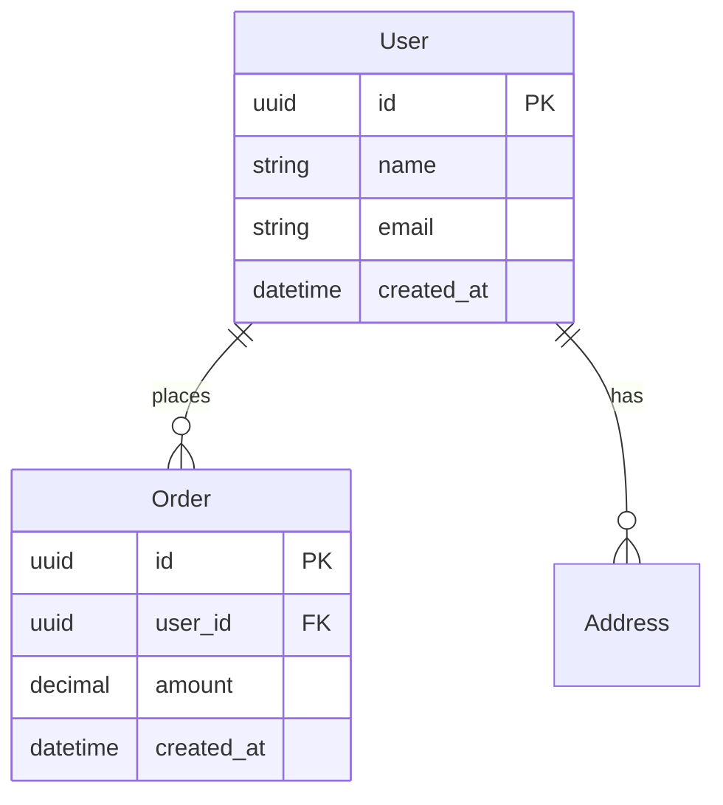
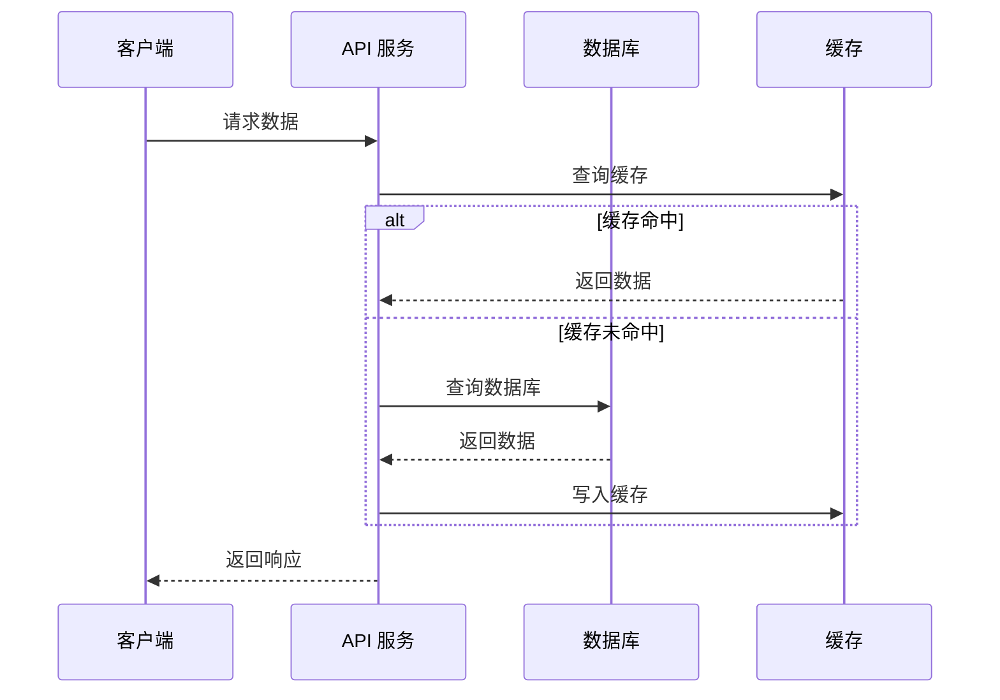
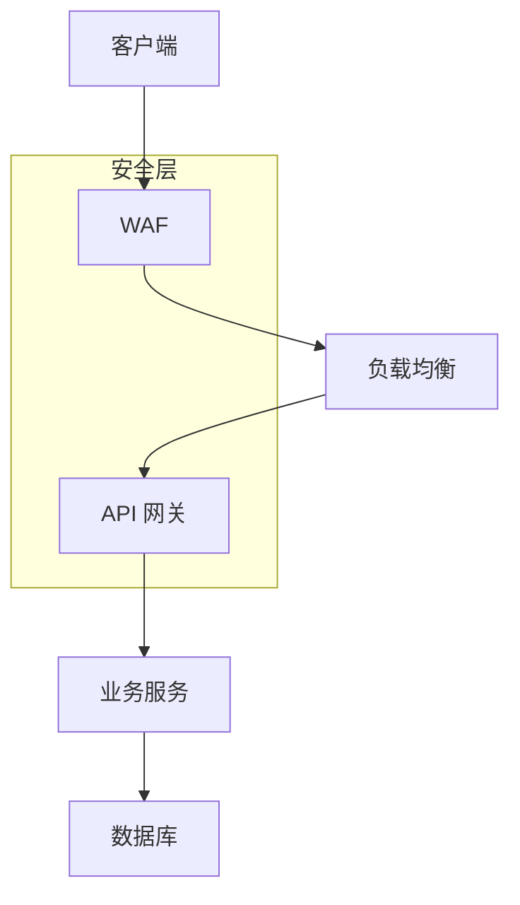
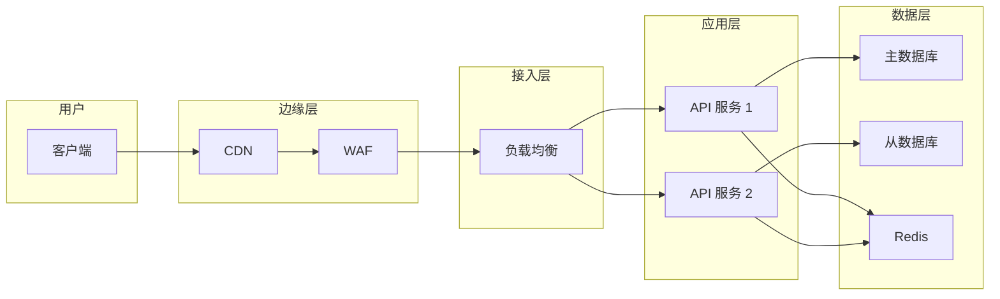

# 架构设计文档模板

## 基本信息

| 字段 | 内容 |
|------|------|
| 文档名称 | <系统名称> 架构设计文档 |
| 版本 | v1.0 |
| 作者 | <姓名> |
| 创建时间 | YYYY-MM-DD |
| 最后更新 | YYYY-MM-DD |
| 状态 | <草稿 / 评审中 / 已评审 / 已废弃> |

---

## 目录

- [1. 概述](#1-概述)
- [2. 系统上下文](#2-系统上下文)
- [3. 架构设计](#3-架构设计)
- [4. 技术选型](#4-技术选型)
- [5. 非功能性需求](#5-非功能性需求)
- [6. 数据模型](#6-数据模型)
- [7. 安全设计](#7-安全设计)
- [8. 部署架构](#8-部署架构)
- [9. 演进路线](#9-演进路线)
- [10. 风险识别](#10-风险识别)
- [11. 附件](#11-附件)

---

## 1. 概述

### 1.1 背景

<描述系统背景>

- 为什么需要这个系统
- 解决什么问题
- 业务价值是什么

### 1.2 目标

<明确系统目标>

- 功能目标
- 性能目标
- 成本目标

### 1.3 范围

<明确系统边界>

- 包含什么
- 不包含什么

---

## 2. 系统上下文

### 2.1 System Context Diagram

### 2.2 外部系统说明

| 系统 | 用途 | 交互方式 | SLA |
|------|------|----------|-----|
| <系统名称> | <描述> | <REST API / 消息队列 / ...> | <99.9%> |

---

## 3. 架构设计

### 3.1 Container Diagram

### 3.2 Component Diagram

### 3.3 架构风格

<描述架构风格>

- 微服务架构 / 单体架构 / 事件驱动架构 / ...
- 为什么选择这种架构
- 架构的优势和挑战

---

## 4. 技术选型

### 4.1 技术栈

| 层级 | 技术 | 版本 | 选择原因 |
|------|------|------|----------|
| 前端 | React | 18.x | 组件化、生态完善 |
| 后端 | Go | 1.21 | 高性能、并发支持好 |
| 数据库 | PostgreSQL | 15.x | 开源、功能强大 |
| 缓存 | Redis | 7.x | 高性能、支持丰富数据结构 |
| 消息队列 | RabbitMQ | 3.12 | 可靠、支持多种协议 |

### 4.2 技术决策（ADR）

| ADR 编号 | 决策内容 | 状态 |
|----------|----------|------|
| ADR-001 | 数据库选型 | Accepted |
| ADR-002 | 缓存策略 | Accepted |
| ADR-003 | 消息队列选型 | Accepted |

---

## 5. 非功能性需求

### 5.1 性能

| 指标 | 目标值 | 测量方式 |
|------|--------|----------|
| QPS | > 10,000 | 压力测试 |
| 响应时间（P50） | < 50ms | 监控系统 |
| 响应时间（P99） | < 200ms | 监控系统 |
| 吞吐量 | > 1 GB/s | 压力测试 |

### 5.2 可用性

| 指标 | 目标值 | 实现方式 |
|------|--------|----------|
| 系统可用性 | 99.9% | 多副本部署、自动故障转移 |
| 数据持久性 | 99.999% | 数据库备份、异地容灾 |

### 5.3 可扩展性

| 类型 | 扩展方式 | 目标 |
|------|----------|------|
| 水平扩展 | 增加实例 | 支持自动扩缩容 |
| 垂直扩展 | 升级配置 | 支持资源升级 |

### 5.4 安全性

| 安全项 | 措施 |
|--------|------|
| 认证 | JWT Token |
| 授权 | RBAC |
| 加密 | TLS 1.3、AES-256 |
| 防护 | WAF、限流 |

---

## 6. 数据模型

### 6.1 ER 图

### 6.2 数据流转

---

## 7. 安全设计

### 7.1 安全架构

### 7.2 安全措施

| 风险 | 防护措施 |
|------|----------|
| SQL 注入 | 参数化查询 |
| XSS 攻击 | 输入过滤、输出编码 |
| CSRF 攻击 | CSRF Token |
| DDoS 攻击 | WAF、限流 |
| 数据泄露 | 加密存储、访问控制 |

---

## 8. 部署架构

### 8.1 部署拓扑

### 8.2 资源需求

| 资源 | 规格 | 数量 |
|------|------|------|
| API 服务 | 4C8G | 3 |
| 数据库 | 8C32G | 2（主备） |
| Redis | 4C8G | 3 |

---

## 9. 演进路线

### 9.1 短期目标（3 个月）

- 目标 1
- 目标 2

### 9.2 中期目标（6-12 个月）

- 目标 1
- 目标 2

### 9.3 长期目标（1-3 年）

- 目标 1
- 目标 2

---

## 10. 风险识别

| 风险 | 影响 | 概率 | 缓解措施 |
|------|------|------|----------|
| <风险描述> | <高/中/低> | <高/中/低> | <缓解措施> |

---

## 11. 附件

### 11.1 参考资料

- [链接 1](URL)
- [链接 2](URL)

### 11.2 相关 ADR

- [ADR-001](adr/ADR-001-database-selection.md)
- [ADR-002](adr/ADR-002-cache-strategy.md)

---

**最后更新**：YYYY-MM-DD
