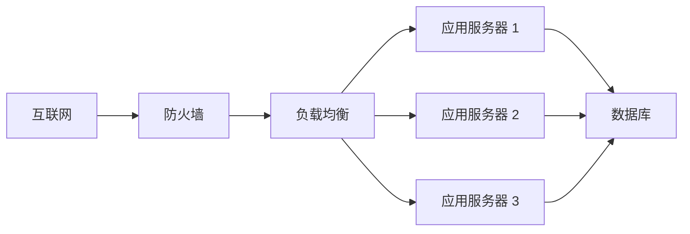
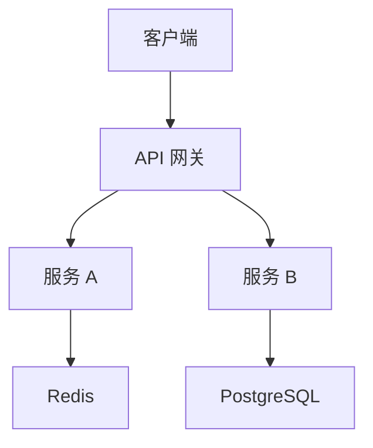
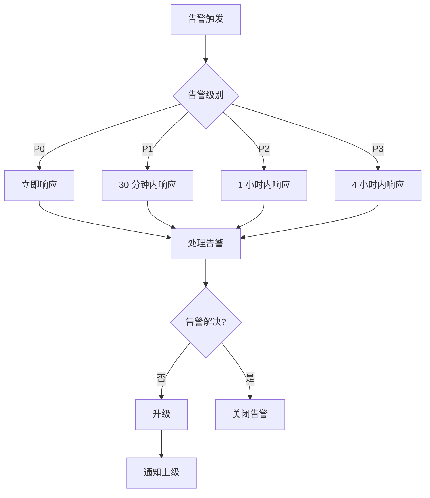
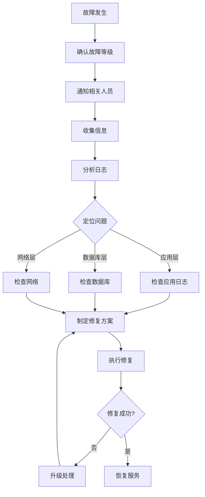

# 运维手册模板

## 基本信息

| 字段 | 内容 |
|------|------|
| 文档名称 | <系统名称> 运维手册 |
| 版本 | v1.0 |
| 作者 | <姓名> |
| 创建时间 | YYYY-MM-DD |
| 最后更新 | YYYY-MM-DD |
| 状态 | <草稿 / 评审中 / 已评审 / 已废弃> |

---

## 目录

- [1. 概述](#1-概述)
- [2. 部署架构](#2-部署架构)
- [3. 资源清单](#3-资源清单)
- [4. 环境配置](#4-环境配置)
- [5. 部署步骤](#5-部署步骤)
- [6. 扩缩容策略](#6-扩缩容策略)
- [7. 监控告警](#7-监控告警)
- [8. 故障排查](#8-故障排查)
- [9. 回滚流程](#9-回滚流程)
- [10. SLA/SLO](#10-slaslo)

---

## 1. 概述

### 1.1 系统介绍

<描述系统的基本信息>

### 1.2 部署目标

<描述部署的目标>

---

## 2. 部署架构

### 2.1 网络拓扑



### 2.2 服务拓扑



### 2.3 数据流向

<描述数据在系统中的流向>

---

## 3. 资源清单

### 3.1 应用服务器

| 资源 | 规格 | 数量 | 用途 |
|------|------|------|------|
| CPU | 4C | 3 | 应用服务 |
| 内存 | 8G | 3 | 应用服务 |
| 磁盘 | 100G | 3 | 应用和数据 |

### 3.2 数据库

| 资源 | 规格 | 数量 | 用途 |
|------|------|------|------|
| CPU | 8C | 2（主备） | 数据库 |
| 内存 | 32G | 2（主备） | 数据库 |
| 磁盘 | 500G | 2（主备） | 数据库 |

### 3.3 缓存

| 资源 | 规格 | 数量 | 用途 |
|------|------|------|------|
| CPU | 4C | 3 | Redis 集群 |
| 内存 | 16G | 3 | Redis 集群 |
| 磁盘 | 100G | 3 | Redis 集群 |

### 3.4 网络带宽

| 用途 | 带宽 | 说明 |
|------|------|------|
| 出口带宽 | 100Mbps | 对外服务 |
| 内网带宽 | 1Gbps | 服务间通信 |

---

## 4. 环境配置

### 4.1 开发环境

| 配置项 | 值 | 说明 |
|--------|---|------|
| 数据库地址 | dev-db.example.com | 开发数据库 |
| 缓存地址 | dev-redis.example.com | 开发缓存 |

### 4.2 测试环境

| 配置项 | 值 | 说明 |
|--------|---|------|
| 数据库地址 | test-db.example.com | 测试数据库 |
| 缓存地址 | test-redis.example.com | 测试缓存 |

### 4.3 生产环境

| 配置项 | 值 | 说明 |
|--------|---|------|
| 数据库地址 | prod-db.example.com | 生产数据库 |
| 缓存地址 | prod-redis.example.com | 生产缓存 |

---

## 5. 部署步骤

### 5.1 初始化

```bash
# 1. 更新系统
sudo apt-get update && sudo apt-get upgrade -y

# 2. 安装依赖
sudo apt-get install -y docker docker-compose

# 3. 创建用户
sudo useradd -m -s /bin/bash appuser

# 4. 配置防火墙
sudo ufw allow 80/tcp
sudo ufw allow 443/tcp
```

### 5.2 配置

```bash
# 1. 拉取代码
git clone <repo> /opt/app

# 2. 配置环境变量
cd /opt/app
cp .env.example .env
# 编辑 .env 文件

# 3. 生成配置
./scripts/generate-config.sh
```

### 5.3 启动

```bash
# 1. 启动服务
docker-compose up -d

# 2. 检查服务状态
docker-compose ps

# 3. 查看日志
docker-compose logs -f
```

---

## 6. 扩缩容策略

### 6.1 水平扩展

| 场景 | 触发条件 | 扩容方式 | 预期时间 |
|------|----------|----------|----------|
| 流量增加 | CPU > 80% 持续 5 分钟 | 增加实例 | 5 分钟 |
| 请求增加 | QPS > 10,000 | 增加实例 | 5 分钟 |

### 6.2 垂直扩展

| 场景 | 触发条件 | 扩容方式 | 预期时间 |
|------|----------|----------|----------|
| 内存不足 | 内存 > 90% | 升级内存 | 10 分钟 |
| CPU 瓶颈 | CPU > 90% | 升级 CPU | 10 分钟 |

---

## 7. 监控告警

### 7.1 监控指标

| 指标类型 | 指标名称 | 目标值 | 告警阈值 |
|----------|----------|--------|----------|
| 系统指标 | CPU 使用率 | < 70% | > 80% |
| 系统指标 | 内存使用率 | < 70% | > 85% |
| 应用指标 | QPS | > 10,000 | < 5,000 |
| 应用指标 | 响应时间（P50） | < 50ms | > 100ms |
| 应用指标 | 响应时间（P99） | < 200ms | > 500ms |
| 应用指标 | 错误率 | < 0.1% | > 1% |

### 7.2 告警规则

| 告警名称 | 条件 | 级别 | 渠道 |
|----------|------|------|------|
| CPU 高 | CPU > 80% 持续 5 分钟 | P2 | 邮件 |
| 内存高 | 内存 > 85% 持续 5 分钟 | P2 | 邮件 |
| 服务不可用 | 健康检查失败 | P0 | 短信 + 电话 |
| 响应慢 | P99 > 500ms | P1 | 邮件 |

### 7.3 告警处理流程



---

## 8. 故障排查

### 8.1 故障等级

| 等级 | 描述 | 响应时间 | 恢复时间 |
|------|------|----------|----------|
| P0 | 服务完全不可用 | 5 分钟 | 30 分钟 |
| P1 | 核心功能不可用 | 30 分钟 | 2 小时 |
| P2 | 部分功能异常 | 1 小时 | 4 小时 |
| P3 | 轻微问题 | 4 小时 | 1 天 |

### 8.2 故障排查流程



### 8.3 常见问题

| 问题描述 | 可能原因 | 解决方案 |
|----------|----------|----------|
| 服务无法启动 | 配置错误 | 检查配置文件 |
| 响应慢 | 数据库慢查询 | 优化 SQL |
| 内存溢出 | 内存泄漏 | 重启服务 |

---

## 9. 回滚流程

### 9.1 回滚条件

| 场景 | 条件 |
|------|------|
| 新版本严重问题 | 影响核心功能 |
| 性能严重下降 | 响应时间 > 阈值 |
| 数据异常 | 数据损坏或丢失 |

### 9.2 回滚步骤

```bash
# 1. 停止新版本
docker-compose stop app

# 2. 切换到旧版本
git checkout <old-version>

# 3. 启动旧版本
docker-compose up -d app

# 4. 验证服务
./scripts/health-check.sh

# 5. 通知相关方
./scripts/notify-rollback.sh
```

### 9.3 回滚验证

| 检查项 | 方法 | 预期结果 |
|--------|------|----------|
| 服务健康 | 健康检查接口 | 返回健康 |
| 功能正常 | 功能测试 | 功能正常 |
| 性能正常 | 性能测试 | 性能达标 |

---

## 10. SLA/SLO

### 10.1 SLA（服务等级协议）

| 服务 | 可用性承诺 | 响应时间承诺 |
|------|------------|--------------|
| API 服务 | 99.9% | P99 < 500ms |
| 数据库 | 99.99% | P99 < 200ms |

### 10.2 SLO（服务等级目标）

| 指标 | 目标值 | 测量方法 |
|------|--------|----------|
| 可用性 | 99.9% | (总时间 - 停机时间) / 总时间 |
| 响应时间 | P99 < 500ms | 监控系统统计 |
| 错误率 | < 0.1% | 错误请求数 / 总请求数 |

### 10.3 SLI（服务等级指标）

| 指标名称 | 计算方法 | 数据来源 |
|----------|----------|----------|
| 可用性 | (总时间 - 停机时间) / 总时间 | 监控系统 |
| 响应时间 | 请求响应时间 | APM 工具 |
| 错误率 | 错误请求数 / 总请求数 | 日志系统 |

---

## 附件

### 参考资料

- [架构设计文档](../../01-架构文档/<系统>-architecture.md)
- [部署文档](../../01-架构文档/deployment.md)

### 联系人

| 角色 | 姓名 | 联系方式 |
|------|------|----------|
| 运维负责人 | <姓名> | <邮箱/电话> |
| 架构师 | <姓名> | <邮箱/电话> |

---

**最后更新**：YYYY-MM-DD
