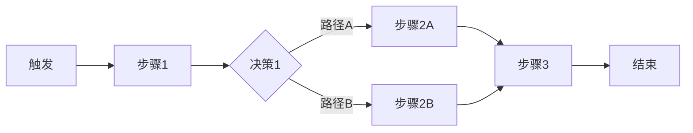

# 用户旅程模板

## 基本信息

| 字段 | 内容 |
|------|------|
| 文档名称 | <功能名称> 用户旅程图 |
| 版本 | v1.0 |
| 作者 | <姓名> |
| 创建时间 | YYYY-MM-DD |
| 最后更新 | YYYY-MM-DD |
| 状态 | <草稿 / 评审中 / 已评审 / 已废弃> |

---

## 目录

- [1. 用户角色](#1-用户角色)
- [2. 用户旅程](#2-用户旅程)
- [3. 情绪曲线](#3-情绪曲线)
- [4. 痛点分析](#4-痛点分析)
- [5. 机会点](#5-机会点)

---

## 1. 用户角色

### 1.1 角色定义

| 角色 | 描述 | 占比 |
|------|------|------|
| <角色1> | <描述> | <百分比> |
| <角色2> | <描述> | <百分比> |

### 1.2 角色特征

**角色 1：<角色名称>**

| 特征 | 描述 |
|------|------|
| 年龄段 | <描述> |
| 技能水平 | <描述> |
| 使用频率 | <描述> |
| 核心目标 | <描述> |
| 痛点 | <描述> |

### 1.3 用户目标

| 角色 | 目标 | 优先级 |
|------|------|--------|
| <角色> | <目标> | <高/中/低> |

---

## 2. 用户旅程

### 2.1 旅程地图



### 2.2 旅程步骤详解

| 步骤 | 触发条件 | 用户行为 | 系统响应 | 预期结果 |
|------|----------|----------|----------|----------|
| 步骤 1 | <条件> | <行为> | <响应> | <结果> |
| 步骤 2 | <条件> | <行为> | <响应> | <结果> |

### 2.3 里程碑

| 里程碑 | 触发条件 | 完成标志 | 奖励/反馈 |
|--------|----------|----------|-----------|
| <里程碑> | <条件> | <标志> | <奖励> |

---

## 3. 情绪曲线

### 3.1 情绪曲线图

```mermaid
xychart-beta
    title "用户情绪曲线"
    x-axis [步骤1, 步骤2, 步骤3, 步骤4, 步骤5]
    y-axis "情绪值" -2 --> 2
    line [1, 0.5, -0.5, 0, 1.5]
```

### 3.2 情绪分析

| 步骤 | 情绪 | 情绪值 | 原因 | 改进建议 |
|------|------|--------|------|----------|
| 步骤 1 | <情绪> | <值> | <原因> | <建议> |
| 步骤 2 | <情绪> | <值> | <原因> | <建议> |

### 3.3 情绪定义

| 情绪值 | 情绪 | 说明 |
|--------|------|------|
| 2 | 非常满意 | 超出预期 |
| 1 | 满意 | 达到预期 |
| 0 | 中性 | 符合预期 |
| -1 | 不满意 | 低于预期 |
| -2 | 非常不满意 | 远低于预期 |

---

## 4. 痛点分析

### 4.1 痛点识别

| 痛点 | 严重程度 | 发生频率 | 影响用户 | 描述 |
|------|----------|----------|----------|------|
| <痛点1> | <高/中/低> | <高/中/低> | <角色> | <描述> |
| <痛点2> | <高/中/低> | <高/中/低> | <角色> | <描述> |

### 4.2 根因分析

| 痛点 | 根因 | 验证方式 |
|------|------|----------|
| <痛点1> | <根因> | <验证方式> |
| <痛点2> | <根因> | <验证方式> |

### 4.3 解决方案

| 痛点 | 解决方案 | 优先级 | 预期效果 |
|------|----------|--------|----------|
| <痛点1> | <方案> | <高/中/低> | <效果> |
| <痛点2> | <方案> | <高/中/低> | <效果> |

---

## 5. 机会点

### 5.1 优化点

| 优化点 | 描述 | 预期收益 | 实施难度 | 优先级 |
|--------|------|----------|----------|--------|
| <优化点1> | <描述> | <收益> | <难度> | <优先级> |

### 5.2 创新点

| 创新点 | 描述 | 预期收益 | 风险 | 优先级 |
|--------|------|----------|------|--------|
| <创新点1> | <描述> | <收益> | <风险> | <优先级> |

### 5.3 下一步行动

| 行动项 | 负责人 | 截止时间 | 状态 |
|--------|--------|----------|------|
| <行动项> | <姓名> | YYYY-MM-DD | <进行中> |

---

## 附件

### 参考资料

- [链接 1](URL)
- [链接 2](URL)

### 相关文档

- [需求文档](../../01-需求文档/<功能>-prd.md)
- [原型图](../../01-需求文档/prototype/)

---

**最后更新**：YYYY-MM-DD
