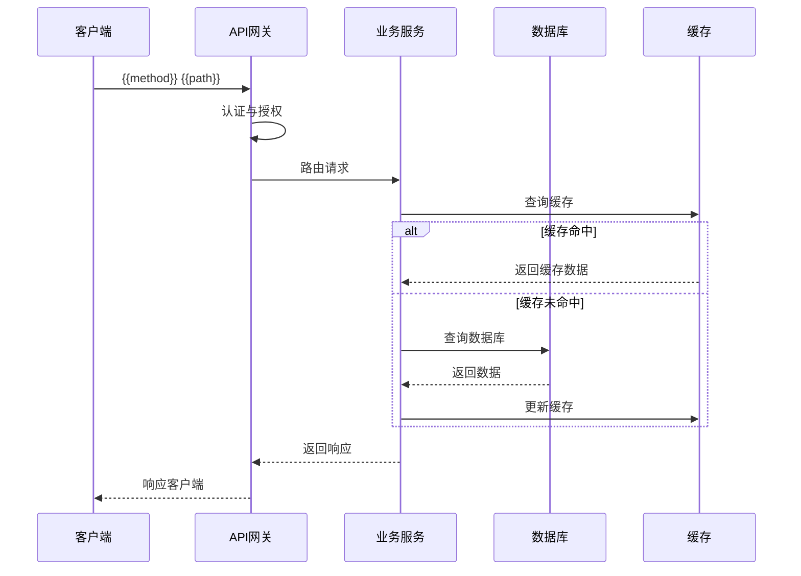

# [API 名称]

## 概述

[简要描述 API 的功能和用途]

**版本**: v[版本号]
**维护人**: [负责人]
**最后更新**: [日期]

---

## 数据模型

### [主模型名称]

| 字段名 | 类型 | 必填 | 默认值 | 说明 | 示例 |
|--------|------|------|--------|------|------|
| {{field_name}} | {{type}} | {{required}} | {{default}} | {{description}} | {{example}} |

### 枚举值说明

| 字段 | 枚举值 | 说明 |
|------|--------|------|
| {{enum_field}} | {{value1}} | {{description}} |
| {{enum_field}} | {{value2}} | {{description}} |

### 类型定义

```typescript
// 类型定义
interface {{ModelName}} {
  {{field_name}}: {{type}};
  {{field_name}}: {{type}};
}

// 请求类型
interface Create{{ModelName}}Request {
  {{field_name}}: {{type}};
}

// 响应类型
interface {{ModelName}}Response {
  {{field_name}}: {{type}};
}
```

---

## 数据流动

### [主要业务流程]

**流程图**：



**数据转换**：

| 阶段 | 数据类型 | 说明 |
|------|----------|------|
| 输入 | JSON Request Body | 客户端发送的数据 |
| 验证 | Validation DTO | 经过验证的数据 |
| 存储 | Database Model | 数据库中的数据 |
| 缓存 | Cache Object | 缓存中的数据 |
| 输出 | Response DTO | 返回给客户端的数据 |

**转换示例**：

```javascript
// 输入
{{input_example}}

// 存储
{{storage_example}}

// 输出
{{output_example}}
```

---

## 接口信息

**URL**: `/api/v[版本]/[路径]`
**方法**: [GET/POST/PUT/DELETE]
**认证**: [是否需要认证]
**限流**: [限流规则]

---

## 请求参数

### Path 参数

| 参数名 | 类型 | 必填 | 说明 | 示例 |
|--------|------|------|------|------|
| {{path_param}} | {{type}} | {{required}} | {{description}} | {{example}} |

### Query 参数

| 参数名 | 类型 | 必填 | 默认值 | 说明 | 示例 |
|--------|------|------|--------|------|------|
| {{query_param}} | {{type}} | {{required}} | {{default}} | {{description}} | {{example}} |

### Body 参数

| 参数名 | 类型 | 必填 | 说明 | 约束 | 示例 |
|--------|------|------|------|------|------|
| {{body_param}} | {{type}} | {{required}} | {{description}} | {{constraint}} | {{example}} |

### Header 参数

| 参数名 | 类型 | 必填 | 说明 | 示例 |
|--------|------|------|------|------|
| Authorization | string | 是 | JWT Token | `Bearer {{token}}` |
| Content-Type | string | 是 | 内容类型 | `application/json` |

---

## 请求示例

### cURL

```bash
curl -X {{method}} '{{base_url}}{{path}}' \
  -H 'Content-Type: application/json' \
  -H 'Authorization: Bearer {{token}}' \
  -d '{{request_body}}'
```

### HTTP

```http
{{method}} {{base_url}}{{path}} HTTP/1.1
Content-Type: application/json
Authorization: Bearer {{token}}

{{request_body}}
```

### JavaScript/TypeScript

```typescript
// 使用 fetch
const response = await fetch('{{base_url}}{{path}}', {
  method: '{{method}}',
  headers: {
    'Content-Type': 'application/json',
    'Authorization': 'Bearer {{token}}'
  },
  body: JSON.stringify({{request_body_object}})
});

const data = await response.json();
console.log(data);
```

---

## 响应格式

### 成功响应 (200/201)

**Response Schema**:

```typescript
interface SuccessResponse<T> {
  code: number;           // 状态码
  message: string;        // 响应消息
  data: T;                // 响应数据
}
```

**Response Body**:

```json
{
  "code": {{success_code}},
  "message": "{{success_message}}",
  "data": {
    {{response_data}}
  }
}
```

**响应数据字段**:

| 字段名 | 类型 | 说明 |
|--------|------|------|
| {{field_name}} | {{type}} | {{description}} |

### 错误响应

**Error Schema**:

```typescript
interface ErrorResponse {
  code: number;           // 错误码
  message: string;        // 错误消息
  errors?: Array<{        // 详细错误（可选）
    field: string;        // 字段名
    message: string;      // 错误描述
    constraint?: string;   // 约束说明
  }>;
}
```

**错误码列表**:

| 状态码 | 错误码 | 说明 | 解决方案 |
|--------|--------|------|----------|
| 400 | VALIDATION_ERROR | 请求参数验证失败 | 检查参数格式和约束 |
| 401 | UNAUTHORIZED | 未授权或 Token 过期 | 重新获取 Token |
| 403 | FORBIDDEN | 权限不足 | 联系管理员 |
| 404 | NOT_FOUND | 资源不存在 | 检查资源 ID |
| 409 | CONFLICT | 资源冲突（如重复创建） | 修改请求参数 |
| 429 | TOO_MANY_REQUESTS | 请求过于频繁 | 稍后重试 |
| 500 | INTERNAL_ERROR | 服务器内部错误 | 联系技术支持 |

**错误响应示例**:

```json
{
  "code": 400,
  "message": "Validation failed",
  "errors": [
    {
      "field": "email",
      "message": "Email already exists",
      "constraint": "unique"
    },
    {
      "field": "password",
      "message": "Password must be at least 8 characters",
      "constraint": "minLength: 8"
    }
  ]
}
```

---

## 业务规则

1. {{rule_1}}
2. {{rule_2}}
3. {{rule_3}}

---

## 注意事项

- {{note_1}}
- {{note_2}}
- {{note_3}}

---

## 变更历史

| 版本 | 日期 | 变更内容 | 维护人 |
|------|------|----------|--------|
| v1.0.0 | 2024-02-19 | 初始版本 | [负责人] |

---

## 相关文档

- [架构文档](../架构设计.md)
- [认证说明](../认证指南.md)
- [错误码列表](../错误码.md)
- [数据模型规范](../数据模型.md)
