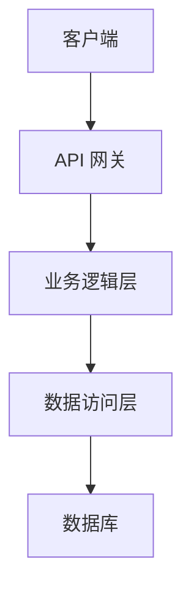
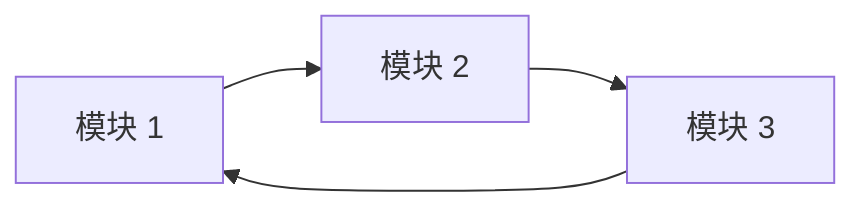
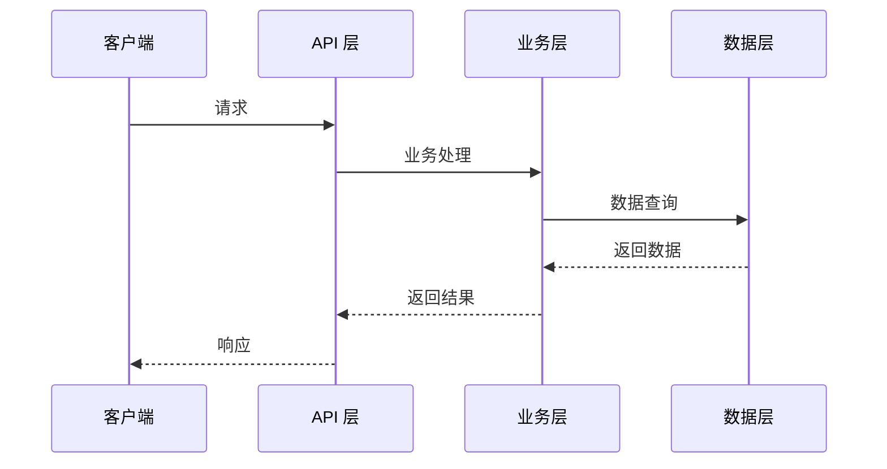

# 架构设计

## 系统架构

### 整体架构

```
[描述系统整体架构]

## 架构图



## 模块划分

### 模块列表

| 模块名称 | 职责 | 技术栈 |
|----------|------|--------|
| [模块 1] | [职责描述] | [技术栈] |
| [模块 2] | [职责描述] | [技术栈] |
| [模块 3] | [职责描述] | [技术栈] |

### 模块关系



## 技术栈

### 前端
- [框架名称]
- [UI 库]
- [构建工具]

### 后端
- [编程语言]
- [Web 框架]
- [数据库]

### 基础设施
- [容器技术]
- [数据库]
- [缓存]
- [消息队列]

## 数据流


