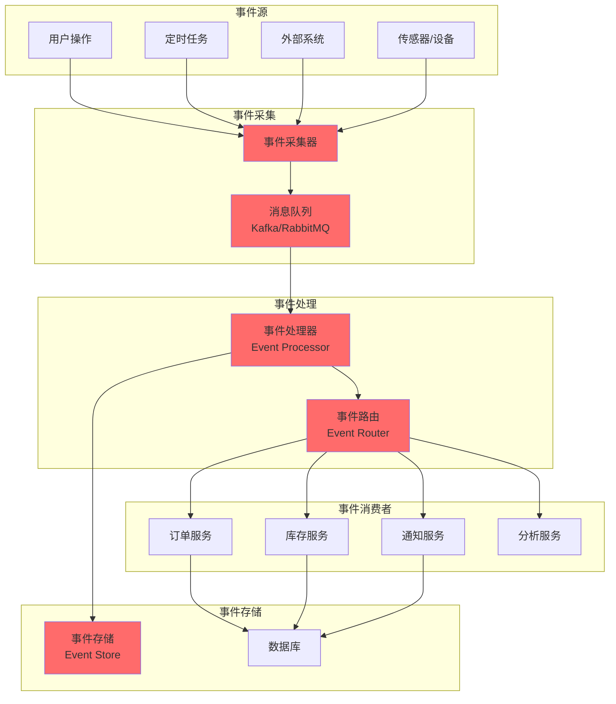

# 事件驱动架构

## 概述

本文档描述事件驱动架构设计，适用于高并发、解耦、实时性要求高的场景。

---

## 架构总览



---

## 事件驱动核心概念

### 1. 事件（Event）

**定义**：系统中发生的有意义的事情

**类型**：
- **领域事件**：业务领域内发生的事情
  - `OrderCreated`（订单创建）
  - `PaymentCompleted`（支付完成）
  - `InventoryUpdated`（库存更新）

- **系统事件**：系统内部发生的事情
  - `UserLoggedIn`（用户登录）
  - `DataExported`（数据导出）

- **外部事件**：外部系统触发的事件
  - `PaymentCallback`（支付回调）
  - `ThirdPartyNotify`（第三方通知）

---

### 2. 事件流（Event Stream）

**定义**：按时间顺序排列的事件序列

**示例**：
```yaml
订单事件流:
  - event: OrderCreated
    timestamp: 2024-01-01T10:00:00Z
    payload:
      orderId: 123
      userId: 456
      amount: 100.00
      
  - event: PaymentCompleted
    timestamp: 2024-01-01T10:01:00Z
    payload:
      orderId: 123
      paymentId: 789
      
  - event: InventoryUpdated
    timestamp: 2024-01-01T10:02:00Z
    payload:
      productId: 101
      quantity: -1
```

---

### 3. 事件处理器（Event Processor）

**定义**：处理事件的组件

**类型**：
- **同步处理器**：立即处理事件
- **异步处理器**：异步处理事件
- **批量处理器**：批量处理事件

---

## 事件驱动模式

### 1. 发布-订阅模式（Pub/Sub）

**原理**：
- 生产者发布事件到主题（Topic）
- 消费者订阅主题接收事件
- 一对多通信

**实现**：
```java
// 发布事件
@Publish("order.created")
public void publishOrderCreated(OrderCreatedEvent event) {
    kafkaTemplate.send("order.created", event);
}

// 订阅事件
@Subscribe("order.created")
public void handleOrderCreated(OrderCreatedEvent event) {
    // 处理订单创建事件
}
```

---

### 2. 事件溯源模式（Event Sourcing）

**原理**：
- 不存储当前状态，而是存储所有事件
- 通过重放事件来恢复状态

**优势**：
- 完整的历史记录
- 审计追踪
- 时序查询

**实现**：
```java
// 事件存储
@Entity
public class OrderEvent {
    @Id
    private Long id;
    private String eventType;
    private String payload;
    private LocalDateTime timestamp;
}

// 重放事件
public Order getOrderState(Long orderId) {
    List<OrderEvent> events = eventRepository.findByOrderId(orderId);
    Order order = new Order();
    for (OrderEvent event : events) {
        applyEvent(order, event);
    }
    return order;
}
```

---

### 3. CQRS 模式（Command Query Responsibility Segregation）

**原理**：
- 命令（Command）：写操作
- 查询（Query）：读操作
- 读写分离

**优势**：
- 读写分离优化
- 性能提升
- 扩展性好

**实现**：
```java
// 命令服务
@Service
public class OrderCommandService {
    @Autowired
    private OrderRepository orderRepository;
    
    public void createOrder(CreateOrderCommand command) {
        Order order = new Order(command);
        orderRepository.save(order);
        // 发布事件
        eventPublisher.publish(new OrderCreatedEvent(order));
    }
}

// 查询服务
@Service
public class OrderQueryService {
    @Autowired
    private OrderReadModel orderReadModel;
    
    public OrderDTO getOrderById(Long orderId) {
        return orderReadModel.findById(orderId);
    }
}
```

---

## 事件设计原则

### 1. 事件命名

**规范**：
- 使用过去时态
- 描述发生的事情
- 使用领域语言

**示例**：
- ✅ `OrderCreated`（订单已创建）
- ✅ `PaymentCompleted`（支付已完成）
- ❌ `CreateOrder`（创建订单）
- ❌ `OrderCreate`（订单创建）

---

### 2. 事件版本

**策略**：
- 向后兼容
- 使用版本号
- 逐步迁移

**实现**：
```java
public class OrderCreatedEvent {
    private String eventType = "OrderCreated.v2";
    private String version = "2.0";
    private Long orderId;
    private Long userId;
    private BigDecimal amount;
    // 新增字段
    private LocalDateTime createdAt;
}
```

---

### 3. 事件幂等性

**保证**：
- 重复处理不产生副作用
- 使用唯一 ID
- 状态检查

**实现**：
```java
@Subscribe("order.created")
@Transactional
public void handleOrderCreated(OrderCreatedEvent event) {
    // 检查是否已处理
    if (processedEventRepository.existsById(event.getEventId())) {
        return;
    }
    
    // 处理事件
    processOrderCreated(event);
    
    // 标记为已处理
    processedEventRepository.save(new ProcessedEvent(event.getEventId()));
}
```

---

## 事件通信

### 1. 同步通信

**场景**：
- 实时性要求高
- 事务一致性要求高

**实现**：
```java
// 同步发布事件
@Publish("order.created", mode = "sync")
public void publishOrderCreated(OrderCreatedEvent event) {
    eventPublisher.publishSync(event);
}
```

---

### 2. 异步通信

**场景**：
- 实时性要求不高
- 解耦要求高
- 性能要求高

**实现**：
```java
// 异步发布事件
@Publish("order.created", mode = "async")
public void publishOrderCreated(OrderCreatedEvent event) {
    kafkaTemplate.send("order.created", event);
}
```

---

## 消息队列选型

### Kafka

**适用场景**：
- 大数据流
- 日志收集
- 事件溯源

**优势**：
- 高吞吐量
- 持久化
- 分布式架构

**配置**：
```yaml
spring:
  kafka:
    bootstrap-servers: localhost:9092
    producer:
      key-serializer: org.apache.kafka.common.serialization.StringSerializer
      value-serializer: org.springframework.kafka.support.serializer.JsonSerializer
    consumer:
      group-id: order-service
      key-deserializer: org.apache.kafka.common.serialization.StringDeserializer
      value-deserializer: org.springframework.kafka.support.serializer.JsonDeserializer
      auto-offset-reset: earliest
```

---

### RabbitMQ

**适用场景**：
- 可靠性要求高
- 复杂路由
- 企业级应用

**优势**：
- 可靠性高
- 路由灵活
- 管理界面友好

**配置**：
```yaml
spring:
  rabbitmq:
    host: localhost
    port: 5672
    username: guest
    password: guest
    publisher-confirm-type: correlated
    publisher-returns: true
```

---

## 事件存储

### 事件存储设计

**结构**：
```sql
CREATE TABLE event_store (
    id BIGINT PRIMARY KEY AUTO_INCREMENT,
    aggregate_id VARCHAR(64) NOT NULL,
    aggregate_type VARCHAR(64) NOT NULL,
    event_type VARCHAR(64) NOT NULL,
    event_data JSON NOT NULL,
    version BIGINT NOT NULL,
    created_at DATETIME NOT NULL,
    INDEX idx_aggregate_id (aggregate_id),
    INDEX idx_aggregate_type (aggregate_type),
    INDEX idx_event_type (event_type)
);
```

---

### 事件查询

**聚合事件**：
```java
public List<OrderEvent> getEventsByAggregateId(String aggregateId) {
    return eventStoreRepository.findByAggregateIdOrderByVersionAsc(aggregateId);
}
```

**按类型查询**：
```java
public List<OrderEvent> getEventsByType(String eventType) {
    return eventStoreRepository.findByEventTypeOrderByCreatedAtDesc(eventType);
}
```

---

## 错误处理

### 1. 重试机制

**策略**：
- 指数退避
- 最大重试次数
- 死信队列

**实现**：
```java
@RetryableTopic(
    attempts = "3",
    backoff = @Backoff(delay = 1000, multiplier = 2)
)
@Subscribe("order.created")
public void handleOrderCreated(OrderCreatedEvent event) {
    // 处理事件
}
```

---

### 2. 死信队列

**配置**：
```yaml
spring:
  kafka:
    listener:
      ack-mode: manual_immediate
    template:
      dlt-enabled: true
```

---

### 3. 补偿机制

**Saga 模式**：
```java
public void processOrder(Order order) {
    try {
        // 步骤1：扣减库存
        inventoryService.deductInventory(order);
        
        // 步骤2：创建订单
        orderRepository.save(order);
        
        // 步骤3：支付
        paymentService.pay(order);
    } catch (Exception e) {
        // 补偿：回滚库存
        inventoryService.revertInventory(order);
        // 补偿：取消订单
        orderRepository.cancel(order);
    }
}
```

---

## 监控与追踪

### 事件监控

**监控指标**：
- 事件生产速率
- 事件消费速率
- 事件积压量
- 处理延迟

---

### 事件追踪

**链路追踪**：
```java
@Publish("order.created")
public void publishOrderCreated(OrderCreatedEvent event) {
    // 添加追踪信息
    MDC.put("traceId", TraceContext.getTraceId());
    eventPublisher.publish(event);
}
```

---

## 技术栈选型

| 技术 | 版本 | 用途 |
|------|------|------|
| Spring Boot | 3.0 | 应用框架 |
| Kafka | 3.6 | 消息队列 |
| RabbitMQ | 3.12 | 消息队列 |
| MySQL | 8.0 | 事件存储 |
| Redis | 7.0 | 缓存 |
| Elasticsearch | 8.0 | 事件搜索 |
| Jaeger | 1.50 | 链路追踪 |

---

## 演进路线

### 阶段一：基础事件驱动

**目标**：
- 实现发布-订阅模式
- 实现事件存储
- 实现基本的事件处理

---

### 阶段二：高级特性

**目标**：
- 实现事件溯源
- 实现 CQRS
- 实现 Saga 模式

---

### 阶段三：云原生

**目标**：
- 实现事件网格
- 实现事件流处理
- 实现实时分析

---

## 参考资料

- [架构设计指南](../../guides/architecture/architecture-design-guide.md)
- [架构模式详解](../../guides/architecture/architecture-patterns.md)
