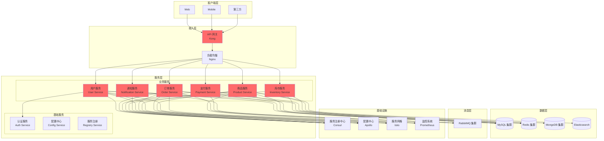

# 微服务架构

## 概述

本文档描述微服务架构设计，包括服务拆分、服务治理、通信模式和技术栈选型。

---

## 架构总览



---

## 微服务设计原则

### 1. 单一职责原则（SRP）

**定义**：每个服务只关注一个业务功能

**示例**：
- ✅ 用户服务：负责用户管理
- ✅ 订单服务：负责订单管理
- ❌ 订单服务：负责订单管理和库存管理

---

### 2. 限界上下文原则（Bounded Context）

**定义**：每个服务有明确的数据边界

**示例**：
- 用户服务：用户表、用户地址表
- 订单服务：订单表、订单明细表
- 商品服务：商品表、分类表

---

### 3. 无状态原则（Stateless）

**定义**：服务不保存会话状态

**优势**：
- 易于水平扩展
- 容错性强
- 部署灵活

---

### 4. 独立部署原则（Independent Deployment）

**定义**：每个服务可以独立部署和升级

**优势**：
- 快速迭代
- 降低风险
- 提升效率

---

## 服务拆分策略

### 按业务领域拆分（DDD）

**拆分维度**：
- 用户域（用户服务）
- 订单域（订单服务）
- 商品域（商品服务）
- 支付域（支付服务）

**示例**：
```yaml
服务清单:
  - name: 用户服务
    responsibility: 用户注册、登录、信息管理
    database: user_db
  - name: 订单服务
    responsibility: 订单创建、查询、取消
    database: order_db
  - name: 商品服务
    responsibility: 商品管理、分类管理
    database: product_db
  - name: 支付服务
    responsibility: 支付处理、退款
    database: payment_db
```

---

### 按功能拆分

**拆分维度**：
- 认证服务（Auth Service）
- 配置服务（Config Service）
- 通知服务（Notification Service）

---

### 按数据拆分

**拆分维度**：
- 热数据服务（频繁访问）
- 冷数据服务（历史归档）
- 搜索服务（全文检索）

---

## 服务通信

### 同步通信（REST/RPC）

**REST API**：
```yaml
场景: 服务间简单调用
协议: HTTP/HTTPS
格式: JSON
优点: 简单、通用
缺点: 性能较低
工具: Feign / RestTemplate
```

**RPC**：
```yaml
场景: 高性能内部调用
协议: gRPC / Dubbo
格式: Protobuf
优点: 高性能、强类型
缺点: 复杂度高
工具: gRPC / Dubbo
```

---

### 异步通信（MQ）

**应用场景**：
- 订单异步处理
- 消息通知
- 数据同步
- 日志收集

**消息队列选型**：
```yaml
RabbitMQ:
  场景: 可靠性要求高
  优点: 可靠性高、路由灵活
  缺点: 吞吐量低

Kafka:
  场景: 高吞吐量、大数据
  优点: 高吞吐量、持久化
  缺点: 复杂度高
```

---

## 服务治理

### 1. 服务注册与发现

**工具**：
- Consul（推荐）
- Eureka
- Nacos

**配置**：
```yaml
Consul:
  server: consul-server:8500
  service-name: order-service
  health-check: /health
  interval: 10s
```

---

### 2. 负载均衡

**策略**：
- 轮询（Round Robin）
- 随机（Random）
- 加权（Weighted）
- 最少连接（Least Connections）

**工具**：
- Ribbon
- Spring Cloud LoadBalancer

---

### 3. 熔断降级

**工具**：
- Sentinel（推荐）
- Hystrix
- Resilience4j

**配置**：
```yaml
Sentinel:
  circuit-breaker:
    error-ratio: 50%
    min-request: 10
  fallback:
    enabled: true
    class: OrderFallback
```

---

### 4. 限流

**策略**：
- 并发数限流
- QPS 限流
- 令牌桶算法
- 漏桶算法

**工具**：
- Sentinel
- Nginx

---

## 数据一致性

### 最终一致性

**方案**：
- 分布式事务（Saga 模式）
- 事件溯源（Event Sourcing）
- 消息队列（可靠消息）

---

### Saga 模式

**实现**：
```yaml
订单流程:
  - step1: 创建订单
  - step2: 扣减库存
  - step3: 创建支付
  - compensation:
    - 如果 step3 失败，回滚 step2
    - 如果 step2 失败，回滚 step1
```

---

### 分布式事务

**工具**：
- Seata（推荐）
- RocketMQ 事务消息
- 本地消息表

---

## 服务监控

### 1. 指标监控（Prometheus）

**监控指标**：
- QPS（每秒查询数）
- 响应时间（P99、P95）
- 错误率
- 资源使用率

---

### 2. 日志监控（ELK）

**日志收集**：
- Filebeat
- Logstash
- Elasticsearch

---

### 3. 链路追踪（Jaeger）

**追踪内容**：
- 请求链路
- 调用关系
- 性能瓶颈

---

## 服务部署

### 容器化部署

**工具**：
- Docker
- Kubernetes

**配置**：
```yaml
Deployment:
  replicas: 3
  image: order-service:1.0.0
  resources:
    limits:
      cpu: 1000m
      memory: 1Gi
    requests:
      cpu: 500m
      memory: 512Mi
```

---

### 蓝绿部署

**策略**：
- 蓝环境：旧版本
- 绿环境：新版本
- 流量切换

---

### 金丝雀发布

**策略**：
- 灰度发布
- 小流量验证
- 逐步扩大

---

## 技术栈选型

### 后端技术栈

| 技术 | 版本 | 用途 |
|------|------|------|
| Spring Cloud | 2022.0 | 微服务框架 |
| Consul | 1.16 | 服务注册 |
| Apollo | 2.1 | 配置中心 |
| Sentinel | 1.8 | 流量控制 |
| Seata | 1.7 | 分布式事务 |
| Kafka | 3.6 | 消息队列 |
| MySQL | 8.0 | 主数据库 |
| Redis | 7.0 | 缓存 |
| Elasticsearch | 8.0 | 搜索 |
| Prometheus | 2.45 | 监控 |
| Grafana | 10.0 | 可视化 |
| Jaeger | 1.50 | 链路追踪 |

---

## 演进路线

### 阶段一：服务拆分

**目标**：
- 拆分 5-10 个核心服务
- 实现服务注册与发现
- 实现配置中心

---

### 阶段二：服务治理

**目标**：
- 实现熔断降级
- 实现限流
- 实现负载均衡

---

### 阶段三：数据一致性

**目标**：
- 实现分布式事务
- 实现最终一致性

---

### 阶段四：云原生

**目标**：
- 实现服务网格（Istio）
- 实现自动扩缩容
- 实现自动化运维

---

## 参考资料

- [架构设计指南](../../guides/architecture/architecture-design-guide.md)
- [架构模式详解](../../guides/architecture/architecture-patterns.md)
