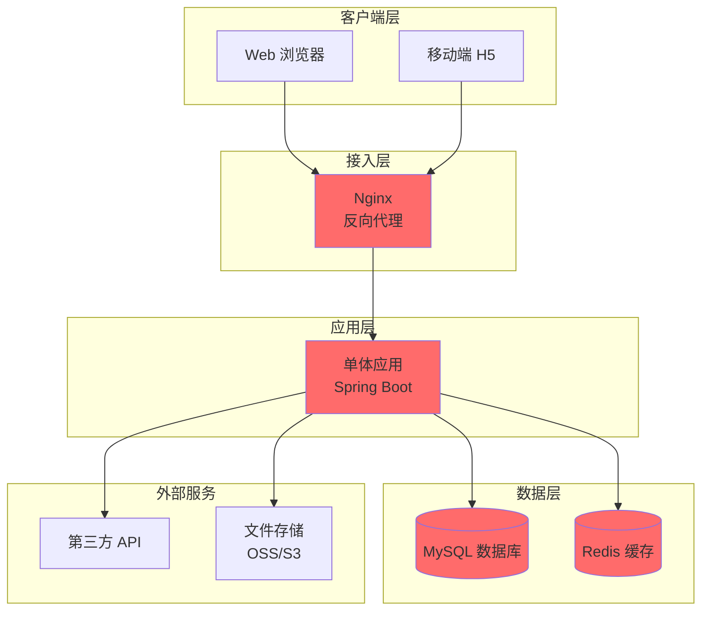

# 单体架构

## 概述

本文档描述单体架构设计，适用于中小型项目、快速开发、MVP 验证等场景。

---

## 架构总览



---

## 架构特点

### 优势

1. **开发简单**：
   - 所有功能在一个项目中
   - 不需要分布式系统知识
   - 新人上手快

2. **部署简单**：
   - 只需要部署一个应用
   - 不需要容器编排
   - 运维成本低

3. **性能好**：
   - 内部调用无网络开销
   - 事务处理简单
   - 调试方便

4. **适合场景**：
   - 小型项目
   - 快速开发
   - MVP 验证
   - 团队规模 < 10 人

---

### 劣势

1. **扩展性差**：
   - 无法单独扩展某个功能
   - 必须整体扩展
   - 资源利用率低

2. **耦合度高**：
   - 所有功能在一个应用中
   - 代码耦合严重
   - 难以维护

3. **技术栈固定**：
   - 必须使用同一技术栈
   - 难以引入新技术

4. **不适用场景**：
   - 大型项目
   - 高并发场景
   - 复杂业务
   - 团队规模 > 20 人

---

## 分层设计

### 1. 表现层（Presentation Layer）

**功能**：
- 接收 HTTP 请求
- 参数验证
- 返回响应

**技术栈**：
- Spring MVC
- Controller

**示例**：
```java
@RestController
@RequestMapping("/api/users")
public class UserController {
    @Autowired
    private UserService userService;
    
    @GetMapping("/{id}")
    public Result<User> getUser(@PathVariable Long id) {
        User user = userService.getById(id);
        return Result.success(user);
    }
}
```

---

### 2. 业务逻辑层（Service Layer）

**功能**：
- 业务逻辑处理
- 事务管理
- 服务编排

**技术栈**：
- Service
- Transaction

**示例**：
```java
@Service
@Transactional
public class UserServiceImpl implements UserService {
    @Autowired
    private UserMapper userMapper;
    
    @Override
    public User getById(Long id) {
        return userMapper.selectById(id);
    }
}
```

---

### 3. 数据访问层（Data Access Layer）

**功能**：
- 数据库操作
- 缓存操作

**技术栈**：
- MyBatis / JPA
- Redis

**示例**：
```java
@Mapper
public interface UserMapper {
    User selectById(Long id);
    void insert(User user);
    void update(User user);
    void deleteById(Long id);
}
```

---

### 4. 工具层（Utility Layer）

**功能**：
- 通用工具类
- 配置管理

**技术栈**：
- Utils
- Config

---

## 模块化设计

### 模块划分

```yaml
modules:
  - name: user-module
    package: com.example.user
    responsibility: 用户管理
    layers:
      - controller
      - service
      - mapper
      - entity
      - dto
      - vo
      
  - name: order-module
    package: com.example.order
    responsibility: 订单管理
    layers:
      - controller
      - service
      - mapper
      - entity
      - dto
      - vo
      
  - name: product-module
    package: com.example.product
    responsibility: 商品管理
    layers:
      - controller
      - service
      - mapper
      - entity
      - dto
      - vo
```

---

### 模块通信

**内部调用**：
```java
// OrderService 调用 ProductService
@Service
public class OrderServiceImpl implements OrderService {
    @Autowired
    private ProductService productService;
    
    @Override
    public Order createOrder(Long userId, Long productId) {
        Product product = productService.getById(productId);
        // 创建订单逻辑
    }
}
```

---

## 数据库设计

### 单数据库设计

**优点**：
- 事务处理简单
- 数据一致性强
- 开发简单

**缺点**：
- 无法分库分表
- 性能瓶颈

---

### 读写分离

**配置**：
```yaml
datasource:
  master:
    url: jdbc:mysql://master-db:3306/db
    username: root
    password: password
  slave:
    url: jdbc:mysql://slave-db:3306/db
    username: root
    password: password
```

**使用**：
```java
// 读操作走从库
@DataSource("slave")
public User getById(Long id) {
    return userMapper.selectById(id);
}

// 写操作走主库
@DataSource("master")
public void insert(User user) {
    userMapper.insert(user);
}
```

---

## 缓存设计

### 缓存策略

**Cache Aside**：
```java
// 先查缓存
User user = redisTemplate.opsForValue().get("user:" + id);
if (user == null) {
    // 缓存未命中，查数据库
    user = userMapper.selectById(id);
    // 写入缓存
    redisTemplate.opsForValue().set("user:" + id, user, 1, TimeUnit.HOURS);
}
return user;
```

---

### 缓存更新

**策略**：
- 写操作时更新缓存
- 定时刷新缓存
- 设置过期时间

---

## 技术栈选型

### 后端技术栈

| 技术 | 版本 | 用途 |
|------|------|------|
| Spring Boot | 3.0 | 后端框架 |
| MyBatis | 3.5 | ORM 框架 |
| MySQL | 8.0 | 数据库 |
| Redis | 7.0 | 缓存 |
| Nginx | 1.24 | 反向代理 |
| Maven | 3.9 | 构建工具 |

---

### 前端技术栈

| 技术 | 版本 | 用途 |
|------|------|------|
| Vue | 3.0 | 前端框架 |
| Element Plus | 2.0 | UI 组件库 |
| Axios | 1.0 | HTTP 客户端 |
| Vite | 4.0 | 构建工具 |

---

## 部署方案

### 单机部署

**架构**：
```
Nginx → Spring Boot → MySQL + Redis
```

**配置**：
```yaml
server:
  port: 8080
  tomcat:
    threads:
      max: 200
spring:
  datasource:
    url: jdbc:mysql://localhost:3306/db
  redis:
    host: localhost
    port: 6379
```

---

### 双机部署

**架构**：
```
Nginx (LB) → Spring Boot (2 台) → MySQL (主从) + Redis (集群)
```

**优势**：
- 高可用
- 负载均衡

---

## 性能优化

### 1. 数据库优化

**索引优化**：
```sql
CREATE INDEX idx_user_email ON user(email);
CREATE INDEX idx_order_user_id ON order(user_id);
```

**查询优化**：
```java
// 避免 N+1 查询
@Mapper
public interface OrderMapper {
    @Select("SELECT * FROM `order` WHERE user_id = #{userId}")
    List<Order> selectByUserId(Long userId);
    
    @Select("SELECT * FROM order_item WHERE order_id IN (#{orderIds})")
    List<OrderItem> selectByOrderIds(@Param("orderIds") List<Long> orderIds);
}
```

---

### 2. 缓存优化

**多级缓存**：
```java
// 一级缓存：本地缓存（Caffeine）
@Cacheable(value = "user", key = "#id", cacheManager = "caffeineCacheManager")
public User getById(Long id) {
    return userMapper.selectById(id);
}

// 二级缓存：Redis 缓存
@Cacheable(value = "user", key = "#id", cacheManager = "redisCacheManager")
public User getById(Long id) {
    return userMapper.selectById(id);
}
```

---

### 3. 代码优化

**异步处理**：
```java
@Async
public void sendNotification(Long userId, String message) {
    // 发送通知
}
```

**批量处理**：
```java
// 批量插入
@Insert("<script>" +
        "INSERT INTO order_item (order_id, product_id, quantity) VALUES " +
        "<foreach collection='items' item='item' separator=','>" +
        "(#{item.orderId}, #{item.productId}, #{item.quantity})" +
        "</foreach>" +
        "</script>")
void batchInsert(@Param("items") List<OrderItem> items);
```

---

## 演进路线

### 何时拆分微服务

**触发条件**：
- 团队规模 > 20 人
- 业务复杂度高
- 部署频繁
- 性能瓶颈

**拆分策略**：
1. 前后端分离
2. 服务拆分（用户、订单、商品）
3. 数据库拆分
4. 微服务化

---

### 演进步骤

**阶段一：单体架构**（当前）
- 快速开发
- MVP 验证

**阶段二：前后端分离**
- 前端独立部署
- API 网关

**阶段三：服务拆分**
- 拆分核心服务
- 服务注册与发现

**阶段四：微服务架构**
- 服务治理
- 云原生部署

---

## 参考资料

- [架构设计指南](../../guides/architecture/architecture-design-guide.md)
- [架构模式详解](../../guides/architecture/architecture-patterns.md)
- [技术选型指南](../../guides/architecture/technology-selection-guide.md)
