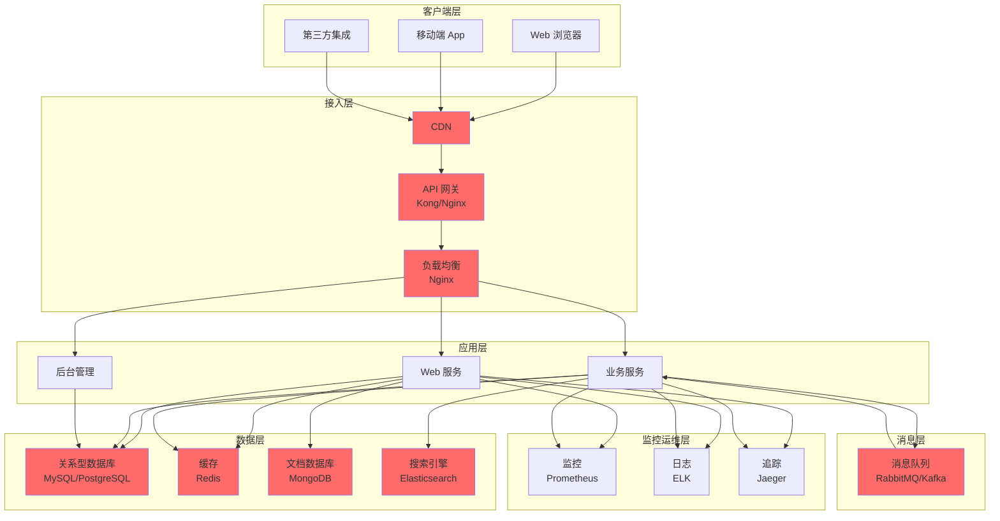
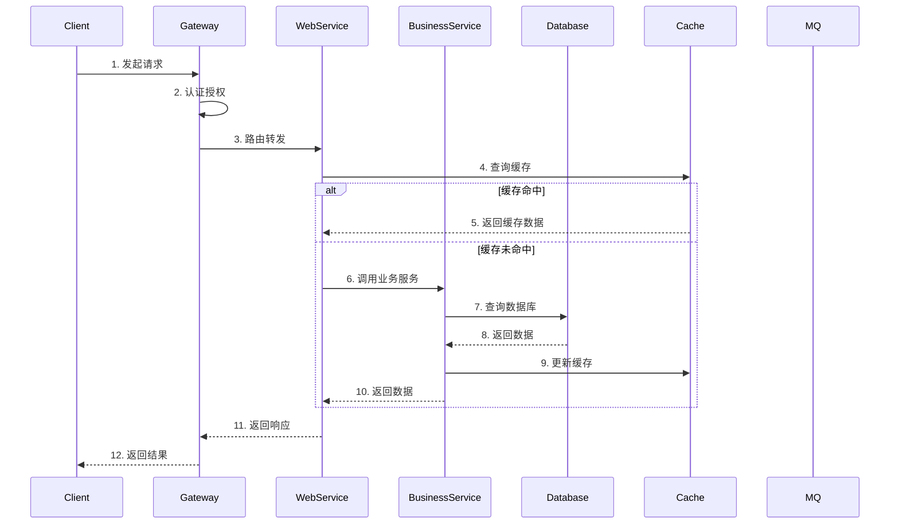

# 系统整体架构

## 概述

本文档描述系统的整体架构设计，包括架构层次、组件关系、技术栈选型和演进路线。

---

## 架构总览

---

## 架构层次

### 1. 客户端层（Client Layer）

**功能**：用户交互界面

**组件**：
- Web 浏览器（React/Vue.js）
- 移动端 App（Flutter/React Native）
- 第三方集成（API 调用）

**技术栈**：
- 前端框架：React 18 / Vue 3
- 移动端：Flutter 3.0
- 状态管理：Redux / Pinia
- UI 组件：Ant Design / Element Plus

---

### 2. 接入层（Access Layer）

**功能**：流量接入、负载均衡、安全防护

**组件**：
- CDN（静态资源加速）
- API 网关（Kong/Nginx）
- 负载均衡（Nginx）

**技术栈**：
- CDN：阿里云 CDN / CloudFlare
- API 网关：Kong 3.0 / Nginx + Lua
- 负载均衡：Nginx 1.24

**功能**：
- 路由转发
- 认证授权（JWT/OAuth2）
- 限流熔断
- 请求日志

---

### 3. 应用层（Application Layer）

**功能**：业务逻辑处理

**组件**：
- Web 服务（前端 API）
- 业务服务（核心业务）
- 后台管理（管理后台）

**技术栈**：
- 后端框架：Spring Boot 3.0 / Go 1.21
- API 规范：RESTful / GraphQL
- 服务治理：Consul / Eureka
- 配置中心：Apollo / Nacos

**设计原则**：
- 单一职责
- 接口隔离
- 依赖倒置

---

### 4. 数据层（Data Layer）

**功能**：数据存储和查询

**组件**：
- 关系型数据库（MySQL/PostgreSQL）
- 缓存（Redis）
- 文档数据库（MongoDB）
- 搜索引擎（Elasticsearch）

**技术栈**：
- 主数据库：MySQL 8.0 / PostgreSQL 15
- 缓存：Redis 7.0
- 文档：MongoDB 6.0
- 搜索：Elasticsearch 8.0

**数据策略**：
- 读写分离
- 分库分表
- 数据缓存
- 索引优化

---

### 5. 消息层（Message Layer）

**功能**：异步处理、事件驱动

**组件**：
- 消息队列（RabbitMQ/Kafka）

**技术栈**：
- RabbitMQ 3.12（企业级）
- Kafka 3.6（大数据流）

**应用场景**：
- 订单异步处理
- 消息通知
- 数据同步
- 日志收集

---

### 6. 监控运维层（Monitoring Layer）

**功能**：系统监控、日志分析、链路追踪

**组件**：
- 监控（Prometheus + Grafana）
- 日志（ELK Stack）
- 追踪（Jaeger）

**技术栈**：
- 监控：Prometheus 2.45 + Grafana 10.0
- 日志：Elasticsearch 8.0 + Logstash 8.0 + Kibana 8.0
- 追踪：Jaeger 1.50

**监控指标**：
- 系统资源（CPU、内存、磁盘）
- 应用性能（响应时间、吞吐量）
- 业务指标（订单量、用户数）

---

## 核心组件

### API 网关

**功能**：
- 统一接入
- 路由转发
- 认证授权
- 限流熔断
- 日志记录

**技术选型**：
- Kong（推荐）：插件丰富、性能好
- Nginx + Lua：灵活定制、性能极佳

### 业务服务

**核心服务**：
- 用户服务（User Service）
- 订单服务（Order Service）
- 商品服务（Product Service）
- 支付服务（Payment Service）

**服务治理**：
- 服务注册：Consul
- 服务发现：Consul
- 负载均衡：Ribbon
- 熔断降级：Hystrix / Sentinel

### 数据存储

**数据分层**：
- 热数据：Redis（缓存）
- 温数据：MySQL（主库）
- 冷数据：MongoDB（归档）
- 搜索数据：Elasticsearch

**数据同步**：
- 主从复制：MySQL
- 缓存更新：Redis Pub/Sub
- 数据归档：定时任务
- 搜索同步：MQ 异步

---

## 数据流动

---

## 技术栈选型

### 后端技术栈

| 技术 | 版本 | 用途 | 理由 |
|------|------|------|------|
| Spring Boot | 3.0 | 后端框架 | 生态成熟、企业级支持 |
| MySQL | 8.0 | 主数据库 | 事务支持、数据一致性强 |
| Redis | 7.0 | 缓存 | 性能高、数据结构丰富 |
| RabbitMQ | 3.12 | 消息队列 | 可靠性高、路由灵活 |
| Elasticsearch | 8.0 | 搜索 | 全文检索强大、分布式架构 |
| Kong | 3.0 | API 网关 | 插件丰富、性能好 |
| Consul | 1.16 | 服务治理 | 服务注册、配置中心 |
| Prometheus | 2.45 | 监控 | 拉取模式、多维数据 |
| Grafana | 10.0 | 可视化 | 图表丰富、插件多 |

### 前端技术栈

| 技术 | 版本 | 用途 | 理由 |
|------|------|------|------|
| React | 18.0 | 前端框架 | 生态庞大、组件化成熟 |
| TypeScript | 5.0 | 类型安全 | 降低错误、提升开发效率 |
| Ant Design | 5.0 | UI 组件库 | 组件丰富、设计规范 |
| Redux Toolkit | 1.9 | 状态管理 | 简化 Redux、开发体验好 |
| Vite | 4.0 | 构建工具 | 构建快、开发体验好 |

---

## 演进路线图

### 阶段一：单体架构（MVP）

**时间**：1-3 个月

**特征**：
- 单体应用
- 单数据库
- 简单部署

**技术栈**：
- Spring Boot + MySQL + Redis

**目标**：
- 快速上线
- 验证需求

---

### 阶段二：垂直拆分

**时间**：3-6 个月

**特征**：
- 前后端分离
- 服务拆分（用户、订单、商品）
- 读写分离

**技术栈**：
- React + Spring Boot + MySQL（主从）+ Redis + RabbitMQ

**目标**：
- 提升性能
- 优化架构

---

### 阶段三：微服务架构

**时间**：6-12 个月

**特征**：
- 服务拆分（10+ 服务）
- 服务治理（注册、发现、熔断）
- 容器化部署

**技术栈**：
- React + Spring Cloud + MySQL + Redis + RabbitMQ + Elasticsearch + Docker + Kubernetes

**目标**：
- 高可用
- 弹性伸缩

---

### 阶段四：云原生架构

**时间**：12-24 个月

**特征**：
- 云原生部署
- Service Mesh
- 自动扩缩容

**技术栈**：
- React + Spring Cloud + Istio + Kubernetes + Prometheus + Grafana + ELK + Jaeger

**目标**：
- 极致性能
- 自动化运维

---

## 架构评估

### 性能指标

| 指标 | 目标值 | 当前值 | 状态 |
|------|--------|--------|------|
| 响应时间 | < 200ms | - | ⏳ |
| 吞吐量 | > 10000 QPS | - | ⏳ |
| 并发用户 | > 10000 | - | ⏳ |
| 可用性 | > 99.9% | - | ⏳ |

### 可扩展性

**水平扩展**：
- 无状态服务：支持水平扩展
- 数据库：分库分表
- 缓存：Redis 集群

**垂直扩展**：
- 增加服务器资源
- 优化代码性能

### 可靠性

**高可用**：
- 服务多副本部署
- 数据库主从复制
- 缓存集群部署

**容灾**：
- 多机房部署
- 数据备份
- 故障自动恢复

---

## 安全设计

### 认证授权

**认证**：
- JWT Token
- OAuth2.0
- 多因素认证（MFA）

**授权**：
- RBAC（角色访问控制）
- ABAC（属性访问控制）

### 数据安全

**传输加密**：
- HTTPS/TLS 1.3

**存储加密**：
- 敏感数据加密（AES-256）
- 密码加密（bcrypt）

### 安全防护

**防护措施**：
- SQL 注入防护
- XSS 攻击防护
- CSRF 攻击防护
- DDoS 攻击防护

---

## 参考资料

- [架构设计指南](../../guides/architecture/architecture-design-guide.md)
- [架构模式详解](../../guides/architecture/architecture-patterns.md)
- [技术选型指南](../../guides/architecture/technology-selection-guide.md)
