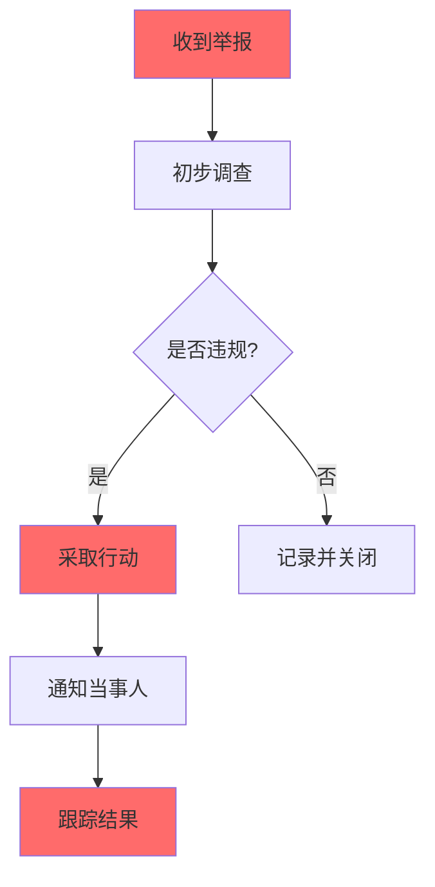

# 行为准则

## 我们的承诺

为了营造一个开放、包容、积极的社区环境，我们承诺让所有人都有愉快的参与体验，不论年龄、体型、残疾、性别认同与表达、经验水平、教育程度、社会经济地位、国籍、个人外貌、种族、宗教信仰或性取向如何。

## 我们的标准

### 积极的行为

- 使用热情、欢迎的语言
- 尊重不同的观点和经验
- 优雅地接受建设性批评
- 关注对社区最有利的事情
- 对其他社区成员表示同理心

### 不可接受的行为

- 使用带有性暗示的语言或图像
- 挑衅、侮辱或贬低他人的评论
- 个人或政治攻击
- 公开或私下骚扰
- 未经授权发布他人的隐私信息
- 其他不道德或不专业的行为

## 我们的责任

社区管理员负责解释和执行本行为准则，并有权决定不当行为的内容是否违反本准则。

## 适用范围

本行为准则适用于以下场景：
- 所有社区空间
- 个人代表社区时
- 公共场合

## 执行方式

### 报告

如果您发现有人违反行为准则，请通过以下方式报告：

1. **GitHub Issues**：创建新的 Issue 并标记为 `conduct`
2. **电子邮件**：contact@example.com
3. **直接联系**：社区管理员

### 处理流程

### 处理措施

根据违规的严重程度，可能采取以下措施：

| 级别 | 措施 | 说明 |
|------|------|------|
| 轻微 | 口头警告 | 提醒注意 |
| 中等 | 书面警告 | 正式提醒 |
| 严重 | 临时禁言 | 1-7 天 |
| 极严重 | 永久除名 | 永久禁止参与 |

## 申诉

如果对处理结果不满意，可以在收到处理决定后 7 天内提出申诉。

## 指导原则

### 社区管理员的职责

- 公平、一致地执行行为准则
- 保护举报人的隐私
- 及时处理问题
- 保持专业和克制

### 期望社区成员

- 遵守行为准则
- 尊重他人
- 建设性参与
- 报告问题

## 反馈

我们欢迎您对本行为准则的反馈。请通过以下方式提出建议：

- GitHub Issues
- 电子邮件：feedback@example.com

## 版本历史

| 版本 | 日期 | 说明 |
|------|------|------|
| 1.0 | {date} | 初始版本 |

---

## 联系信息

- 社区管理员：admin@example.com
- 紧急联系：emergency@example.com

---

本行为准则基于 [Contributor Covenant](https://www.contributor-covenant.org) 版本 2.0 改编。

> 让我们共同营造一个友好、包容的社区环境！🌟
