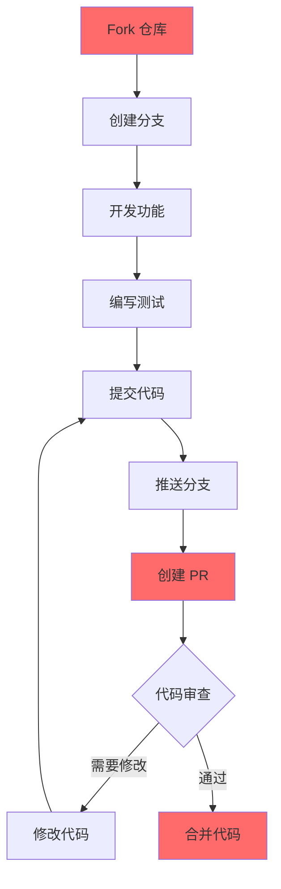

# 贡献指南

感谢您对本项目的关注！本指南将帮助您了解如何为本项目做出贡献。

## 目录

- [行为准则](#行为准则)
- [如何贡献](#如何贡献)
- [开发环境](#开发环境)
- [开发流程](#开发流程)
- [代码规范](#代码规范)
- [提交规范](#提交规范)
- [PR 流程](#pr-流程)
- [问题反馈](#问题反馈)

---

## 行为准则

请阅读并遵守我们的 [行为准则](./CODE_OF_CONDUCT.md)。我们希望营造一个友好、包容的社区环境。

---

## 如何贡献

### 报告 Bug

1. 在 GitHub Issues 中搜索是否已存在相同问题
2. 如果没有，请创建新的 Issue
3. 使用 Bug 报告模板，提供以下信息：
   - 清晰的标题和描述
   - 复现步骤（最好提供最小复现代码）
   - 预期行为和实际行为
   - 环境信息（操作系统、版本等）
   - 截图或日志（如适用）

### 提出新功能

1. 在 GitHub Issues 中搜索是否已有人提出类似功能
2. 创建新的 Issue，选择 Feature 模板
3. 清晰描述：
   - 功能描述
   - 使用场景
   - 可能的实现方案
   - 是否有替代方案

### 贡献代码

1. Fork 本仓库
2. 创建特性分支：`git checkout -b feature/your-feature`
3. 进行开发并提交更改
4. 推送到远程：`git push origin feature/your-feature`
5. 创建 Pull Request

---

## 开发环境

### 前置要求

- Git
- Node.js >= 18.0.0
- npm >= 9.0.0 或 yarn >= 1.22.0

### 本地开发

```bash
# 1. Fork 并克隆仓库
git clone https://github.com/{your-username}/{project-name}.git
cd {project-name}

# 2. 创建分支
git checkout -b feature/your-feature

# 3. 安装依赖
npm install

# 4. 配置环境变量
cp .env.example .env
# 编辑 .env 文件

# 5. 启动开发服务器
npm run dev
```

### 运行测试

```bash
# 运行所有测试
npm test

# 监听模式运行测试
npm run test:watch

# 生成覆盖率报告
npm run test:coverage
```

---

## 开发流程



---

## 代码规范

### 语言规范

- **JavaScript/TypeScript**: 遵循 ESLint 配置
- **Python**: 遵循 PEP 8
- **其他**: 遵循社区最佳实践

### 代码格式

```bash
# 格式化代码
npm run lint
# 或
npm run format
```

### 命名规范

**变量和函数**：
- 使用 camelCase
- 命名要有意义
- 避免缩写（除非是公认的缩写）

```javascript
// ✅ 正确
const userName = 'John';
function calculateTotal() {}

// ❌ 错误
const n = 'John';
function calc() {}
```

**常量**：
- 使用 UPPER_SNAKE_CASE
- 放在文件顶部或专门的常量文件中

```javascript
// ✅ 正确
const MAX_RETRY_COUNT = 3;
const API_BASE_URL = 'https://api.example.com';
```

**类和组件**：
- 使用 PascalCase

```javascript
// ✅ 正确
class UserService {}
function UserCard() {}
```

### 注释规范

**必要注释**：
- 复杂的业务逻辑
- 性能优化的代码
- 临时解决方案（TODO）

**JSDoc 格式**：

```javascript
/**
 * 获取用户信息
 * @param {number} userId - 用户 ID
 * @returns {Promise<User>} 用户信息
 * @throws {Error} 用户不存在
 */
async function getUser(userId) {
  // ...
}
```

---

## 提交规范

### 提交信息格式

```
<type>(<scope>): <subject>

<body>

<footer>
```

### Type 类型

| 类型 | 说明 |
|------|------|
| feat | 新功能 |
| fix | Bug 修复 |
| docs | 文档更新 |
| style | 代码格式（不影响功能）|
| refactor | 重构（既不是新功能也不是修复）|
| test | 测试相关 |
| chore | 构建过程或辅助工具变动 |

### Scope 范围

- 模块名：user, order, product
- 功能名：login, upload, export

### 示例

```bash
# 功能
git commit -m "feat(user): 添加用户注册功能"

# 修复
git commit -m "fix(order): 修复订单支付失败的问题"

# 文档
git commit -m "docs: 更新 README 安装说明"

# 重构
git commit -m "refactor(api): 重构用户接口响应格式"
```

---

## PR 流程

### 创建 PR 前

1. 确保代码符合规范：`npm run lint`
2. 确保所有测试通过：`npm test`
3. 确保分支是最新的：rebase 或 merge main 分支
4. 更新相关文档（如需要）

### PR 标题格式

```
<type>(<scope>): <description>
```

### PR 描述模板

```markdown
## 描述
简要说明这个 PR 做了什么

## 变更类型
- [ ] 新功能 (feat)
- [ ] Bug 修复 (fix)
- [ ] 破坏性变更
- [ ] 文档更新

## 测试
- [ ] 单元测试通过
- [ ] E2E 测试通过
- [ ] 手动测试通过

## 截图（如适用）


## 相关 Issue
Closes #123
```

### PR 审查要点

- 代码是否符合规范
- 是否有测试覆盖
- 文档是否更新
- 是否有性能问题
- 是否有安全问题

---

## 问题反馈

### Issue 类型

- 🐛 Bug：程序错误
- 💡 Feature：功能请求
- 📝 Documentation：文档改进
- ❓ Question：问题咨询
- 🚧 Performance：性能优化
- 🔒 Security：安全问题

### Issue 模板

**Bug 报告**：
```markdown
## Bug 描述
清晰描述问题

## 复现步骤
1. 进入页面
2. 点击按钮
3. 出现错误

## 预期行为
正常显示

## 实际行为
显示错误

## 环境
- OS:
- Version:
- Browser:
```

**功能请求**：
```markdown
## 功能描述
清晰描述你想要的功能

## 使用场景
描述你的使用场景

## 可能的实现方案
描述你可能的实现思路
```

---

## 联系方式

- 如果有问题，可以在 GitHub Issues 中提问
- 欢迎加入我们的社区讨论

---

感谢您的贡献！🎉
