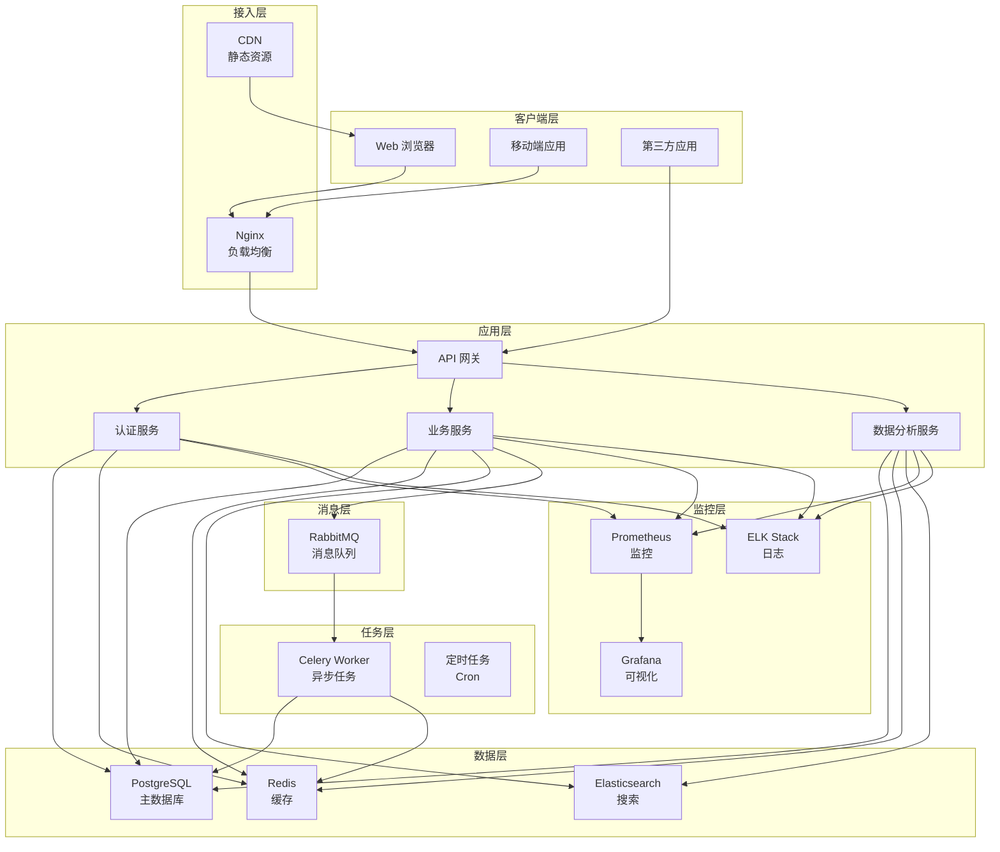
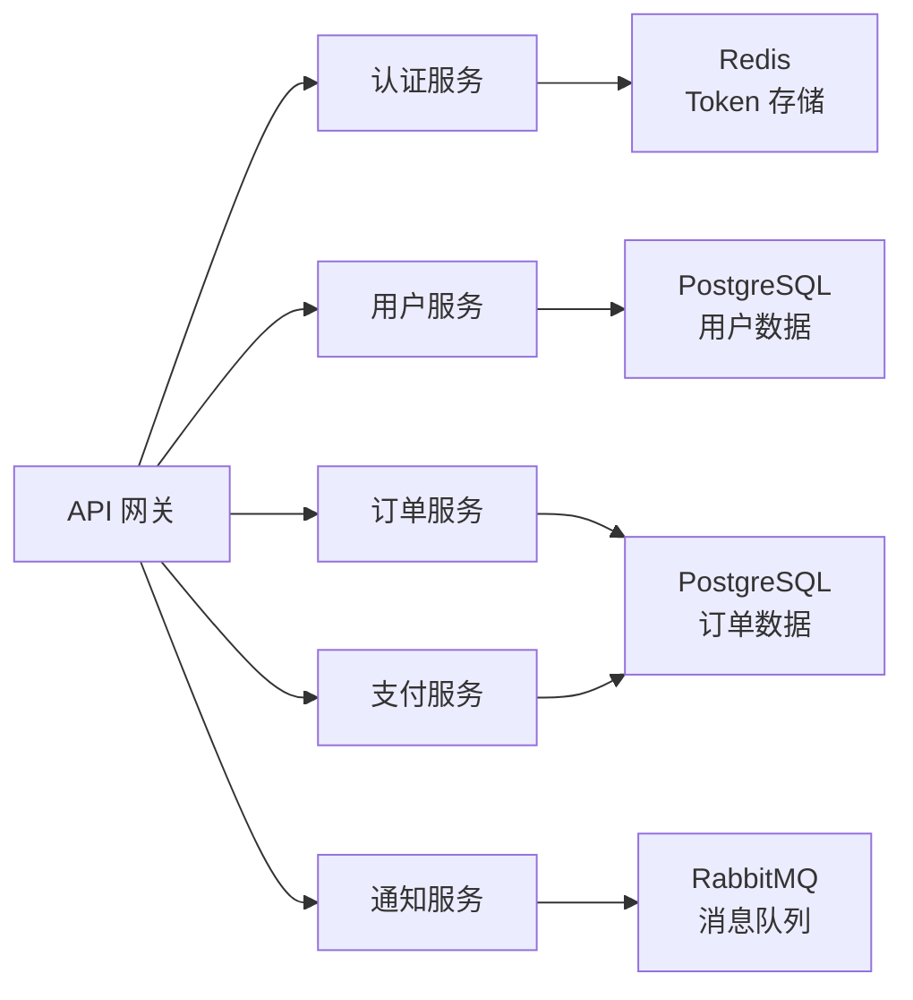
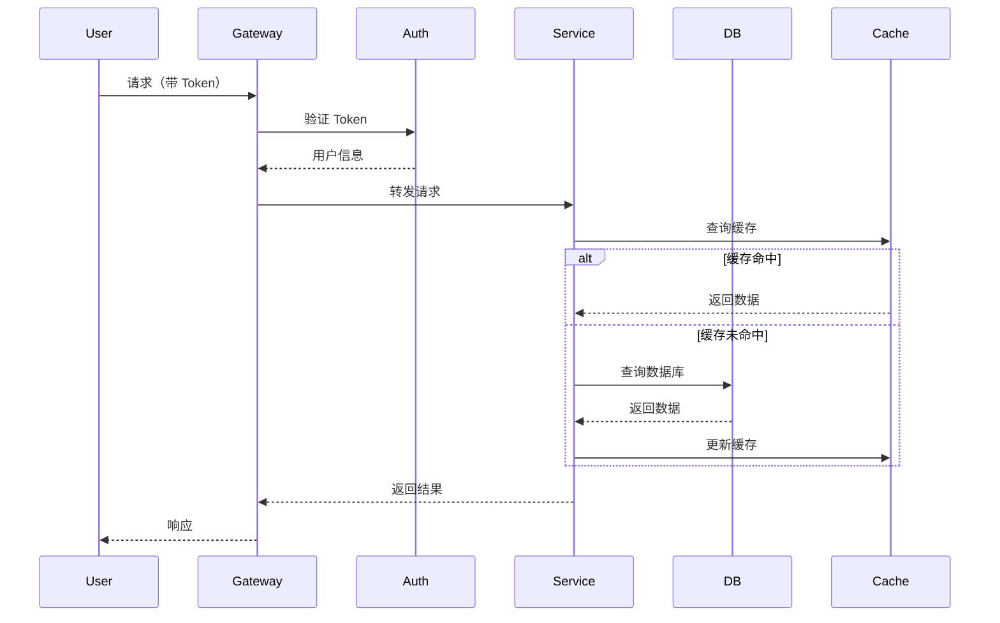
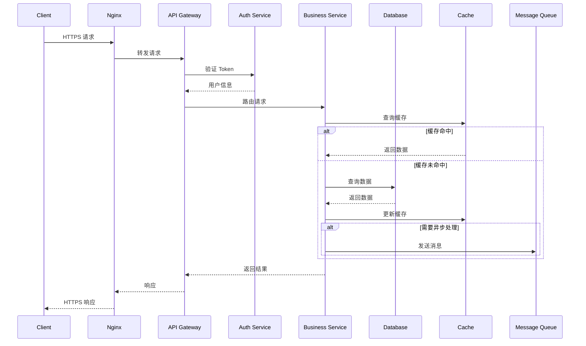
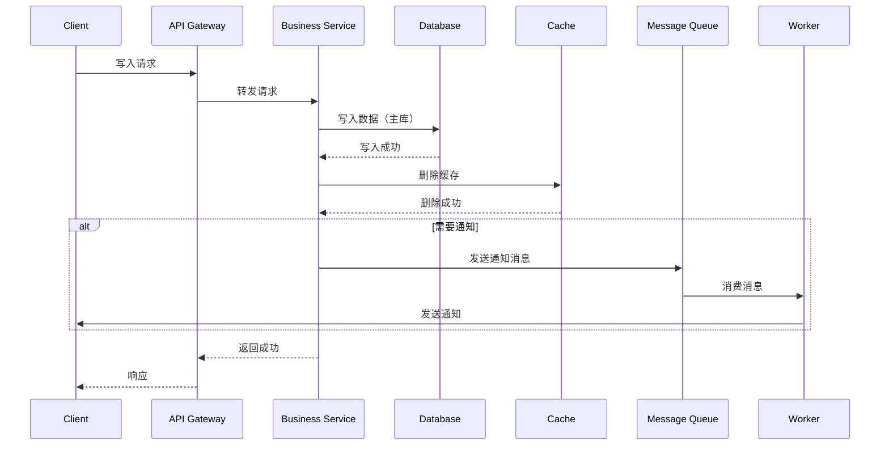
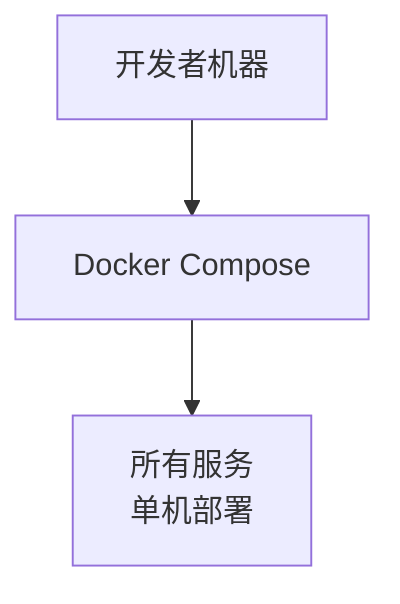
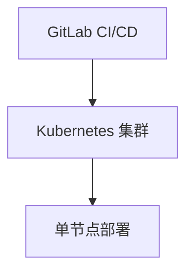
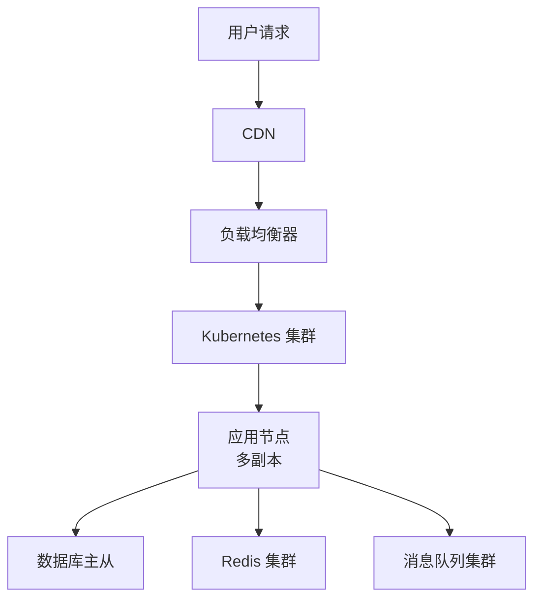

# 系统架构

## 概述

本文档描述系统的整体架构、技术选型、设计决策和扩展性考虑。

---

## 技术栈

### 后端技术栈

| 技术 | 版本 | 用途 |
|------|------|------|
| Python | 3.11+ | 编程语言 |
| Django | 4.2 | Web 框架 |
| Django REST Framework | 3.14+ | API 框架 |
| PostgreSQL | 15 | 关系型数据库 |
| Redis | 7.0 | 缓存和消息队列 |
| Celery | 5.3+ | 异步任务处理 |
| Nginx | 1.24+ | Web 服务器和反向代理 |
| Gunicorn | 21.2+ | WSGI 服务器 |

### 前端技术栈

| 技术 | 版本 | 用途 |
|------|------|------|
| React | 18.2+ | 前端框架 |
| TypeScript | 5.0+ | 类型安全的 JavaScript |
| Redux Toolkit | 1.9+ | 状态管理 |
| React Router | 6.0+ | 路由管理 |
| Ant Design | 5.0+ | UI 组件库 |
| Vite | 4.0+ | 构建工具 |
| ECharts | 5.4+ | 数据可视化 |

### DevOps 工具

| 工具 | 版本 | 用途 |
|------|------|------|
| Docker | 24.0+ | 容器化 |
| Kubernetes | 1.27+ | 容器编排 |
| GitLab CI/CD | Latest | 持续集成和部署 |
| Prometheus | 2.45+ | 监控和告警 |
| Grafana | 10.0+ | 可视化监控 |
| ELK Stack | 8.0+ | 日志管理 |

---

## 系统架构

### 整体架构图



### 微服务架构



---

## 核心模块

### 模块划分

| 模块 | 职责 | 技术栈 |
|------|------|--------|
| **认证模块** | 用户认证和授权 | JWT + Redis + OAuth 2.0 |
| **用户模块** | 用户管理、角色权限 | Django REST Framework |
| **业务模块** | 核心业务逻辑 | Django + Celery |
| **数据模块** | 数据存储和查询 | PostgreSQL + Redis + Elasticsearch |
| **通知模块** | 消息通知、邮件推送 | RabbitMQ + SMTP |
| **分析模块** | 数据分析和报表 | Pandas + ECharts |

### 模块交互



---

## 数据流动

### 请求数据流



### 数据写入流



---

## 设计决策

### 1. 为什么选择 Django？

**优点**：
- 成熟稳定，社区活跃
- 内置管理后台，快速开发
- 完善的 ORM 系统
- 丰富的第三方库
- 优秀的文档

**缺点**：
- 相比 FastAPI，性能稍低
- 同步框架，不适合高并发

**决策**：选择 Django，因为：
1. 项目需求重视开发效率
2. 内置功能减少开发成本
3. 生态系统完善，易于集成

**替代方案**：FastAPI（性能更好，但需要自行实现更多功能）

### 2. 为什么使用 PostgreSQL？

**优点**：
- 支持复杂查询和窗口函数
- 优秀的并发性能（MVCC）
- 丰富的数据类型（JSONB、数组、几何类型）
- 完整的 ACID 事务支持
- 强大的扩展能力

**决策**：选择 PostgreSQL，因为：
1. 需要 JSONB 存储复杂数据
2. 需要复杂查询和聚合
3. 事务支持对业务至关重要

**替代方案**：MySQL（更广泛使用，但 JSON 支持较弱）

### 3. 为什么使用 Redis？

**优点**：
- 极高的读写性能
- 丰富的数据结构
- 持久化支持
- 支持主从复制和集群

**决策**：选择 Redis，因为：
1. 缓存热点数据，提升性能
2. 存储会话和 Token
3. 实现分布式锁
4. 作为消息队列（轻量级）

**替代方案**：Memcached（更简单，但功能较少）

### 4. 为什么使用 Celery？

**优点**：
- 成熟的异步任务框架
- 支持多种消息代理（RabbitMQ、Redis）
- 支持定时任务（Cron）
- 支持任务监控和重试

**决策**：选择 Celery，因为：
1. 需要异步处理耗时任务
2. 需要定时任务
3. 需要任务监控和重试

**替代方案**：Dramatiq（更轻量，但生态较小）

---

## 部署架构

### 开发环境



**配置**：
- 使用 Docker Compose 本地开发
- 所有服务在同一台机器
- 使用 SQLite 简化配置

### 测试环境



**配置**：
- 使用 Kubernetes 部署
- 单节点集群，节省资源
- 自动化测试和部署

### 生产环境



**配置**：
- CDN 加速静态资源
- 负载均衡器分发请求
- Kubernetes 集群部署
- 数据库主从复制
- Redis 集群
- 消息队列集群
- 自动扩缩容

---

## 扩展性设计

### 水平扩展

**策略**：
1. **无状态服务设计**
   - 服务不保存会话状态
   - 使用 Redis 存储会话
   - 支持水平扩展

2. **数据库读写分离**
   - 主库负责写操作
   - 从库负责读操作
   - 使用中间件实现读写分离

3. **缓存集群**
   - Redis 集群
   - 一致性哈希分布
   - 自动故障转移

### 垂直扩展

**策略**：
1. **数据库优化**
   - 添加合适的索引
   - 优化慢查询
   - 使用连接池

2. **代码优化**
   - 异步处理耗时任务
   - 批量操作减少数据库访问
   - 算法优化

3. **硬件升级**
   - 增加内存
   - 使用更快的磁盘（SSD）
   - 更快的 CPU

---

## 安全性

### 认证和授权

**实现方案**：
- JWT Token 认证
- OAuth 2.0 第三方登录
- RBAC 权限模型
- API 限流（令牌桶算法）

### 数据安全

**实现方案**：
- 数据库字段加密
- 传输加密（HTTPS）
- 敏感数据脱敏
- 定期数据备份

### 安全审计

**实现方案**：
- 操作日志记录（谁、何时、做了什么）
- 异常监控和告警
- 定期安全扫描
- 漏洞修复流程

---

## 性能优化

### 数据库优化

**策略**：
1. **索引优化**
   - 为常用查询字段添加索引
   - 使用复合索引
   - 定期分析和优化索引

2. **查询优化**
   - 使用 EXPLAIN 分析慢查询
   - 避免 SELECT *
   - 使用批量操作

3. **连接池管理**
   - 使用连接池
   - 合理配置连接数
   - 监控连接池使用情况

### 缓存策略

**策略**：
1. **多级缓存**
   - 应用缓存（本地缓存）
   - 分布式缓存（Redis）
   - CDN 缓存（静态资源）

2. **缓存模式**
   - Cache Aside：先更新数据库，再删除缓存
   - Read Through：缓存代理负责加载
   - Write Through：同步写入缓存和数据库

3. **缓存更新**
   - 设置合理的过期时间
   - 使用缓存预热
   - 监控缓存命中率

### 代码优化

**策略**：
1. **异步处理**
   - 使用 Celery 异步处理耗时任务
   - 使用异步 I/O（FastAPI）
   - 使用消息队列解耦

2. **批量操作**
   - 批量插入/更新
   - 批量查询
   - 使用事务

3. **算法优化**
   - 选择合适的算法
   - 避免嵌套循环
   - 使用生成器减少内存占用

---

## 监控和日志

### 监控

**工具**：
- **Prometheus**：指标收集和存储
- **Grafana**：可视化仪表盘
- **Alertmanager**：告警管理

**监控指标**：
- 应用性能（响应时间、吞吐量）
- 系统资源（CPU、内存、磁盘、网络）
- 业务指标（用户数、订单数、错误率）

### 日志

**工具**：
- **Elasticsearch**：日志存储和搜索
- **Logstash**：日志收集和处理
- **Kibana**：日志可视化

**日志级别**：
- DEBUG：调试信息
- INFO：一般信息
- WARNING：警告信息
- ERROR：错误信息
- CRITICAL：严重错误

**日志格式**：
```json
{
  "timestamp": "2024-01-15T10:00:00Z",
  "level": "INFO",
  "service": "user-service",
  "message": "User login successful",
  "user_id": 123,
  "ip": "192.168.1.1",
  "request_id": "abc123"
}
```

---

## 参考资料

- [Django 官方文档](https://docs.djangoproject.com/)
- [React 官方文档](https://react.dev/)
- [PostgreSQL 官方文档](https://www.postgresql.org/docs/)
- [Redis 官方文档](https://redis.io/documentation)
- [Kubernetes 官方文档](https://kubernetes.io/docs/)
- [Prometheus 官方文档](https://prometheus.io/docs/)
