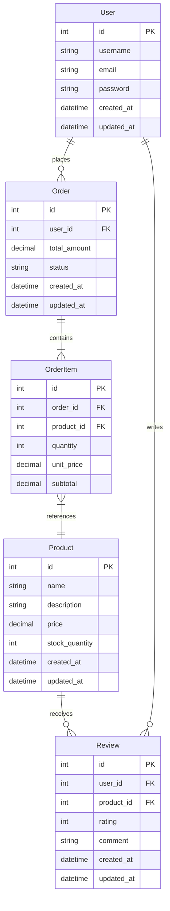

# 数据库 ER 图

## 概述

本文档描述系统的数据库实体关系（ER）图。

---

## ER 图



---

## 实体说明

### 1. User（用户表）

| 字段名 | 类型 | 约束 | 说明 |
|--------|------|------|------|
| id | int | PK, AUTO_INCREMENT | 用户 ID |
| username | varchar(50) | NOT NULL, UNIQUE | 用户名 |
| email | varchar(100) | NOT NULL, UNIQUE | 邮箱 |
| password | varchar(255) | NOT NULL | 密码（加密） |
| created_at | datetime | NOT NULL | 创建时间 |
| updated_at | datetime | NOT NULL | 更新时间 |

**索引**：
- PRIMARY KEY (id)
- UNIQUE KEY (username)
- UNIQUE KEY (email)
- INDEX (created_at)

**说明**：
- 存储用户基本信息
- 密码使用 bcrypt 加密存储
- 邮箱用于登录和通知

---

### 2. Order（订单表）

| 字段名 | 类型 | 约束 | 说明 |
|--------|------|------|------|
| id | int | PK, AUTO_INCREMENT | 订单 ID |
| user_id | int | FK, NOT NULL | 用户 ID |
| total_amount | decimal(10,2) | NOT NULL | 订单总金额 |
| status | enum | NOT NULL | 订单状态（pending/paid/shipped/completed/cancelled） |
| created_at | datetime | NOT NULL | 创建时间 |
| updated_at | datetime | NOT NULL | 更新时间 |

**索引**：
- PRIMARY KEY (id)
- FOREIGN KEY (user_id) REFERENCES User(id)
- INDEX (user_id)
- INDEX (status)
- INDEX (created_at)

**说明**：
- 存储订单基本信息
- 关联用户表
- 支持多种订单状态

---

### 3. OrderItem（订单明细表）

| 字段名 | 类型 | 约束 | 说明 |
|--------|------|------|------|
| id | int | PK, AUTO_INCREMENT | 订单明细 ID |
| order_id | int | FK, NOT NULL | 订单 ID |
| product_id | int | FK, NOT NULL | 商品 ID |
| quantity | int | NOT NULL | 数量 |
| unit_price | decimal(10,2) | NOT NULL | 单价 |
| subtotal | decimal(10,2) | NOT NULL | 小计 |

**索引**：
- PRIMARY KEY (id)
- FOREIGN KEY (order_id) REFERENCES Order(id)
- FOREIGN KEY (product_id) REFERENCES Product(id)
- INDEX (order_id)
- INDEX (product_id)

**说明**：
- 存储订单商品明细
- 关联订单和商品表
- 支持订单拆分和合并

---

### 4. Product（商品表）

| 字段名 | 类型 | 约束 | 说明 |
|--------|------|------|------|
| id | int | PK, AUTO_INCREMENT | 商品 ID |
| name | varchar(200) | NOT NULL | 商品名称 |
| description | text | NULL | 商品描述 |
| price | decimal(10,2) | NOT NULL | 商品价格 |
| stock_quantity | int | NOT NULL | 库存数量 |
| created_at | datetime | NOT NULL | 创建时间 |
| updated_at | datetime | NOT NULL | 更新时间 |

**索引**：
- PRIMARY KEY (id)
- INDEX (name)
- INDEX (price)
- INDEX (created_at)

**说明**：
- 存储商品基本信息
- 支持库存管理
- 支持价格调整

---

### 5. Review（评价表）

| 字段名 | 类型 | 约束 | 说明 |
|--------|------|------|------|
| id | int | PK, AUTO_INCREMENT | 评价 ID |
| user_id | int | FK, NOT NULL | 用户 ID |
| product_id | int | FK, NOT NULL | 商品 ID |
| rating | int | NOT NULL, CHECK(1-5) | 评分（1-5星） |
| comment | text | NULL | 评价内容 |
| created_at | datetime | NOT NULL | 创建时间 |
| updated_at | datetime | NOT NULL | 更新时间 |

**索引**：
- PRIMARY KEY (id)
- FOREIGN KEY (user_id) REFERENCES User(id)
- FOREIGN KEY (product_id) REFERENCES Product(id)
- INDEX (user_id)
- INDEX (product_id)
- INDEX (rating)

**说明**：
- 存储商品评价
- 关联用户和商品表
- 支持 1-5 星评分

---

## 关系说明

### 1. User - Order（一对多）

**关系类型**：一对多（1:N）
**说明**：一个用户可以下多个订单

**外键约束**：
- Order.user_id → User.id
- ON DELETE CASCADE（删除用户时级联删除订单）
- ON UPDATE CASCADE（更新用户 ID 时级联更新）

---

### 2. Order - OrderItem（一对多）

**关系类型**：一对多（1:N）
**说明**：一个订单包含多个订单明细

**外键约束**：
- OrderItem.order_id → Order.id
- ON DELETE CASCADE（删除订单时级联删除订单明细）
- ON UPDATE CASCADE（更新订单 ID 时级联更新）

---

### 3. OrderItem - Product（多对一）

**关系类型**：多对一（N:1）
**说明**：多个订单明细可以对应同一个商品

**外键约束**：
- OrderItem.product_id → Product.id
- ON DELETE RESTRICT（删除商品时限制删除，需先删除关联的订单明细）
- ON UPDATE CASCADE（更新商品 ID 时级联更新）

---

### 4. User - Review（一对多）

**关系类型**：一对多（1:N）
**说明**：一个用户可以写多个评价

**外键约束**：
- Review.user_id → User.id
- ON DELETE CASCADE（删除用户时级联删除评价）
- ON UPDATE CASCADE（更新用户 ID 时级联更新）

---

### 5. Product - Review（一对多）

**关系类型**：一对多（1:N）
**说明**：一个商品可以收到多个评价

**外键约束**：
- Review.product_id → Product.id
- ON DELETE CASCADE（删除商品时级联删除评价）
- ON UPDATE CASCADE（更新商品 ID 时级联更新）

---

## 数据字典

### 表汇总

| 表名 | 说明 | 记录数 | 索引数 |
|------|------|--------|--------|
| User | 用户表 | ~100万 | 4 |
| Order | 订单表 | ~500万 | 4 |
| OrderItem | 订单明细表 | ~1500万 | 3 |
| Product | 商品表 | ~10万 | 4 |
| Review | 评价表 | ~300万 | 4 |

### 字段汇总

| 字段名 | 类型 | 是否必填 | 默认值 | 说明 |
|--------|------|----------|--------|------|
| id | int | 是 | AUTO_INCREMENT | 主键 ID |
| created_at | datetime | 是 | CURRENT_TIMESTAMP | 创建时间 |
| updated_at | datetime | 是 | CURRENT_TIMESTAMP | 更新时间 |

---

## 性能优化

### 索引策略

**主键索引**：所有表都使用自增整数主键

**唯一索引**：
- User.username
- User.email

**普通索引**：
- 外键字段
- 查询频繁的字段
- 排序字段

### 分区策略

**Order 表**：按 created_at 时间字段分区
- 每月一个分区
- 便于历史数据归档和查询

**Review 表**：按 created_at 时间字段分区
- 每月一个分区
- 便于历史数据归档和查询

### 查询优化

**常用查询**：
```sql
-- 查询用户订单
SELECT * FROM Order WHERE user_id = ? ORDER BY created_at DESC;

-- 查询订单明细
SELECT * FROM OrderItem WHERE order_id = ?;

-- 查询商品评价
SELECT * FROM Review WHERE product_id = ? ORDER BY created_at DESC;
```

**优化建议**：
- 使用覆盖索引
- 避免全表扫描
- 使用 JOIN 优化
- 使用缓存（Redis）

---

## 数据完整性

### 约束

**主键约束**：所有表都有主键

**外键约束**：确保数据一致性

**唯一约束**：User.username、User.email

**非空约束**：关键字段不允许为空

**检查约束**：Review.rating（1-5）

### 触发器

**自动更新 updated_at**：
```sql
CREATE TRIGGER update_updated_at
BEFORE UPDATE ON User
FOR EACH ROW
SET NEW.updated_at = CURRENT_TIMESTAMP;
```

**库存扣减**：
```sql
CREATE TRIGGER update_stock
AFTER INSERT ON OrderItem
FOR EACH ROW
UPDATE Product
SET stock_quantity = stock_quantity - NEW.quantity
WHERE id = NEW.product_id;
```

---

## 安全性

### 访问控制

**用户权限**：
- User 表：仅允许用户读写自己的数据
- Order 表：仅允许用户读写自己的订单
- Review 表：仅允许用户读写自己的评价

**管理员权限**：
- 所有表的读写权限

### 数据加密

**密码加密**：使用 bcrypt 加密

**敏感数据加密**：
- 使用 AES 加密
- 存储在应用层

---

## 参考资料

- [ER 图指南](../../guides/database/er-diagram-guide.md)
- [数据库设计最佳实践](https://www.postgresql.org/docs/current/ddl-constraints.html)
