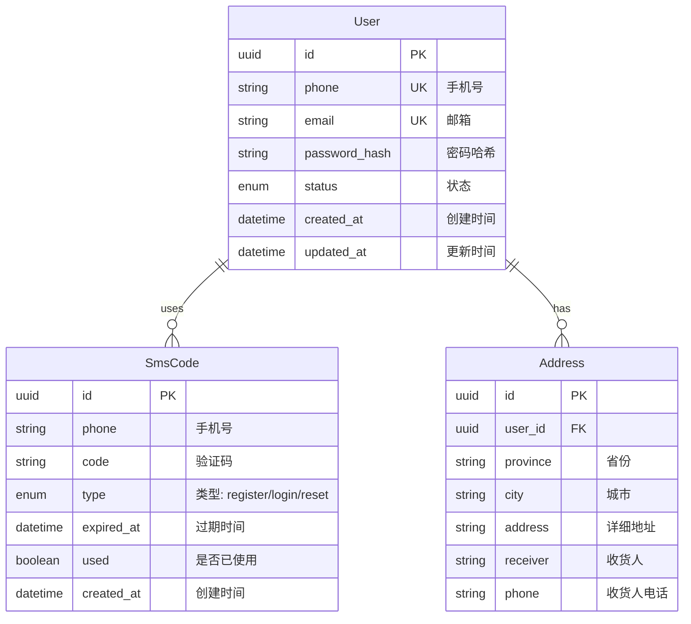
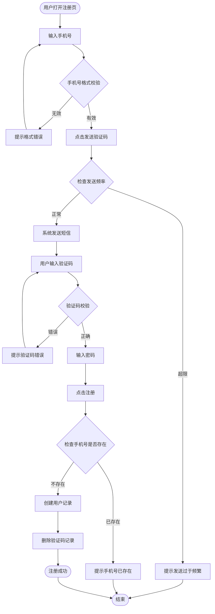
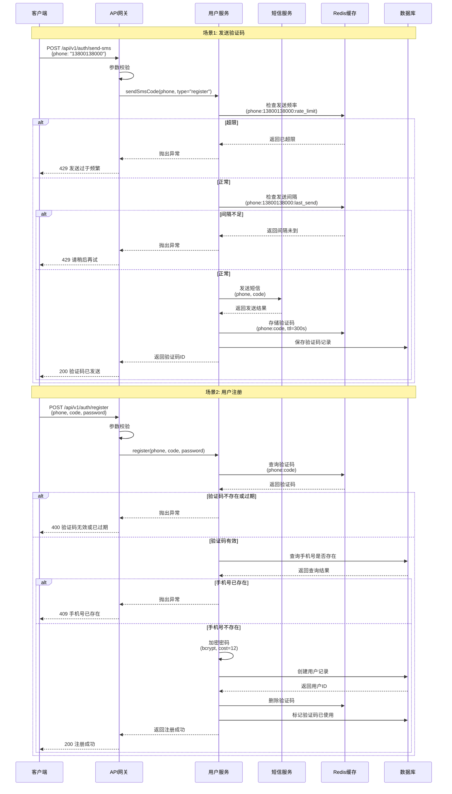
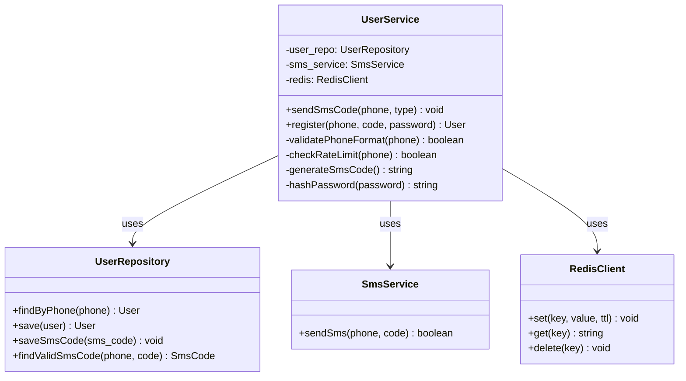
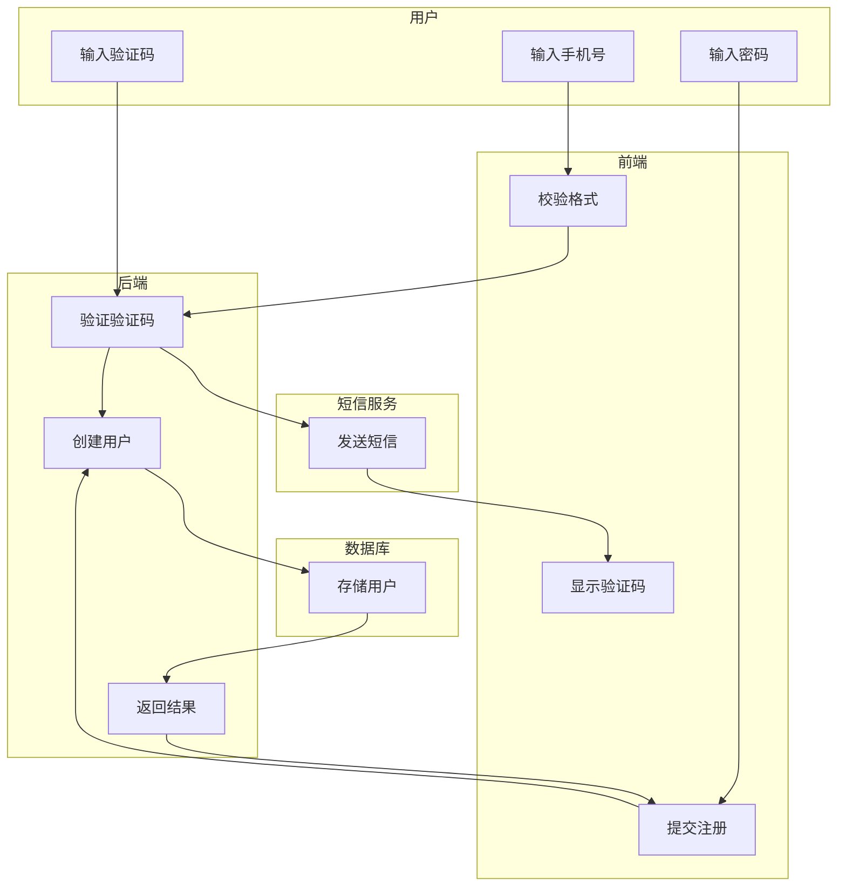

# 软件开发设计文档模板

## 版本信息
- **版本**：v1.0
- **作者**：[姓名]
- **创建时间**：2024-MM-DD
- **最后更新**：2024-MM-DD
- **状态**：草稿 / 评审中 / 已评审 / 已废弃

---

## 目录
- [概要](#概要)
- [表结构设计](#表结构设计)
- [业务流程](#业务流程)
- [程序流程](#程序流程)
- [接口约定](#接口约定)
- [其他](#其他)
- [附注](#附注)
- [评审情况](#评审情况)
- [变更记录](#变更记录)

---

## 概要

### 背景
[描述为什么要做这个功能，解决了什么问题，业务背景是什么]

**示例**：
当前系统仅支持邮箱注册，用户反馈注册门槛较高。需要新增手机号注册方式，以降低用户注册成本，提升注册转化率。

### 目标
[明确希望达到的目标和指标]

**示例**：
- 支持手机号 + 验证码的注册方式
- 验证码有效期 5 分钟
- 同一手机号每天最多发送 5 次验证码
- 注册成功率 > 95%

### 方案概述
[简要描述采用的技术方案]

**示例**：
采用短信验证码 + 密码的方式实现手机号注册。验证码由第三方短信服务发送，有效期存储在 Redis 中，用户信息存储在 MySQL。

### 备选方案
1. **[方案 1 名称]**：[简要说明]
   - 优点：[优点 1]、[优点 2]
   - 缺点：[缺点 1]、[缺点 2]

2. **[方案 2 名称]**：[简要说明]
   - 优点：[优点 1]、[优点 2]
   - 缺点：[缺点 1]、[缺点 2]

**选择原因**：[为什么选择当前方案，对比说明]

**示例**：
1. **OAuth 第三方登录**：
   - 优点：用户体验好，无需输入密码
   - 缺点：需要接入第三方服务，开发周期较长

2. **邮箱 + 手机号双重注册**：
   - 优点：覆盖更多场景
   - 缺点：开发周期较长，维护成本高

选择当前方案的原因：实现简单、用户体验好、开发周期短（3 天）。

---

## 表结构设计

### ER 图



### 表结构

#### users 表

| 字段名 | 类型 | 约束 | 默认值 | 说明 | 索引 |
|--------|------|------|--------|------|------|
| id | uuid | PK | - | 用户ID（主键） | PRIMARY |
| phone | varchar(11) | UNIQUE | NULL | 手机号 | INDEX phone_idx |
| email | varchar(255) | UNIQUE | NULL | 邮箱 | INDEX email_idx |
| password_hash | varchar(255) | NOT NULL | - | 密码哈希（bcrypt） | - |
| status | enum('active','inactive','banned') | NOT NULL | 'active' | 用户状态 | - |
| created_at | datetime | NOT NULL | CURRENT_TIMESTAMP | 创建时间 | INDEX created_at_idx |
| updated_at | datetime | NOT NULL | CURRENT_TIMESTAMP | 更新时间 | - |

**索引设计**：
- PRIMARY KEY：id（UUID）
- UNIQUE INDEX：phone、email（用于唯一性校验）
- INDEX：created_at（用于按时间排序查询）

---

#### sms_codes 表

| 字段名 | 类型 | 约束 | 默认值 | 说明 | 索引 |
|--------|------|------|--------|------|------|
| id | uuid | PK | - | 验证码ID（主键） | PRIMARY |
| phone | varchar(11) | NOT NULL | - | 手机号 | INDEX phone_idx |
| code | varchar(6) | NOT NULL | - | 验证码 | - |
| type | enum('register','login','reset') | NOT NULL | - | 验证码类型 | INDEX type_idx |
| expired_at | datetime | NOT NULL | - | 过期时间 | INDEX expired_at_idx |
| used | boolean | NOT NULL | false | 是否已使用 | - |
| created_at | datetime | NOT NULL | CURRENT_TIMESTAMP | 创建时间 | - |

**索引设计**：
- PRIMARY KEY：id（UUID）
- INDEX：phone（用于查询同一手机号的验证码）
- INDEX：type（用于按类型查询）
- INDEX：expired_at（用于清理过期验证码）

---

## 业务流程

### 流程图



### 流程说明

1. **输入手机号**
   - 用户输入 11 位手机号
   - 系统校验手机号格式（正则：`^1[3-9]\d{9}$`）

2. **发送验证码**
   - 检查发送频率（同一手机号每天最多 5 次）
   - 检查发送间隔（同一手机号 60 秒内只能发送 1 次）
   - 调用短信服务发送验证码
   - 生成 6 位随机验证码
   - 存储验证码到数据库和 Redis（有效期 5 分钟）

3. **输入验证码**
   - 用户输入 6 位验证码
   - 系统校验验证码是否正确
   - 校验验证码是否过期

4. **输入密码**
   - 用户输入密码（8-20 位）
   - 系统校验密码强度（包含大小写字母、数字、特殊字符）

5. **提交注册**
   - 检查手机号是否已存在
   - 使用 bcrypt 加密密码（成本因子 12）
   - 创建用户记录
   - 删除验证码记录
   - 返回注册成功

---

## 程序流程

### 时序图



### 核心算法

#### 算法 1：密码强度校验

**输入**：密码字符串

**输出**：布尔值（true/false）

**伪代码**：
```
function validatePassword(password):
    // 1. 检查长度
    if length(password) < 8 or length(password) > 20:
        return false

    // 2. 检查是否包含大写字母
    if not containsUpperCase(password):
        return false

    // 3. 检查是否包含小写字母
    if not containsLowerCase(password):
        return false

    // 4. 检查是否包含数字
    if not containsDigit(password):
        return false

    // 5. 检查是否包含特殊字符
    if not containsSpecialChar(password):
        return false

    return true
```

**实现示例**（Python）：
```python
import re

def validate_password(password: str) -> bool:
    """
    校验密码强度
    
    要求：
    - 长度 8-20 位
    - 至少一个大写字母
    - 至少一个小写字母
    - 至少一个数字
    - 至少一个特殊字符
    """
    if len(password) < 8 or len(password) > 20:
        return False
    
    if not re.search(r'[A-Z]', password):
        return False
    
    if not re.search(r'[a-z]', password):
        return False
    
    if not re.search(r'\d', password):
        return False
    
    if not re.search(r'[!@#$%^&*(),.?":{}|<>]', password):
        return False
    
    return True
```

---

#### 算法 2：验证码生成

**输入**：无

**输出**：6 位数字验证码

**伪代码**：
```
function generateSmsCode():
    // 生成 6 位随机数字
    code = randomInt(100000, 999999)
    return code
```

**实现示例**（Python）：
```python
import random

def generate_sms_code() -> str:
    """
    生成 6 位随机验证码
    """
    return str(random.randint(100000, 999999))
```

---

### 类图



---

## 接口约定

### API 列表

| 接口名称 | 方法 | 路径 | 说明 |
|----------|------|------|------|
| 发送验证码 | POST | /api/v1/auth/send-sms | 发送短信验证码 |
| 用户注册 | POST | /api/v1/auth/register | 用户注册 |
| 验证码校验 | POST | /api/v1/auth/validate-code | 校验验证码有效性 |

---

### 详细接口文档

#### POST /api/v1/auth/send-sms

发送短信验证码。

**请求参数**：

| 参数名 | 类型 | 必填 | 说明 | 示例 |
|--------|------|------|------|------|
| phone | string | 是 | 手机号（11位） | "13800138000" |
| type | string | 否 | 验证码类型，默认 "register" | "register" |

**请求示例**：
```json
{
  "phone": "13800138000",
  "type": "register"
}
```

**响应格式**：

| 字段名 | 类型 | 说明 |
|--------|------|------|
| code | number | 响应码（200表示成功） |
| message | string | 响应消息 |
| data.code_id | string | 验证码ID（用于验证） |

**响应示例**（成功）：
```json
{
  "code": 200,
  "message": "验证码已发送",
  "data": {
    "code_id": "sms_code_123"
  }
}
```

**错误码**：

| 错误码 | 说明 | 处理建议 |
|--------|------|----------|
| 400 | 参数错误 | 检查手机号格式 |
| 429 | 发送过于频繁 | 稍后再试 |
| 500 | 短信服务异常 | 联系管理员 |

**错误响应示例**：
```json
{
  "code": 429,
  "message": "发送过于频繁，请稍后再试",
  "data": null
}
```

---

#### POST /api/v1/auth/register

用户注册。

**请求参数**：

| 参数名 | 类型 | 必填 | 说明 | 示例 |
|--------|------|------|------|------|
| phone | string | 是 | 手机号（11位） | "13800138000" |
| code | string | 是 | 验证码（6位） | "123456" |
| password | string | 是 | 密码（8-20位） | "Abc123!@#" |

**请求示例**：
```json
{
  "phone": "13800138000",
  "code": "123456",
  "password": "Abc123!@#"
}
```

**响应格式**：

| 字段名 | 类型 | 说明 |
|--------|------|------|
| code | number | 响应码（200表示成功） |
| message | string | 响应消息 |
| data.user_id | string | 用户ID |
| data.token | string | 登录Token |

**响应示例**（成功）：
```json
{
  "code": 200,
  "message": "注册成功",
  "data": {
    "user_id": "user_123",
    "token": "eyJhbGciOiJIUzI1NiIsInR5cCI6IkpXVCJ9..."
  }
}
```

**错误码**：

| 错误码 | 说明 | 处理建议 |
|--------|------|----------|
| 400 | 参数错误 | 检查参数格式 |
| 401 | 验证码无效或已过期 | 重新获取验证码 |
| 409 | 手机号已存在 | 直接登录 |
| 500 | 系统错误 | 联系管理员 |

**错误响应示例**：
```json
{
  "code": 409,
  "message": "手机号已存在",
  "data": null
}
```

---

## 其他

### 性能分析

| 指标 | 目标值 | 当前值 | 优化方案 |
|------|--------|--------|----------|
| 响应时间 | < 200ms | 150ms | 使用 Redis 缓存 |
| 并发数 | 1000 QPS | 800 QPS | 数据库连接池 |
| 数据库查询 | < 50ms | 30ms | 添加索引 |
| 短信发送成功率 | > 99% | 99.5% | 短信服务降级 |

**性能优化措施**：
1. 使用 Redis 缓存验证码，减少数据库查询
2. 数据库连接池配置：最大连接数 50
3. 手机号字段添加索引，提升查询速度
4. 短信服务降级：如果短信服务不可用，使用备用服务商

---

### 安全考虑

| 安全项 | 措施 | 说明 |
|--------|------|------|
| 密码加密 | bcrypt | 成本因子 12，加盐存储 |
| 验证码有效期 | 5 分钟 | 防止验证码被滥用 |
| 限流策略 | 同一 IP 每分钟 3 次 | 防止暴力破解 |
| SQL 注入防护 | 参数化查询 | 使用 ORM 框架 |
| HTTPS 加密 | 全站 HTTPS | 防止中间人攻击 |
| 敏感信息脱敏 | 日志不记录密码 | 保护用户隐私 |

**密码加密示例**（Python）：
```python
import bcrypt

def hash_password(password: str) -> str:
    """
    使用 bcrypt 加密密码
    
    cost=12: 计算成本，值越大越安全但越慢
    """
    salt = bcrypt.gensalt(rounds=12)
    hashed = bcrypt.hashpw(password.encode(), salt)
    return hashed.decode()

def verify_password(password: str, hashed: str) -> bool:
    """
    验证密码
    """
    return bcrypt.checkpw(password.encode(), hashed.encode())
```

---

### 边界情况

| 场景 | 处理方式 | 返回码 |
|------|----------|--------|
| 手机号格式错误 | 提示格式错误 | 400 |
| 验证码过期 | 提示验证码已过期 | 401 |
| 验证码错误 | 提示验证码错误（剩余尝试次数） | 401 |
| 验证码已使用 | 提示验证码已使用 | 401 |
| 手机号已存在 | 提示手机号已存在 | 409 |
| 密码强度不足 | 提示密码强度要求 | 400 |
| 发送超限 | 提示发送过于频繁 | 429 |
| 网络超时 | 重试 3 次，失败后返回错误 | 500 |
| 短信服务不可用 | 使用备用服务商或降级 | 500 |

---

### 泳道流程图



---

## 附注

### 参考资料

- [bcrypt 算法说明](https://en.wikipedia.org/wiki/Bcrypt)
- [短信服务 API 文档](https://sms-provider.com/docs)
- [RESTful API 设计指南](https://restfulapi.net/)

### 相关文档

- [用户认证系统设计](./user-auth-design.md)
- [数据库设计规范](./database-design-guidelines.md)
- [API 文档编写规范](./api-doc-guide.md)

### 技术术语

| 术语 | 说明 |
|------|------|
| bcrypt | 一种密码加密算法，安全性高 |
| Redis | 内存数据库，用于缓存 |
| QPS | 每秒查询数 |

---

## 评审情况

### 评审记录

| 轮次 | 时间 | 评审人员 | 意见 | 修改 |
|------|------|----------|------|------|
| 第一轮 | 2024-02-19 | 张三、李四、王五 | 1. 建议增加验证码有效期说明<br/>2. 建议考虑短信服务降级方案 | 已全部采纳 |
| 第二轮 | 2024-02-20 | 张三、李四 | 无 | - |

### 评审结论

**评审通过，可以开始开发**

- 时间：2024-02-20
- 结论：设计文档完整，方案可行，评审通过
- 下一步：开始编码实现

---

## 变更记录

| 版本 | 时间 | 变更内容 | 变更人 |
|------|------|----------|--------|
| v1.0 | 2024-02-19 | 初稿创建 | 张三 |
| v1.1 | 2024-02-20 | 新增短信服务降级方案 | 张三 |
| v1.2 | 2024-02-21 | 更新性能分析表格 | 李四 |

---

**最后更新**：2024-MM-DD
