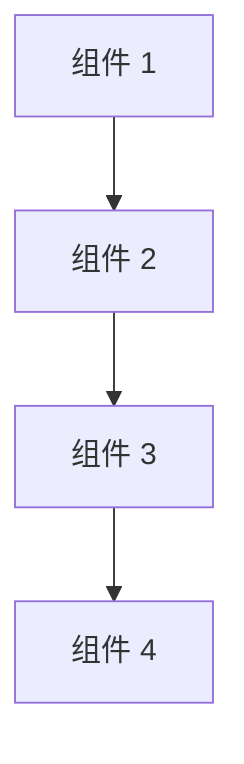

# [技术栈名称] 知识库

## 概述

**知识类型**：[库/架构/设计模式/数学公式/原理]

**最后更新**：[YYYY-MM-DD]

---

## 基本信息

### 名称
- **中文名称**：[中文名称]
- **英文名称**：[英文名称]
- **简称**：[简称]

### 简介
[简要描述该技术栈的核心功能和用途]

### 版本信息
- **最新版本**：[版本号]
- **发布日期**：[日期]
- **主要变化**：[主要更新内容]

### 官方资源
- **官方网站**：[URL]
- **文档地址**：[URL]
- **GitHub 仓库**：[URL]
- **许可证**：[许可证类型]

---

## 核心概念

### 核心特性
- [特性 1]
- [特性 2]
- [特性 3]

### 核心概念
| 概念 | 说明 | 应用场景 |
|------|------|----------|
| [概念 1] | [说明] | [场景] |
| [概念 2] | [说明] | [场景] |
| [概念 3] | [说明] | [场景] |

### 架构设计



**架构说明**：
- [组件 1]：[说明]
- [组件 2]：[说明]
- [组件 3]：[说明]
- [组件 4]：[说明]

---

## 安装与配置

### 安装方式
```bash
# 安装命令
[安装命令]
```

### 基础配置
```yaml
# 配置示例
[配置内容]
```

### 环境要求
- [要求 1]
- [要求 2]
- [要求 3]

---

## 核心用法

### 快速开始

**示例 1：基础用法**
```python
# 代码示例
[代码]
```

**示例 2：进阶用法**
```python
# 代码示例
[代码]
```

### 主要API

| API | 说明 | 参数 | 返回值 |
|-----|------|------|--------|
| [API 1] | [说明] | [参数] | [返回值] |
| [API 2] | [说明] | [参数] | [返回值] |
| [API 3] | [说明] | [参数] | [返回值] |

---

## 最佳实践

### 设计原则
1. [原则 1]
2. [原则 2]
3. [原则 3]

### 使用建议

✅ **推荐做法**：
- [建议 1]
- [建议 2]
- [建议 3]

❌ **避免做法**：
- [避免 1]
- [避免 2]
- [避免 3]

### 性能优化

| 优化点 | 方法 | 效果 |
|--------|------|------|
| [优化 1] | [方法] | [效果] |
| [优化 2] | [方法] | [效果] |

---

## 常见问题

### 问题 1：[问题描述]

**原因**：[原因说明]

**解决方案**：
```python
# 解决代码
[代码]
```

### 问题 2：[问题描述]

**原因**：[原因说明]

**解决方案**：
```python
# 解决代码
[代码]
```

---

## 高级主题

### 高级特性

**特性 1：[名称]**
- **描述**：[描述]
- **适用场景**：[场景]
- **实现方式**：[方式]
- **代码示例**：
```python
[代码]
```

**特性 2：[名称]**
- **描述**：[描述]
- **适用场景**：[场景]
- **实现方式**：[方式]
- **代码示例**：
```python
[代码]
```

### 扩展方式

**方式 1：插件**
[说明]

**方式 2：中间件**
[说明]

**方式 3：自定义**
[说明]

---

## 与其他技术对比

### 对比表格

| 特性 | [本技术] | [对比技术 1] | [对比技术 2] |
|------|----------|-------------|-------------|
| 性能 | [评价] | [评价] | [评价] |
| 易用性 | [评价] | [评价] | [评价] |
| 生态 | [评价] | [评价] | [评价] |
| 适用场景 | [场景] | [场景] | [场景] |

### 选择建议

- 适合使用 [本技术] 的场景：
  - [场景 1]
  - [场景 2]

- 适合使用其他技术的场景：
  - [场景 1] → [技术 1]
  - [场景 2] → [技术 2]

---

## 实际应用案例

### 案例 1：[案例名称]

**背景**：[背景说明]

**需求**：[需求说明]

**解决方案**：[方案说明]

**实现代码**：
```python
[代码]
```

**效果**：[效果说明]

### 案例 2：[案例名称]

**背景**：[背景说明]

**需求**：[需求说明]

**解决方案**：[方案说明]

**实现代码**：
```python
[代码]
```

**效果**：[效果说明]

---

## 陷阱与注意事项

### 常见陷阱

1. **陷阱 1**：[描述]
   - **现象**：[现象]
   - **原因**：[原因]
   - **避免方法**：[方法]

2. **陷阱 2**：[描述]
   - **现象**：[现象]
   - **原因**：[原因]
   - **避免方法**：[方法]

### 注意事项

⚠️ **注意 1**：[说明]
⚠️ **注意 2**：[说明]
⚠️ **注意 3**：[说明]

---

## 版本历史

### v[版本号]（[日期]）
- [变更 1]
- [变更 2]

### v[版本号]（[日期]）
- [变更 1]
- [变更 2]

---

## 参考资源

### 官方文档
- [文档 1]([URL])
- [文档 2]([URL])

### 教程与指南
- [教程 1]([URL])
- [教程 2]([URL])

### 社区资源
- [社区 1]([URL])
- [社区 2]([URL])

### 书籍推荐
- [书籍 1]([链接])
- [书籍 2]([链接])

---

## 搜索来源

本知识库通过以下搜索关键词获取：
1. [关键词 1]
2. [关键词 2]
3. [关键词 3]

搜索时间：[YYYY-MM-DD HH:MM:SS]

---

## 附录

### 术语表
| 术语 | 说明 |
|------|------|
| [术语 1] | [说明] |
| [术语 2] | [说明] |

### 相关技术
- [技术 1]：[描述]
- [技术 2]：[描述]
