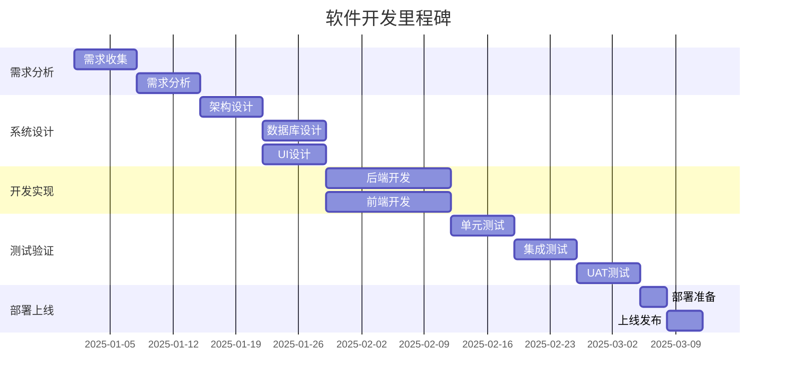

# 软件生命周期

## 概述

本文档描述软件从需求分析到系统维护的完整生命周期，包括各阶段的目标、活动和交付物。

---

## 生命周期总览

---

## 阶段一：需求分析

### 目标
明确系统需求，理解业务需求，制定项目计划。

### 活动
1. **需求收集**
   - 访谈用户
   - 分析业务流程
   - 收集用户故事

2. **需求分析**
   - 功能需求分析
   - 非功能需求分析
   - 技术可行性分析

3. **需求规格**
   - 编写需求文档
   - 用例设计
   - 数据模型设计

### 交付物
- [ ] 需求规格说明书（REQUIREMENT.md）
- [ ] 用例图（USECASE.md）
- [ ] 数据模型（ER图）

### 时间周期
- 1-2 周

---

## 阶段二：系统设计

### 目标
设计系统架构、数据库、接口，为开发提供技术方案。

### 活动
1. **架构设计**
   - 系统分层设计
   - 技术选型
   - 部署架构设计

2. **数据库设计**
   - ER 图设计
   - 表结构设计
   - 索引优化设计

3. **接口设计**
   - REST API 设计
   - 数据格式定义
   - 接口文档编写

4. **UI/UX 设计**
   - 界面原型设计
   - 交互流程设计
   - 视觉设计

### 交付物
- [ ] 架构设计文档（ARCHITECTURE.md）
- [ ] 数据库 ER 图（ER_DIAGRAM.md）
- [ ] API 接口文档（API.md）
- [ ] UI/UX 原型

### 时间周期
- 2-3 周

---

## 阶段三：开发实现

### 目标
根据设计文档开发系统功能，完成代码实现。

### 活动
1. **环境搭建**
   - 开发环境配置
   - CI/CD 环境搭建
   - 版本控制初始化

2. **后端开发**
   - 数据库实现
   - 业务逻辑实现
   - 接口实现

3. **前端开发**
   - 页面实现
   - 组件开发
   - 交互实现

4. **代码审查**
   - 代码规范检查
   - 代码评审
   - 重构优化

### 交付物
- [ ] 源代码（Git 仓库）
- [ ] API 接口（可测试）
- [ ] 单元测试代码

### 时间周期
- 4-6 周

---

## 阶段四：测试验证

### 目标
验证系统功能、性能、安全性，确保系统质量。

### 活动
1. **单元测试**
   - 编写单元测试
   - 覆盖率测试
   - 测试报告生成

2. **集成测试**
   - 接口集成测试
   - 系统集成测试
   - 数据流测试

3. **系统测试**
   - 功能测试
   - 性能测试
   - 安全测试
   - 兼容性测试

4. **用户验收测试（UAT）**
   - 用户场景测试
   - 验收标准确认
   - 问题修复

### 交付物
- [ ] 测试计划（TEST_PLAN.md）
- [ ] 测试用例
- [ ] 测试报告（TEST_REPORT.md）

### 时间周期
- 2-3 周

---

## 阶段五：部署上线

### 目标
将系统部署到生产环境，提供正式服务。

### 活动
1. **部署准备**
   - 生产环境搭建
   - 数据库迁移
   - 配置文件准备

2. **部署执行**
   - 代码部署
   - 数据迁移
   - 服务启动

3. **部署验证**
   - 冒烟测试
   - 功能验证
   - 性能验证

4. **发布通知**
   - 用户通知
   - 运维交接
   - 文档归档

### 交付物
- [ ] 部署文档（DEPLOY.md）
- [ ] 运维手册（OPS.md）
- [ ] 用户手册（USER.md）

### 时间周期
- 1 周

---

## 阶段六：运维监控

### 目标
监控系统运行状态，及时发现和解决问题。

### 活动
1. **监控配置**
   - 服务监控
   - 性能监控
   - 日志监控
   - 告警配置

2. **问题排查**
   - 日志分析
   - 性能分析
   - 故障诊断

3. **备份恢复**
   - 数据备份
   - 灾难恢复演练
   - 恢复测试

### 交付物
- [ ] 监控大盘
- [ ] 告警规则
- [ ] 备份策略

### 时间周期
- 持续进行

---

## 阶段七：维护更新

### 目标
持续优化系统，修复问题，添加新功能。

### 活动
1. **问题修复**
   - Bug 修复
   - 补丁发布
   - 紧急修复

2. **功能迭代**
   - 新需求分析
   - 新功能开发
   - 新功能测试

3. **性能优化**
   - 性能分析
   - 代码优化
   - 架构优化

4. **技术升级**
   - 依赖升级
   - 架构升级
   - 技术栈升级

### 交付物
- [ ] 更新日志（CHANGELOG.md）
- [ ] 版本发布说明
- [ ] 技术债务清单

### 时间周期
- 持续进行

---

## 阶段八：系统退役

### 目标
安全、完整地退役系统，保障数据和服务的迁移。

### 活动
1. **退役评估**
   - 退役原因分析
   - 影响评估
   - 迁移计划

2. **数据迁移**
   - 数据备份
   - 数据迁移
   - 数据验证

3. **服务迁移**
   - 服务迁移
   - DNS 切换
   - 流量切换

4. **资源清理**
   - 服务器下线
   - 数据库清理
   - 账号权限回收

### 交付物
- [ ] 退役计划（RETIREMENT.md）
- [ ] 数据迁移报告
- [ ] 退役报告

### 时间周期
- 2-4 周

---

## 里程碑规划

---

## 质量保障

### 代码质量
- 代码覆盖率 > 80%
- 代码审查率 100%
- 静态代码检查通过

### 测试质量
- 单元测试覆盖率 > 80%
- 集成测试覆盖率 > 70%
- UAT 通过率 100%

### 文档质量
- 技术文档完整性 100%
- 用户文档可用性 100%
- 运维文档准确性 100%

---

## 风险管理

### 需求风险
- 风险：需求变更频繁
- 缓解：需求冻结机制
- 应对：敏捷迭代开发

### 技术风险
- 风险：技术选型不当
- 缓解：技术调研和验证
- 应对：架构重构

### 进度风险
- 风险：开发进度延期
- 缓解：里程碑管理
- 应对：资源调配

### 质量风险
- 风险：测试不充分
- 缓解：自动化测试
- 应对：回归测试

---

## 参考资料

- [软件生命周期指南](../../guides/lifecycle/lifecycle-guide.md)
- [敏捷开发实践](https://www.agilealliance.org/)
- [DevOps 最佳实践](https://aws.amazon.com/devops/)
