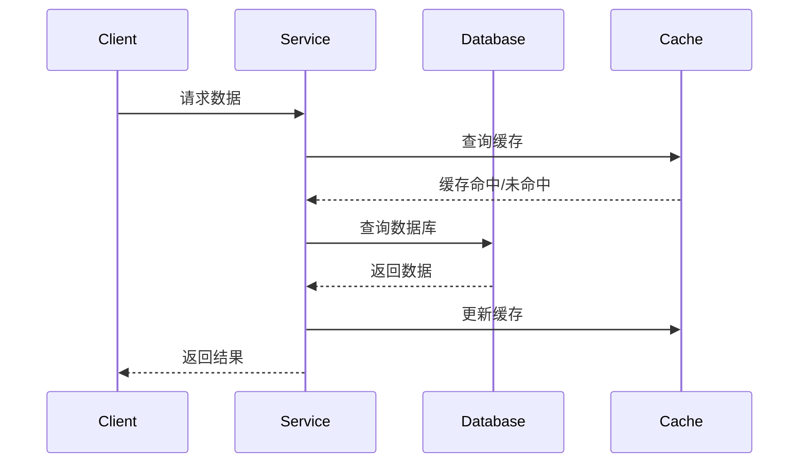
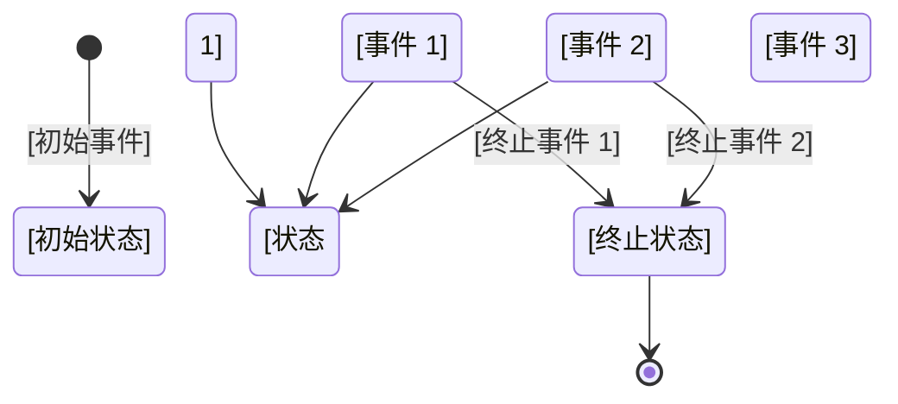
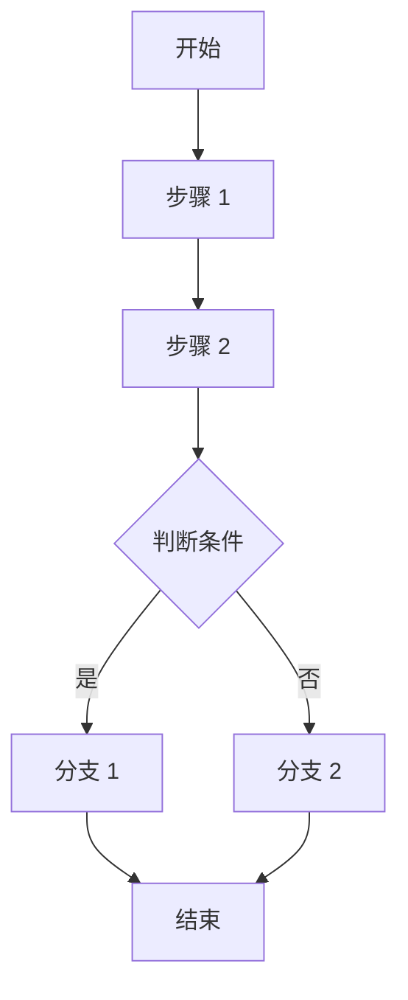

# 需求文档模板

## 使用说明

这是一个需求文档模板，基于功能文档进行深度分析。

**填写指南**：
1. 使用此模板创建需求文档
2. 引用对应的功能文档
3. 填写各个章节的内容
4. **重点关注数据模型设计、数据流动和状态管理**
5. 保存到 `requirement-docs/` 目录

---

# [需求名称]

## 功能来源
- **功能文档**：[功能文档路径]
- **创建日期**：[YYYY-MM-DD]
- **负责人**：[姓名]

---

## 意图分析

### 用户意图
> 基于功能文档分析

[基于功能文档的用户意图分析]

### 核心问题
[要解决的核心问题]

### 解决方向
[技术解决方向]

---

## 业务需求

### 功能需求
- [需求 1]
- [需求 2]
- [需求 3]

### 非功能性需求

#### 性能需求
- [性能指标 1]
- [性能指标 2]

#### 可用性需求
- [可用性指标 1]
- [可用性指标 2]

#### 安全性需求
- [安全需求 1]
- [安全需求 2]

#### 可扩展性需求
- [扩展性需求 1]
- [扩展性需求 2]

### 约束条件
- [约束条件 1]
- [约束条件 2]
- [约束条件 3]

---

## 数据模型设计

### 核心实体

#### 实体 1：[实体名称]
| 字段名 | 类型 | 说明 | 约束 |
|--------|------|------|------|
| [字段 1] | [类型] | [说明] | [约束] |
| [字段 2] | [类型] | [说明] | [约束] |

**数据一致性规则**：
- [一致性规则 1]
- [一致性规则 2]

#### 实体 2：[实体名称]
| 字段名 | 类型 | 说明 | 约束 |
|--------|------|------|------|
| [字段 1] | [类型] | [说明] | [约束] |
| [字段 2] | [类型] | [说明] | [约束] |

**数据一致性规则**：
- [一致性规则 1]
- [一致性规则 2]

### 实体关系

```mermaid
erDiagram
    ENTITY1 ||--o{ ENTITY2 : "关系描述"
    ENTITY2 {
        id PK
        name
        ...
    }
    ENTITY1 {
        id PK
        ...
    }
```

### 数据流动

#### 数据流图


#### 数据流说明
| 数据流 | 起点 | 终点 | 数据内容 | 触发条件 | 频率 |
|--------|------|------|---------|---------|------|
| [数据流 1] | [起点] | [终点] | [内容] | [条件] | [频率] |
| [数据流 2] | [起点] | [终点] | [内容] | [条件] | [频率] |

#### 数据一致性保证

**事务一致性**
**使用场景**：[场景描述]

**实现方式**：
```python
# 事务示例
with transaction.atomic():
    # 操作 1
    # 操作 2
```

**缓存一致性**
**使用场景**：[场景描述]

**实现策略**：
- **Cache Aside**：[说明]
- **Write Through**：[说明]
- **Write Behind**：[说明]

**实现代码**：
```python
# 缓存一致性示例
def update_data(key, value):
    # 1. 更新数据库
    db.update(key, value)
    # 2. 删除缓存
    cache.delete(key)
```

**分布式一致性**
**使用场景**：[场景描述]

**实现策略**：
- **强一致性**：2PC、TCC
- **最终一致性**：事件驱动、消息队列

**实现代码**：
```python
# 事件驱动示例
def process_event(event):
    # 处理事件
    pass

event_bus.publish(Event(...))
```

---

## 状态管理

### 状态定义
| 状态 | 说明 | 触发条件 | 退出条件 | 可回退 |
|------|------|---------|---------|--------|
| [状态 1] | [说明] | [条件] | [条件] | [是/否] |
| [状态 2] | [说明] | [条件] | [条件] | [是/否] |
| [状态 3] | [说明] | [条件] | [条件] | [是/否] |

### 状态转换图


### 状态转换表
| 当前状态 | 事件 | 目标状态 | 动作 | 条件 |
|---------|------|---------|------|------|
| [状态 1] | [事件 1] | [状态 2] | [动作] | [条件] |
| [状态 2] | [事件 2] | [状态 3] | [动作] | [条件] |
| [状态 3] | [终止事件] | [终止状态] | [动作] | [条件] |

### 状态持久化

**存储方式**
- [存储方式说明]

**存储结构**
```json
{
  "entity_id": "实体ID",
  "current_state": "当前状态",
  "state_history": [
    {
      "state": "状态",
      "timestamp": "时间",
      "event": "事件",
      "user": "操作人"
    }
  ],
  "state_data": {
    "字段1": "值1",
    "字段2": "值2"
  }
}
```

**备份策略**
- [备份策略说明]

**恢复机制**
- [恢复机制说明]

### 状态一致性

**一致性保证**
- [说明]

**冲突处理**
- [说明]

**回滚策略**
- [说明]

---

## 接口设计

### 接口列表
| 接口名称 | 方法 | 路径 | 说明 |
|---------|------|------|------|
| [接口 1] | POST | /api/xxx | [说明] |
| [接口 2] | GET | /api/xxx | [说明] |
| [接口 3] | PUT | /api/xxx | [说明] |
| [接口 4] | DELETE | /api/xxx | [说明] |

### 详细接口设计

#### 接口 1：[接口名称]

**接口描述**
[接口功能描述]

**请求**
```json
{
  "field1": "value1",
  "field2": "value2"
}
```

**字段说明**
| 字段名 | 类型 | 必填 | 说明 |
|--------|------|------|------|
| field1 | string | 是 | [说明] |
| field2 | integer | 否 | [说明] |

**响应**
```json
{
  "code": 0,
  "message": "success",
  "data": {
    "field1": "value1"
  }
}
```

**错误码**
| 错误码 | 说明 | 解决方案 |
|--------|------|----------|
| 1001 | [错误说明] | [解决方案] |
| 1002 | [错误说明] | [解决方案] |

---

## 业务流程

### 流程图



### 流程说明
1. **步骤 1**：[步骤说明]
2. **步骤 2**：[步骤说明]
3. **判断条件**：[条件说明]
   - 是：[分支 1 说明]
   - 否：[分支 2 说明]

---

## 验收标准

### 功能验收
- [ ] [验收项 1]
- [ ] [验收项 2]
- [ ] [验收项 3]

### 性能验收
- [ ] [性能指标 1]
- [ ] [性能指标 2]

### 数据一致性验收
- [ ] [一致性检查项 1]
- [ ] [一致性检查项 2]
- [ ] [一致性检查项 3]

### 状态管理验收
- [ ] [状态转换正确性]
- [ ] [状态持久化正确性]
- [ ] [状态一致性保证]

### 安全验收
- [ ] [安全检查项 1]
- [ ] [安全检查项 2]

---

## 风险评估

### 技术风险
| 风险项 | 影响 | 概率 | 应对措施 |
|--------|------|------|----------|
| [风险 1] | 高/中/低 | 高/中/低 | [措施] |
| [风险 2] | 高/中/低 | 高/中/低 | [措施] |

### 业务风险
| 风险项 | 影响 | 概率 | 应对措施 |
|--------|------|------|----------|
| [风险 1] | 高/中/低 | 高/中/低 | [措施] |
| [风险 2] | 高/中/低 | 高/中/低 | [措施] |

---

## 非功能性需求详述

### 性能
- [性能需求 1]
- [性能需求 2]

### 可靠性
- [可靠性需求 1]
- [可靠性需求 2]

### 可维护性
- [可维护性需求 1]
- [可维护性需求 2]

### 可用性
- [可用性需求 1]
- [可用性需求 2]

### 安全性
- [安全性需求 1]
- [安全性需求 2]

---

## 数据质量

### 数据完整性
- [完整性规则 1]
- [完整性规则 2]

### 数据准确性
- [准确性规则 1]
- [准确性规则 2]

### 数据一致性
- [一致性规则 1]
- [一致性规则 2]

### 数据时效性
- [时效性要求 1]
- [时效性要求 2]

---

## 测试策略

### 测试类型
- [单元测试]
- [集成测试]
- [系统测试]
- [性能测试]
- [安全测试]

### 测试重点
- [测试重点 1]
- [测试重点 2]

### 测试数据
[测试数据准备说明]

---

## 依赖关系

### 系统依赖
- [依赖 1]
- [依赖 2]

### 数据依赖
- [依赖 1]
- [依赖 2]

### 服务依赖
- [依赖 1]
- [依赖 2]

---

## 里程碑计划

| 阶段 | 目标 | 时间 | 负责人 |
|------|------|------|--------|
| [阶段 1] | [目标] | [时间] | [负责人] |
| [阶段 2] | [目标] | [时间] | [负责人] |

---

## 文档元数据

- **文档类型**：需求文档
- **创建日期**：[YYYY-MM-DD]
- **最后更新**：[YYYY-MM-DD]
- **状态**：[草稿/审核/已批准]
- **负责人**：[姓名]

---

## 变更记录

| 版本 | 日期 | 变更内容 | 变更人 |
|------|------|----------|--------|
| 1.0 | [YYYY-MM-DD] | 初始版本 | [姓名] |

---

## 相关文档

- [功能文档](../functional-docs/[功能名称].md)
- [架构文档](../architecture-docs/[功能名称]-架构.md)
- [数据流动设计指南](../document-guides/data-flow-guide.md)
- [状态管理指南](../document-guides/state-management-guide.md)
