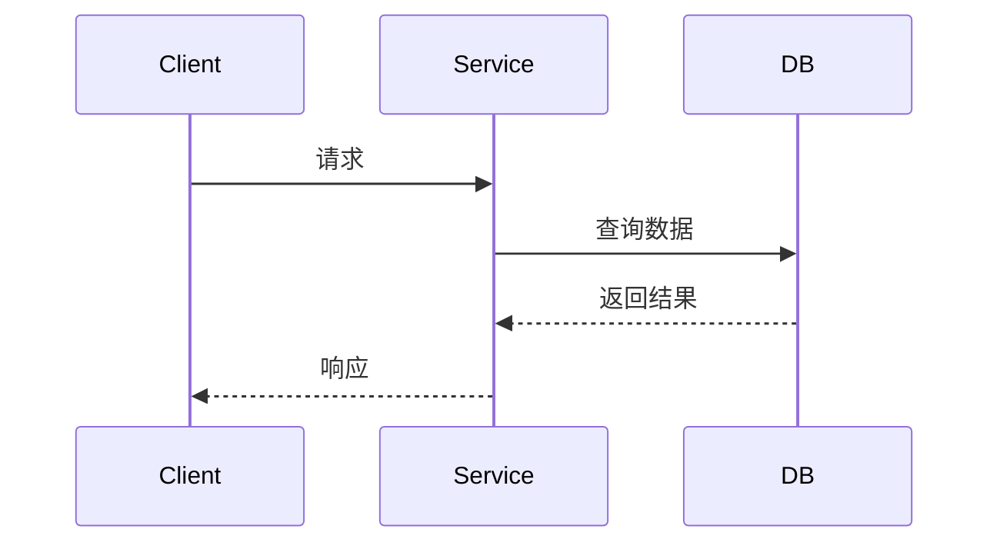
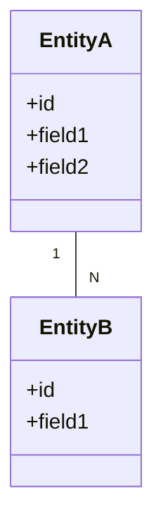

# [服务名称]

## 概述

[简要描述服务的功能和应用场景]

**服务类型**: [RESTful API / GraphQL / gRPC]
**技术栈**: [技术栈]
**版本**: v[版本号]
**维护人**: [负责人]
**最后更新**: [日期]

---

## 服务定位

### 核心职责
- {{responsibility_1}}
- {{responsibility_2}}
- {{responsibility_3}}

### 服务边界
**包含**: [功能A, 功能B, 功能C]
**不包含**: [功能X, 功能Y]

### 依赖服务
- **数据库**: [PostgreSQL / MySQL / MongoDB]
- **缓存**: [Redis / Memcached]
- **消息队列**: [RabbitMQ / Kafka]
- **外部服务**: [外部API1, 外部API2]

---

## 架构设计

### 系统架构图

```mermaid
graph TB
    Client[客户端] --> API[API网关]
    API --> Service[{{service_name}}]
    Service --> DB[(数据库)]
    Service --> Cache[(缓存)]
    Service --> MQ[消息队列]
    Service --> Ext[外部服务]
```

### 分层架构

```
┌─────────────────────────────────┐
│  接口层 (Controller)            │
│  - REST API                      │
│  - GraphQL                       │
├─────────────────────────────────┤
│  业务层 (Service)                │
│  - 业务逻辑                      │
│  - 事务管理                      │
├─────────────────────────────────┤
│  数据层 (Repository)             │
│  - 数据访问                      │
│  - 缓存管理                      │
├─────────────────────────────────┤
│  基础层 (Infrastructure)         │
│  - 数据库                        │
│  - 缓存                          │
│  - 消息队列                      │
└─────────────────────────────────┘
```

---

## 核心功能

### 功能 1: [功能名称]

**描述**: {{description}}

**接口**:
- `{{method}} {{path}}`: {{endpoint_description}}

**流程**:


**业务规则**:
1. {{rule_1}}
2. {{rule_2}}

---

### 功能 2: [功能名称]

**描述**: {{description}}

**接口**:
- `{{method}} {{path}}`: {{endpoint_description}}

---

## 数据模型

### [实体名称]

| 字段名 | 类型 | 必填 | 默认值 | 说明 |
|--------|------|------|--------|------|
| {{field_name}} | {{type}} | {{required}} | {{default}} | {{description}} |

### ER 图



---

## API 文档

### 接口列表

| 接口名称 | 方法 | 路径 | 认证 | 限流 |
|----------|------|------|------|------|
| {{endpoint_1}} | GET | /api/v1/path1 | 是 | 100/min |
| {{endpoint_2}} | POST | /api/v1/path2 | 是 | 50/min |
| {{endpoint_3}} | PUT | /api/v1/path3 | 是 | 50/min |
| {{endpoint_4}} | DELETE | /api/v1/path4 | 是 | 20/min |

### 详细文档

详见 [API 文档](../03-API文档/{{service_name}}.md)

---

## 配置说明

### 环境变量

| 变量名 | 类型 | 必填 | 默认值 | 说明 |
|--------|------|------|--------|------|
| SERVICE_PORT | integer | 否 | 8080 | 服务端口 |
| DB_HOST | string | 是 | - | 数据库地址 |
| DB_PORT | integer | 是 | 5432 | 数据库端口 |
| REDIS_HOST | string | 是 | - | Redis 地址 |
| REDIS_PORT | integer | 是 | 6379 | Redis 端口 |

### 配置文件

```yaml
# config.yaml
service:
  name: {{service_name}}
  port: {{port}}
  mode: {{mode}} # development / production

database:
  host: {{db_host}}
  port: {{db_port}}
  name: {{db_name}}
  pool_size: {{pool_size}}

cache:
  host: {{redis_host}}
  port: {{redis_port}}
  ttl: {{ttl}}

logging:
  level: {{log_level}}
  output: {{log_output}}
```

---

## 部署

### Docker 部署

```dockerfile
FROM python:3.10-slim

WORKDIR /app

COPY requirements.txt .
RUN pip install -r requirements.txt

COPY . .

CMD ["python", "main.py"]
```

```bash
# 构建镜像
docker build -t {{service_name}}:v1.0 .

# 运行容器
docker run -p 8080:8080 \
  -e DB_HOST=localhost \
  -e REDIS_HOST=localhost \
  {{service_name}}:v1.0
```

### Kubernetes 部署

```yaml
apiVersion: apps/v1
kind: Deployment
metadata:
  name: {{service_name}}
spec:
  replicas: 3
  selector:
    matchLabels:
      app: {{service_name}}
  template:
    metadata:
      labels:
        app: {{service_name}}
    spec:
      containers:
      - name: {{service_name}}
        image: {{service_name}}:v1.0
        ports:
        - containerPort: 8080
        env:
        - name: DB_HOST
          valueFrom:
            secretKeyRef:
              name: db-secret
              key: host
```

---

## 监控与日志

### 监控指标

| 指标 | 说明 | 告警阈值 |
|------|------|----------|
| request_count | 请求总数 | - |
| request_duration | 请求耗时 | P99 > 500ms |
| error_rate | 错误率 | > 1% |
| cpu_usage | CPU 使用率 | > 80% |
| memory_usage | 内存使用率 | > 85% |

### 日志格式

```json
{
  "timestamp": "2024-02-19T12:00:00Z",
  "level": "INFO",
  "service": "{{service_name}}",
  "trace_id": "xxx",
  "message": "Request received",
  "data": {...}
}
```

---

## 性能优化

### 缓存策略
- **查询缓存**: TTL 5 分钟
- **热点数据**: 预加载
- **多级缓存**: L1 + L2

### 数据库优化
- **索引**: 关键字段建立索引
- **分库分表**: 按业务维度
- **读写分离**: 主从架构

### 并发处理
- **连接池**: 数据库连接池
- **异步处理**: 非阻塞 I/O
- **批量操作**: 减少往返次数

---

## 测试

### 单元测试
```bash
pytest tests/unit/ -v --cov=src
```

### 集成测试
```bash
pytest tests/integration/ -v
```

### 压力测试
```bash
locust -f tests/load/locustfile.py
```

---

## 故障排查

### 常见问题

| 问题 | 原因 | 解决方案 |
|------|------|----------|
| 服务启动失败 | 端口被占用 | 更换端口或释放占用 |
| 响应慢 | 数据库查询慢 | 添加索引、优化查询 |
| 内存泄漏 | 缓存未释放 | 检查缓存策略 |
| 连接超时 | 连接池耗尽 | 增加连接池大小 |

### 日志查询
```bash
# 查看最近错误日志
tail -f logs/{{service_name}}.log | grep ERROR

# 查看特定请求日志
grep "trace_id=xxx" logs/{{service_name}}.log
```

---

## 安全

### 认证授权
- **方式**: JWT Token
- **有效期**: 24 小时
- **刷新**: 支持刷新令牌

### 数据加密
- **传输加密**: HTTPS
- **存储加密**: 敏感字段加密

### 安全检查
- SQL 注入防护
- XSS 攻击防护
- CSRF 令牌
- 速率限制

---

## 变更历史

| 版本 | 日期 | 变更内容 | 维护人 |
|------|------|----------|--------|
| v1.0.0 | 2024-02-19 | 初始版本 | [负责人] |

---

## 相关文档

- [项目架构](../01-概览/架构设计.md)
- [部署指南](../05-部署运维/部署指南.md)
- [运维手册](../05-部署运维/运维手册.md)
- [监控告警](../05-部署运维/监控告警.md)
