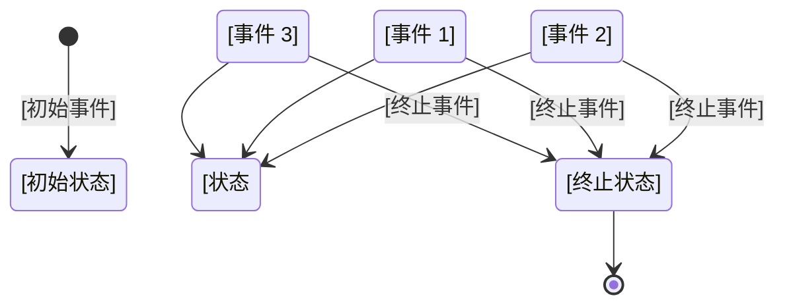

# 状态机模板

## 使用说明

这是一个状态机设计模板，用于设计系统的状态转换逻辑。

**填写指南**：
1. 使用此模板设计状态机
2. 定义所有可能的状态
3. 定义触发转换的事件
4. 定义状态转换时的动作
5. 使用 Mermaid 图表可视化
6. 保存到 `references/state-machines/` 目录

---

# [状态机名称]

## 概述

### 业务背景
[描述状态机对应的业务场景]

### 设计目标
- [目标 1]
- [目标 2]

---

## 状态定义

| 状态 | 说明 | 入口条件 | 出口条件 |
|------|------|---------|---------|
| [状态 1] | [说明] | [条件] | [条件] |
| [状态 2] | [说明] | [条件] | [条件] |
| [状态 3] | [说明] | [条件] | [条件] |

### 状态说明

#### [状态 1]
- **名称**：[英文名称]
- **说明**：[详细说明]
- **持续时间**：[永久/临时]
- **可回退**：[是/否]
- **示例**：[示例场景]

---

## 事件定义

| 事件 | 说明 | 触发条件 | 参数 |
|------|------|---------|------|
| [事件 1] | [说明] | [条件] | [参数] |
| [事件 2] | [说明] | [条件] | [参数] |
| [事件 3] | [说明] | [条件] | [参数] |

---

## 状态转换图



---

## 状态转换表

| 当前状态 | 事件 | 目标状态 | 动作 | 条件 |
|---------|------|---------|------|------|
| [状态 1] | [事件 1] | [状态 2] | [动作] | [条件] |
| [状态 1] | [事件 2] | [状态 3] | [动作] | [条件] |
| [状态 2] | [事件 3] | [状态 1] | [动作] | [条件] |
| [状态 2] | [终止事件] | [终止状态] | [动作] | [条件] |
| [状态 3] | [事件 4] | [终止状态] | [动作] | [条件] |

---

## 状态转换详情

### [状态 1] → [状态 2]

- **触发事件**：[事件名称]
- **转换条件**：[条件]
- **执行动作**：
  - [动作 1]
  - [动作 2]
- **状态数据变更**：
  - [字段 1]：[变更]
  - [字段 2]：[变更]
- **副作用**：
  - [副作用 1]
  - [副作用 2]

---

## 动作定义

### 动作 1：[动作名称]
- **类型**：[同步/异步]
- **执行时机**：[转换前/转换后]
- **失败处理**：[处理方式]
- **重试策略**：[策略]

**代码示例**：
```python
def action_1(context):
    # 实现逻辑
    pass
```

---

## 数据模型

### 状态存储
```json
{
  "entity_id": "实体ID",
  "current_state": "当前状态",
  "state_history": [
    {
      "state": "状态",
      "timestamp": "时间",
      "event": "事件",
      "user": "操作人"
    }
  ],
  "state_data": {
    "字段1": "值1",
    "字段2": "值2"
  }
}
```

### 数据字段说明
| 字段 | 类型 | 说明 | 约束 |
|------|------|------|------|
| entity_id | string | 实体ID | 必填，唯一 |
| current_state | enum | 当前状态 | 必填 |
| state_history | array | 状态历史 | 自动维护 |
| state_data | object | 状态数据 | 可选 |

---

## 代码实现

### 状态定义
```python
from enum import Enum, auto

class [EntityName]State(Enum):
    [STATE_1] = auto()  # [状态 1]
    [STATE_2] = auto()  # [状态 2]
    [STATE_3] = auto()  # [状态 3]
```

### 事件定义
```python
class [EntityName]Event(Enum):
    [EVENT_1] = auto()  # [事件 1]
    [EVENT_2] = auto()  # [事件 2]
    [EVENT_3] = auto()  # [事件 3]
```

### 状态机实现
```python
from dataclasses import dataclass
from typing import Dict, Callable, Optional

@dataclass
class Transition:
    event: [EntityName]Event
    target_state: [EntityName]State
    action: Optional[Callable] = None
    condition: Optional[Callable] = None

class [EntityName]StateMachine:
    def __init__(self):
        self.current_state = [EntityName]State.[INITIAL_STATE]
        self.transitions: Dict[[EntityName]State, Dict[[EntityName]Event, Transition]] = {
            [EntityName]State.[STATE_1]: {
                [EntityName]Event.[EVENT_1]: Transition(
                    event=[EntityName]Event.[EVENT_1],
                    target_state=[EntityName]State.[STATE_2],
                    action=self._action_1,
                    condition=self._check_condition_1
                ),
                # 更多转换...
            },
            # 更多状态...
        }
    
    def transition(self, event: [EntityName]Event, context: dict = None):
        if self.current_state not in self.transitions:
            raise InvalidStateError(f"Invalid current state: {self.current_state}")
        
        if event not in self.transitions[self.current_state]:
            raise InvalidEventError(f"Invalid event for state {self.current_state}: {event}")
        
        transition = self.transitions[self.current_state][event]
        
        # 检查条件
        if transition.condition and not transition.condition(context):
            raise TransitionConditionError("Transition condition not met")
        
        # 执行动作
        if transition.action:
            transition.action(context)
        
        # 更新状态
        old_state = self.current_state
        self.current_state = transition.target_state
        
        # 记录状态变更
        self._record_state_change(old_state, self.current_state, event, context)
        
        return self.current_state
    
    def _record_state_change(self, old_state, new_state, event, context):
        # 记录状态变更历史
        pass
    
    # 动作实现
    def _action_1(self, context):
        # 动作实现
        pass
    
    # 条件检查
    def _check_condition_1(self, context):
        # 条件检查
        return True
```

### 使用示例
```python
# 创建状态机
sm = [EntityName]StateMachine()

# 执行状态转换
try:
    new_state = sm.transition([EntityName]Event.[EVENT_1], context={...})
    print(f"状态转换成功: {new_state}")
except InvalidStateError as e:
    print(f"状态错误: {e}")
except InvalidEventError as e:
    print(f"事件错误: {e}")
except TransitionConditionError as e:
    print(f"条件不满足: {e}")
```

---

## 测试用例

### 测试场景 1：[场景名称]
**描述**：[场景描述]

**初始状态**：[状态]
**触发事件**：[事件]
**预期结果**：[状态]

**测试代码**：
```python
def test_transition_1():
    sm = [EntityName]StateMachine()
    initial_state = sm.current_state
    
    result = sm.transition([EntityName]Event.[EVENT_1])
    
    assert result == [EntityName]State.[EXPECTED_STATE]
    assert result != initial_state
```

---

## 异常处理

### 异常定义
| 异常 | 说明 | 触发条件 | 处理方式 |
|------|------|---------|----------|
| InvalidStateError | 无效状态 | 当前状态不允许此转换 | 返回错误 |
| InvalidEventError | 无效事件 | 当前状态不允许此事件 | 返回错误 |
| TransitionConditionError | 条件不满足 | 转换条件不满足 | 返回错误 |

### 异常处理策略
```python
def handle_transition(entity_id, event, context):
    try:
        sm = load_state_machine(entity_id)
        new_state = sm.transition(event, context)
        save_state_machine(entity_id, sm)
        return {"success": True, "state": new_state.name}
    except InvalidStateError as e:
        return {"success": False, "error": str(e)}
    except InvalidEventError as e:
        return {"success": False, "error": str(e)}
    except TransitionConditionError as e:
        return {"success": False, "error": str(e)}
    except Exception as e:
        # 记录异常
        log_exception(e)
        return {"success": False, "error": "Internal error"}
```

---

## 监控和日志

### 监控指标
| 指标 | 说明 | 阈值 |
|------|------|------|
| 状态转换成功率 | 成功的转换占比 | > 95% |
| 平均状态转换时间 | 转换平均耗时 | < 100ms |
| 状态转换失败率 | 失败的转换占比 | < 5% |

### 日志记录
```python
import logging

logger = logging.getLogger(__name__)

def log_state_change(entity_id, old_state, new_state, event, duration):
    logger.info(
        f"State change: entity={entity_id}, "
        f"{old_state.name}->{new_state.name}, "
        f"event={event.name}, "
        f"duration={duration}ms"
    )
```

---

## 性能优化

### 优化策略
1. **缓存状态机**：缓存已加载的状态机
2. **批量操作**：支持批量状态转换
3. **异步处理**：异步执行非关键动作
4. **索引优化**：优化状态历史查询

---

## 安全考虑

### 权限控制
- 状态转换需要权限验证
- 敏感状态转换需要二次确认
- 记录操作人信息

### 审计日志
```python
def audit_log(entity_id, event, user, timestamp):
    audit_record = {
        "entity_id": entity_id,
        "event": event.name,
        "user": user,
        "timestamp": timestamp.isoformat()
    }
    save_audit_log(audit_record)
```

---

## 文档元数据

- **文档类型**：状态机文档
- **创建日期**：[YYYY-MM-DD]
- **最后更新**：[YYYY-MM-DD]
- **负责人**：[姓名]

---

## 变更记录

| 版本 | 日期 | 变更内容 | 变更人 |
|------|------|----------|--------|
| 1.0 | [YYYY-MM-DD] | 初始版本 | [姓名] |

---

## 参考资料

- [State Management Guide](../document-guides/state-management-guide.md)
- [Data Flow Guide](../document-guides/data-flow-guide.md)
