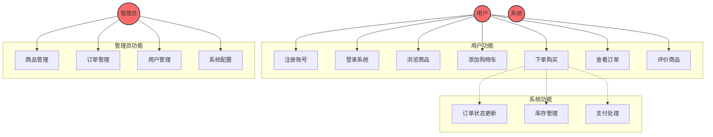

# 用例图

## 概述

本文档描述系统的用例图，包括角色、用例和它们之间的关系。

---

## 用例图

---

## 角色定义

### 1. 用户

**描述**：系统的最终用户，通过系统购买商品。

**权限**：
- 注册账号
- 登录系统
- 浏览商品
- 添加购物车
- 下单购买
- 查看订单
- 评价商品

**数量**：~100 万

---

### 2. 管理员

**描述**：系统管理员，负责管理商品、订单和用户。

**权限**：
- 商品管理
- 订单管理
- 用户管理
- 系统配置

**数量**：~10

---

### 3. 系统

**描述**：自动处理系统逻辑。

**功能**：
- 订单状态更新
- 库存管理
- 支付处理

---

## 用例说明

### 1. 注册账号

**用例 ID**：UC01

**描述**：用户注册账号

**参与者**：用户

**前置条件**：无

**后置条件**：用户账号创建成功

**主流程**：
1. 用户输入用户名
2. 用户输入邮箱
3. 用户输入密码
4. 用户点击注册按钮
5. 系统验证输入信息
6. 系统创建用户账号
7. 系统发送确认邮件
8. 用户点击邮件链接确认
9. 账号激活成功

**备选流程**：
- 5a. 用户名已存在
  - 系统提示"用户名已存在"
  - 返回步骤 1

- 5b. 邮箱已存在
  - 系统提示"邮箱已存在"
  - 返回步骤 2

- 5c. 密码不符合要求
  - 系统提示"密码必须包含大小写字母和数字"
  - 返回步骤 3

---

### 2. 登录系统

**用例 ID**：UC02

**描述**：用户登录系统

**参与者**：用户

**前置条件**：用户已注册并激活账号

**后置条件**：用户登录成功

**主流程**：
1. 用户打开登录页面
2. 用户输入邮箱
3. 用户输入密码
4. 用户点击登录按钮
5. 系统验证用户信息
6. 系统创建会话
7. 用户登录成功

**备选流程**：
- 5a. 邮箱不存在
  - 系统提示"邮箱不存在"
  - 返回步骤 2

- 5b. 密码错误
  - 系统提示"密码错误"
  - 返回步骤 3

- 5c. 账号未激活
  - 系统提示"账号未激活"
  - 返回步骤 2

---

### 3. 浏览商品

**用例 ID**：UC03

**描述**：用户浏览商品

**参与者**：用户

**前置条件**：用户已登录

**后置条件**：用户看到商品列表

**主流程**：
1. 用户点击商品分类
2. 系统展示商品列表
3. 用户点击商品图片
4. 系统展示商品详情

**备选流程**：
- 3a. 商品已下架
  - 系统提示"商品已下架"
  - 返回商品列表

---

### 4. 添加购物车

**用例 ID**：UC04

**描述**：用户添加商品到购物车

**参与者**：用户

**前置条件**：用户已登录，商品存在

**后置条件**：商品添加到购物车

**主流程**：
1. 用户选择商品
2. 用户选择数量
3. 用户点击"加入购物车"按钮
4. 系统验证库存
5. 系统添加商品到购物车
6. 系统提示"添加成功"

**备选流程**：
- 4a. 库存不足
  - 系统提示"库存不足"
  - 返回步骤 2

---

### 5. 下单购买

**用例 ID**：UC05

**描述**：用户下单购买

**参与者**：用户、系统

**前置条件**：用户已登录，购物车有商品

**后置条件**：订单创建成功

**主流程**：
1. 用户打开购物车
2. 用户确认商品和数量
3. 用户点击"去结算"按钮
4. 系统显示订单信息
5. 用户选择配送地址
6. 用户选择支付方式
7. 用户点击"提交订单"按钮
8. 系统创建订单
9. 系统扣减库存
10. 系统发起支付
11. 用户完成支付
12. 订单创建成功

**备选流程**：
- 8a. 商品已下架
  - 系统提示"商品已下架"
  - 返回步骤 4

- 8b. 库存不足
  - 系统提示"库存不足"
  - 返回步骤 4

- 10a. 支付失败
  - 系统提示"支付失败"
  - 返回步骤 10

---

### 6. 查看订单

**用例 ID**：UC06

**描述**：用户查看订单

**参与者**：用户

**前置条件**：用户已登录，有订单

**后置条件**：用户看到订单详情

**主流程**：
1. 用户点击"我的订单"
2. 系统显示订单列表
3. 用户点击订单
4. 系统显示订单详情

---

### 7. 评价商品

**用例 ID**：UC07

**描述**：用户评价商品

**参与者**：用户

**前置条件**：用户已登录，订单已完成

**后置条件**：评价提交成功

**主流程**：
1. 用户打开订单详情
2. 用户点击"评价"按钮
3. 用户选择评分（1-5星）
4. 用户输入评价内容
5. 用户点击"提交"按钮
6. 系统保存评价
7. 评价提交成功

---

### 8. 商品管理

**用例 ID**：UC08

**描述**：管理员管理商品

**参与者**：管理员

**前置条件**：管理员已登录

**后置条件**：商品管理完成

**主流程**：
1. 管理员打开商品管理页面
2. 管理员点击"添加商品"按钮
3. 管理员填写商品信息
4. 管理员上传商品图片
5. 管理员点击"保存"按钮
6. 系统保存商品信息
7. 商品添加成功

---

### 9. 订单管理

**用例 ID**：UC09

**描述**：管理员管理订单

**参与者**：管理员

**前置条件**：管理员已登录

**后置条件**：订单管理完成

**主流程**：
1. 管理员打开订单管理页面
2. 系统显示订单列表
3. 管理员点击订单
4. 系统显示订单详情
5. 管理员更新订单状态
6. 系统保存订单状态
7. 订单更新成功

---

### 10. 用户管理

**用例 ID**：UC10

**描述**：管理员管理用户

**参与者**：管理员

**前置条件**：管理员已登录

**后置条件**：用户管理完成

**主流程**：
1. 管理员打开用户管理页面
2. 系统显示用户列表
3. 管理员点击用户
4. 系统显示用户详情
5. 管理员更新用户信息
6. 系统保存用户信息
7. 用户更新成功

---

### 11. 系统配置

**用例 ID**：UC11

**描述**：管理员配置系统

**参与者**：管理员

**前置条件**：管理员已登录

**后置条件**：系统配置完成

**主流程**：
1. 管理员打开系统配置页面
2. 管理员修改配置项
3. 管理员点击"保存"按钮
4. 系统保存配置
5. 配置保存成功

---

### 12. 订单状态更新

**用例 ID**：UC12

**描述**：系统自动更新订单状态

**参与者**：系统

**前置条件**：订单存在

**后置条件**：订单状态更新成功

**主流程**：
1. 系统检查订单状态
2. 系统根据业务规则更新状态
3. 系统发送状态通知
4. 状态更新成功

---

### 13. 库存管理

**用例 ID**：UC13

**描述**：系统自动管理库存

**参与者**：系统

**前置条件**：订单创建成功

**后置条件**：库存更新成功

**主流程**：
1. 系统检查订单商品
2. 系统扣减库存
3. 系统检查库存预警
4. 库存更新成功

---

### 14. 支付处理

**用例 ID**：UC14

**描述**：系统处理支付

**参与者**：系统

**前置条件**：订单创建成功

**后置条件**：支付处理完成

**主流程**：
1. 系统调用支付接口
2. 支付平台处理支付
3. 支付平台返回结果
4. 系统更新订单状态
5. 支付处理完成

---

## 用例矩阵

| 用例 | 用户 | 管理员 | 系统 |
|------|------|--------|------|
| 注册账号 | ✓ | | |
| 登录系统 | ✓ | | |
| 浏览商品 | ✓ | | |
| 添加购物车 | ✓ | | |
| 下单购买 | ✓ | | ✓ |
| 查看订单 | ✓ | | |
| 评价商品 | ✓ | | |
| 商品管理 | | ✓ | |
| 订单管理 | | ✓ | |
| 用户管理 | | ✓ | |
| 系统配置 | | ✓ | |
| 订单状态更新 | | | ✓ |
| 库存管理 | | | ✓ |
| 支付处理 | | | ✓ |

---

## 参考资料

- [用例图指南](../../guides/usecase/usecase-guide.md)
- [Mermaid 图谱文档](https://mermaid.js.org/)
