# Mermaid 图表语法指南

## 1. 流程图 (Flowchart)

### 基础语法

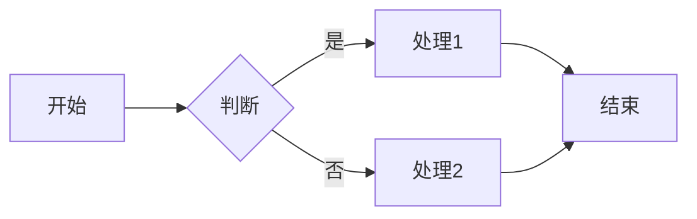

### 方向控制

- `LR`: Left to Right (从左到右)
- `TD`: Top to Down (从上到下)
- `RL`: Right to Left (从右到左)
- `BT`: Bottom to Top (从下到上)

### 节点样式

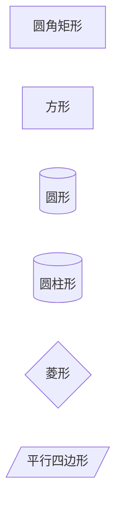

### 样式设置

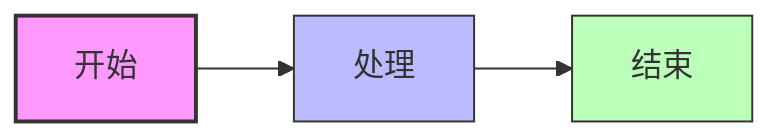

## 2. 类图 (Class Diagram)

### 基础语法

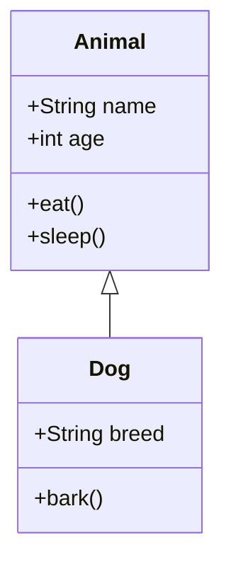

### 关系类型

- `-->`: 关联 (Association)
- `--|>`: 继承 (Inheritance)
- `..|>`: 实现 (Implementation)
- `-->o`: 聚合 (Aggregation)
- `-->*`: 组合 (Composition)
- `--`: 依赖 (Dependency)

### 复杂示例

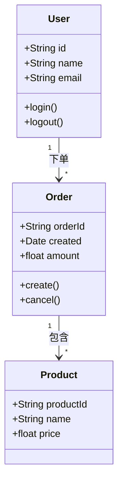

## 3. 序列图 (Sequence Diagram)

### 基础语法

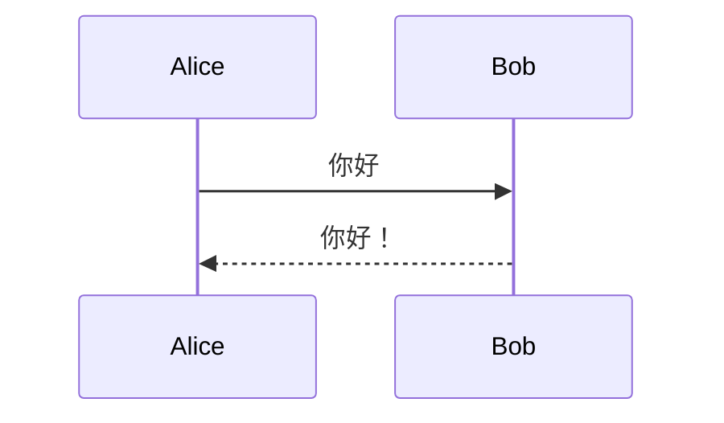

### 循环与条件

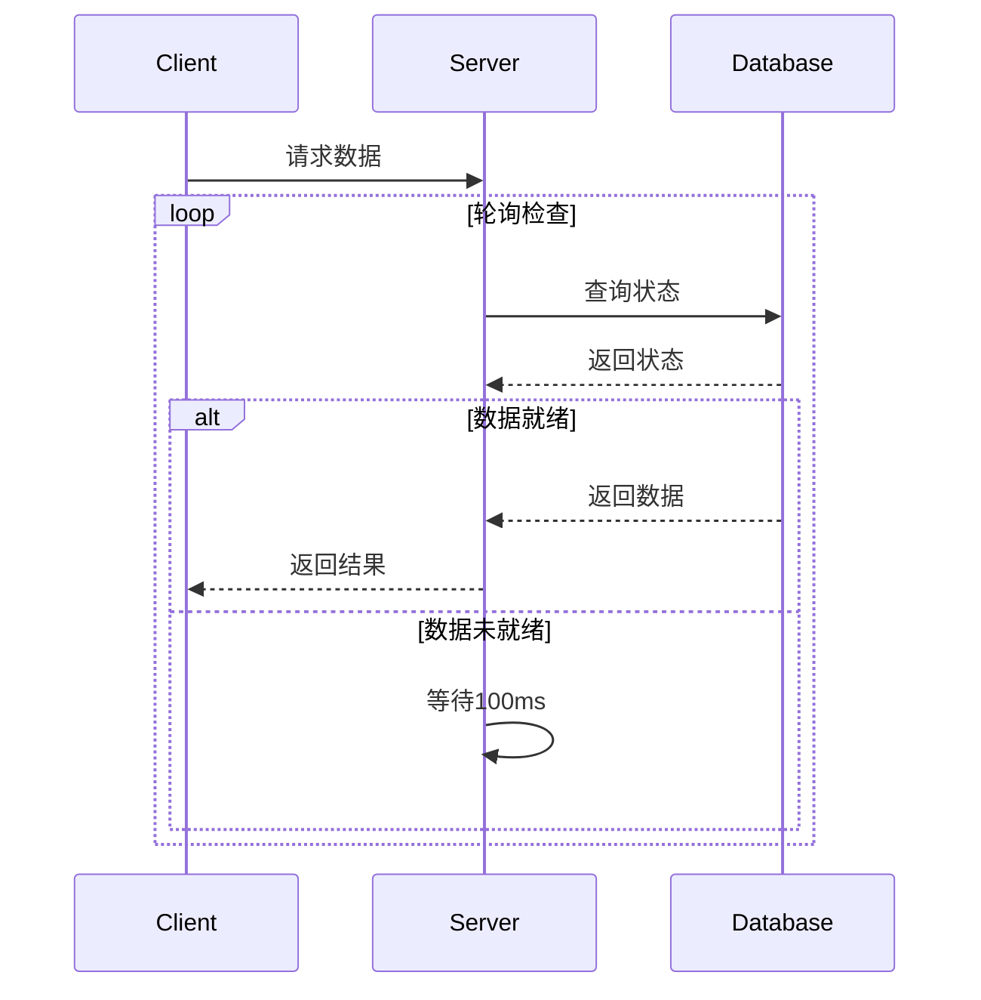

## 4. 状态图 (State Diagram)

### 基础语法

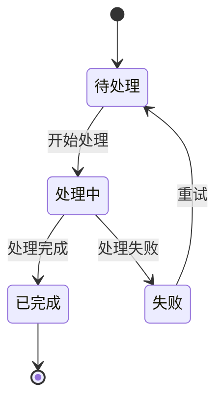

## 5. 实体关系图 (ER Diagram)

### 基础语法

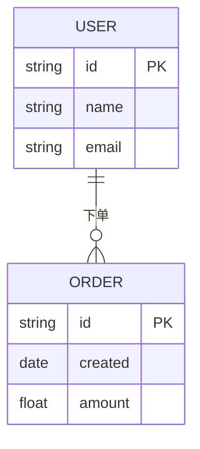

### 关系符号

- `||--||`: 一对一
- `||--o{`: 一对多
- `}o--||`: 多对一
- `}o--o{`: 多对多

## 6. 甘特图 (Gantt Chart)

### 基础语法

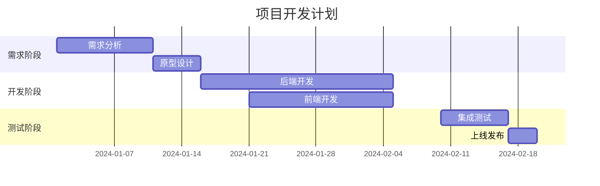

## 7. 饼图 (Pie Chart)

### 基础语法

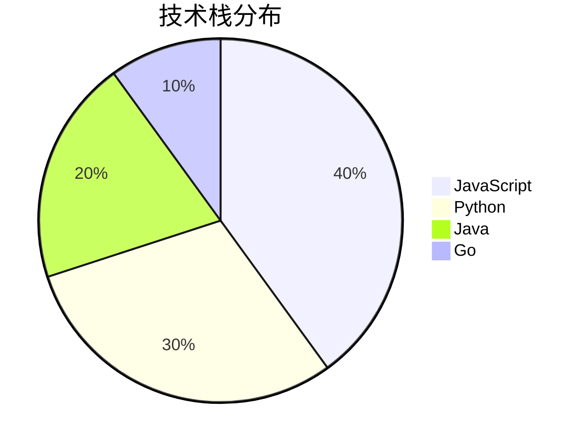

## 8. 依赖关系图 (Graph)

### 模块依赖图

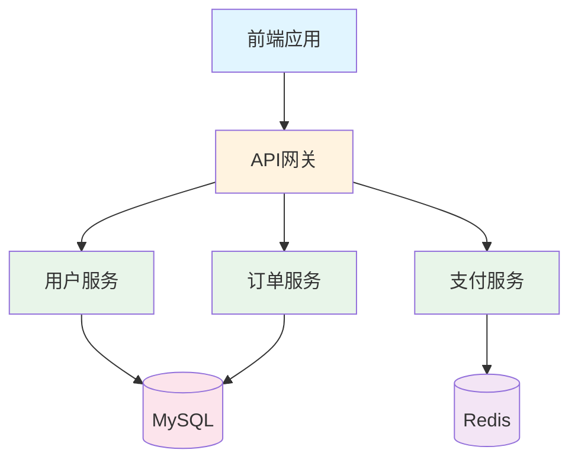

### 类层级图

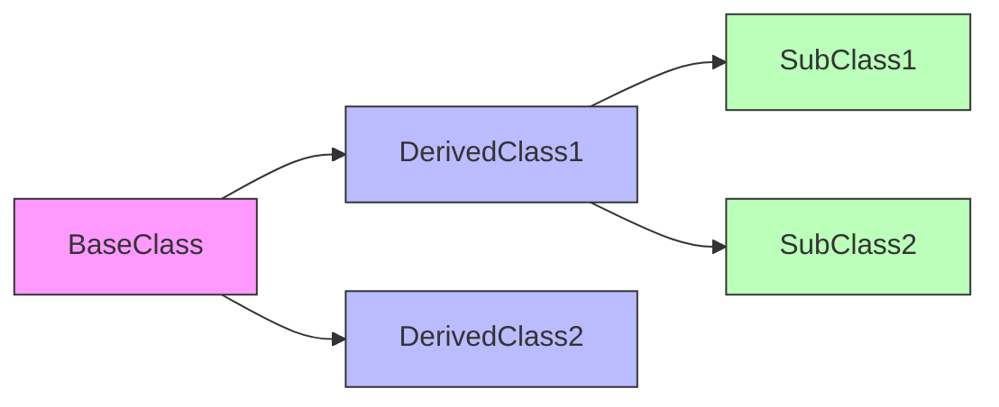

## 9. 最佳实践

### 9.1 命名规范

- 使用清晰、有意义的名称
- 避免特殊字符
- 保持命名一致性

### 9.2 布局优化

- 选择合适的方向（LR/TD）
- 合理分组（使用 subgraph）
- 控制节点数量（避免过于复杂）

### 9.3 样式建议

- 使用不同的颜色区分模块
- 保持视觉层次清晰
- 添加必要的标签和说明

### 9.4 可维护性

- 将复杂图表拆分成多个小图
- 添加图例和注释
- 定期更新保持与代码同步

## 10. 在 Markdown 中使用

### 直接嵌入

```markdown
\`\`\`mermaid
graph LR
    A --> B
\`\`\`
```

### 使用代码块

```markdown
# 架构图

\`\`\`mermaid
graph TD
    subgraph "应用层"
        A[服务A]
        B[服务B]
    end
    subgraph "数据层"
        C[(数据库)]
    end
    A --> C
    B --> C
\`\`\`
```

---

**注意**: Mermaid 图表在 GitHub、GitLab、Typora 等平台可直接渲染，其他平台可能需要插件支持
