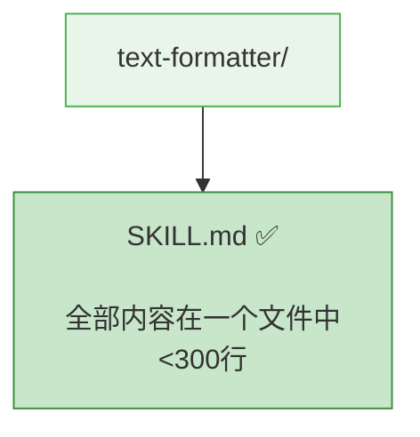
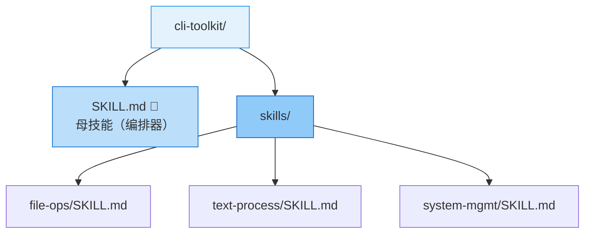
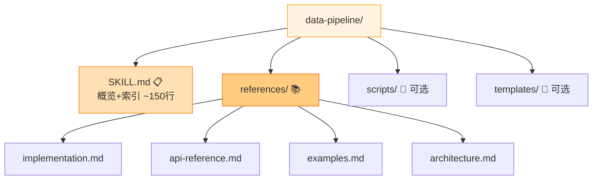
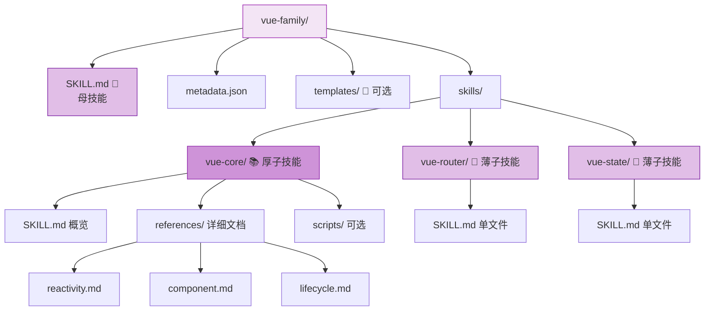
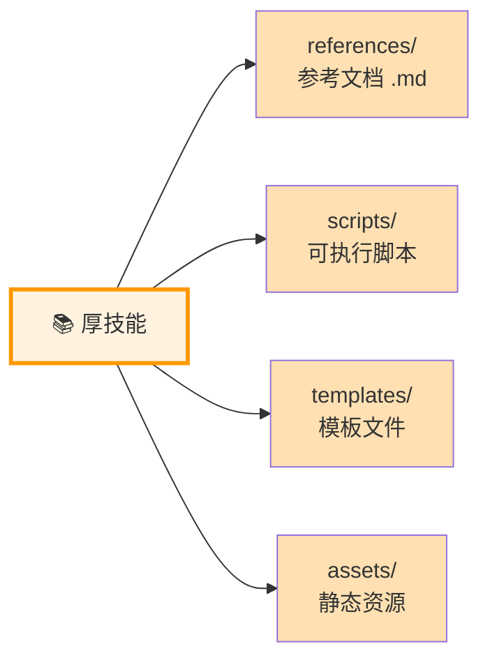

# Skill Factory - 技能工厂

## 任务目标

本 Skill 用于将技术文档或网站转化为结构化的技能族包。

**触发条件**: 当用户提供技术文档/URL 并要求生成技能时使用。

---

## 四维分类体系

```mermaid
quadrantChart
    title 技能四维分类法
    x-axis 轻（单一功能） --> 重（多模块）
    y-axis 厚（内容丰富） --> 薄（内容精简）
    quadrant-1 重+厚：技能族(混合)
    quadrant-2 轻+厚：复杂单技能
    quadrant-3 轻+薄：简单技能
    quadrant-4 重+薄：技能族(薄)
    type1: [0.2, 0.15]
    type2: [0.85, 0.2]
    type3: [0.25, 0.8]
    type4: [0.8, 0.75]
```

### 维度定义

| 维度 | 定义 | 判断标准 | 输出结构 |
|------|------|---------|---------|
| **轻** | 功能单一 | 1 个核心能力，逻辑简单 | 单个 SKILL.md |
| **重** | 功能复杂 | 多个模块，可独立使用 | `skills/{子}/SKILL.md` |
| **薄** | 内容精简 | 单文件 <300 行能描述清楚 | 无需额外文件 |
| **厚** | 内容丰富 | 需要详细说明、示例、代码等 | `references/` + 可选 `scripts/` `templates/` |

### 四种组合与输出结构

| 组合 | 类型 | 目录结构 | 典型场景 |
|------|------|---------|---------|
| **轻+薄** | 简单技能 | `{name}/SKILL.md` | 工具类、格式转换 |
| **重+薄** | 技能族(薄) | `{name}-family/SKILL.md` + `skills/{子}/SKILL.md` | CLI工具集、工作流编排器 |
| **轻+厚** | 复杂单技能 | `{name}/SKILL.md` + `references/*.md` | 数据处理管道、详细教程 |
| **重+厚** | 技能族(厚) | `{name}-family/SKILL.md` + `skills/{子}/` (+ 部分 `references/`) | 大型框架学习包 |

---

## 快速决策流程

```mermaid
flowchart TD
    A[输入: 技术文档/URL] --> B{功能维度判断}
    
    B -->|1-2 个核心能力| C[📦 轻: 单一功能]
    B -->|≥3 个可独立模块| D[🏗️ 重: 多模块拆分]
    
    C --> E{内容维度判断}
    D --> F{内容维度判断}
    
    E -->|<300 行 能说清| G[✅ 类型1: 轻+薄<br/>简单技能<br/>单文件 SKILL.md]
    E -->|需要详细说明| H[📚 类型3: 轻+厚<br/>复杂单技能<br/>SKILL.md + references/]
    
    F -->|每个都简单| I[🔧 类型2: 重+薄<br/>技能族-薄<br/>skills/{子}/SKILL.md]
    F -->|部分子技能复杂| J[⭐ 类型4: 重+厚<br/>技能族-厚<br/>skills/ + 混合 references/]
    
    style G fill:#e8f5e9,stroke:#4caf50,color:#1b5e20
    style H fill:#fff3e0,stroke:#ff9800,color:#e65100
    style I fill:#e3f2fd,stroke:#2196f3,color:#0d47a1
    style J fill:#f3e5f5,stroke:#9c27b0,color:#4a148c
```

---

## 工作流程


| 阶段 | 子技能 | 核心职责 |
|------|--------|----------|
| 分析 | analyzer | 提取技术信息，评估功能数量和内容体量 |
| 规划 | planner | **判定轻重薄厚**，选择输出结构 |
| 生成 | generator | **按四种类型**生成对应目录和文件 |
| 打包 | packager | **验证对应结构**的完整性 |

---

## 子技能索引

| 子技能 | 职责 | 核心 |
|--------|------|------|
| [analyzer](skills/skill-factory-analyzer/SKILL.md) | 技术分析 | 信息完整度 ≥ 80%？ |
| [planner](skills/skill-factory-planner/SKILL.md) | 类型判定 | 轻/重 + 薄/厚 四维决策 |
| [generator](skills/skill-factory-generator/SKILL.md) | 文件生成 | 四种输出模板 |
| [packager](skills/skill-factory-packager/SKILL.md) | 结构验证 | 四种验证规则 |

---

## 四种类型架构示例

### 类型 1：轻+薄（简单技能）

适用于：单一功能的工具类技能



### 类型 2：重+薄（技能族-薄）

适用于：多个独立工具，每个都很简单



### 类型 3：轻+厚（复杂单技能）

适用于：单一主题但内容非常丰富



### 类型 4：重+厚（技能族-厚）⭐

适用于：大型技术栈，外层拆分，内层补充资料



---

## 补充资源说明

当技能为**厚技能**时，除 `references/` 外还可包含：



| 目录 | 用途 | 何时创建 |
|------|------|---------|
| `references/` | 参考文档（.md） | 内容 >300 行时 |
| `scripts/` | 可执行脚本 | 有自动化操作时 |
| `templates/` | 模板文件 | 有初始化模板时 |
| `assets/` | 静态资源 | 有图片/图表时 |

---

## 版本历史

| 版本 | 日期 | 变更说明 |
|------|------|----------|
| v8.0.0 | 2026-04-30 | 添加 Mermaid 图表，图文并茂 |
| v7.0.0 | 2026-04-30 | 引入"轻/重/薄/厚"四维分类体系 |
