# Skill Factory - 技能工厂

## 任务目标

本 Skill 用于将技术文档或网站转化为结构化的技能族包。

**触发条件**: 当用户提供技术文档/URL 并要求生成技能时使用。

---

## 四维分类体系

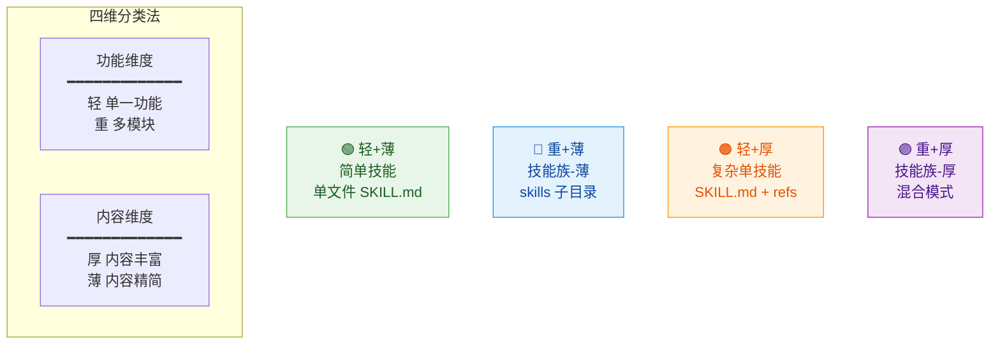

### 维度定义

| 维度 | 定义 | 判断标准 | 输出结构 |
|------|------|---------|---------|
| **轻** | 功能单一 | 1 个核心能力，逻辑简单 | 单个 SKILL.md |
| **重** | 功能复杂 | 多个模块，可独立使用 | `skills/{子}/SKILL.md` |
| **薄** | 内容精简 | 单文件 <300 行能描述清楚 | 无需额外文件 |
| **厚** | 内容丰富 | 需要详细说明、示例、代码等 | `references/` + 可选 `scripts/` `templates/` |

### 四种组合与输出结构

| 组合 | 类型 | 目录结构 | 典型场景 |
|------|------|---------|---------|
| **轻+薄** | 简单技能 | `{name}/SKILL.md` | 工具类、格式转换 |
| **重+薄** | 技能族(薄) | `{name}-family/SKILL.md` + `skills/{子}/SKILL.md` | CLI工具集、工作流编排器 |
| **轻+厚** | 复杂单技能 | `{name}/SKILL.md` + `references/*.md` | 数据处理管道、详细教程 |
| **重+厚** | 技能族(厚) | `{name}-family/SKILL.md` + `skills/{子}/` (+ 部分 `references/`) | 大型框架学习包 |

---

## 完整工作流程（五阶段）

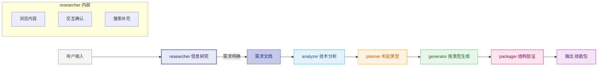

### 阶段职责总览

| 阶段 | 子技能 | 核心职责 | 关键能力 |
|------|--------|----------|---------|
| **① 研究** | **researcher** | 接收输入、交互确认、补充信息 | 用户交互、网络搜索 |
| 分析 | analyzer | 提取技术信息，评估功能数量和内容体量 | 信息完整度 >= 80%？ |
| 规划 | planner | **判定轻重薄厚**，选择输出结构 | 轻/重 + 薄/厚 四维决策 |
| 生成 | generator | **按四种类型**生成对应目录和文件 | 四种输出模板 |
| 打包 | packager | **验证对应结构**的完整性 | 四种验证规则 |

---

## 快速决策流程

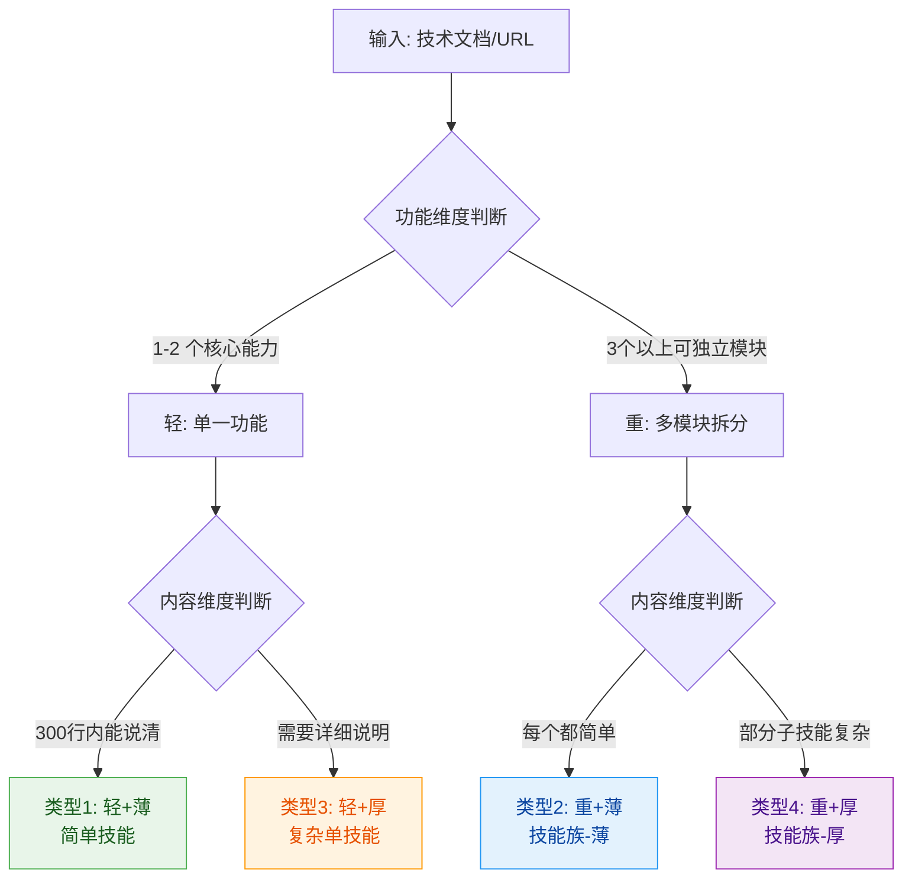

---

## 子技能索引

| 子技能 | 阶段 | 职责 | 核心 |
|--------|------|------|------|
| [**researcher**](skills/skill-factory-researcher/SKILL.md) | ①研究 | 信息研究 | 交互确认、信息补充、需求明确 |
| [analyzer](skills/skill-factory-analyzer/SKILL.md) | ②分析 | 技术分析 | 信息完整度 >= 80%？ |
| [planner](skills/skill-factory-planner/SKILL.md) | ③规划 | 类型判定 | 轻/重 + 薄/厚 四维决策 |
| [generator](skills/skill-factory-generator/SKILL.md) | ④生成 | 文件生成 | 四种输出模板 |
| [packager](skills/skill-factory-packager/SKILL.md) | ⑤验证 | 结构验证 | 四种验证规则 |

---

## 前置研究阶段详解 (researcher)

### 为什么需要前置研究？

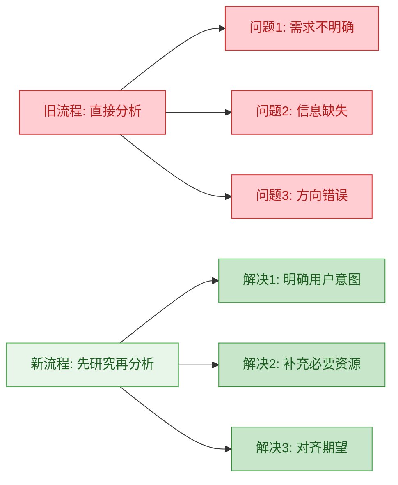

### researcher 六步流程

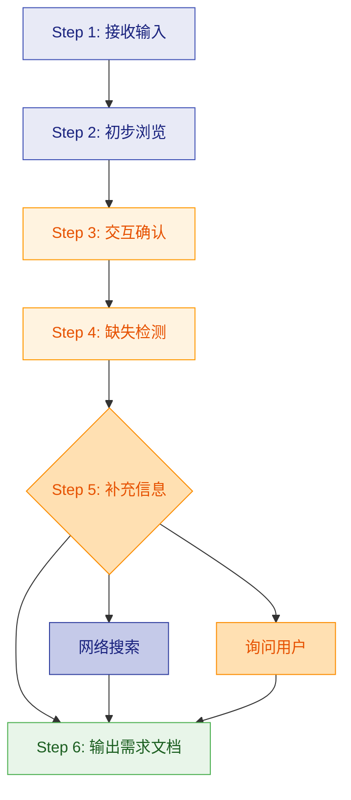

### 全程回调机制

在后续任何阶段发现信息不足时，都可以回调 researcher：

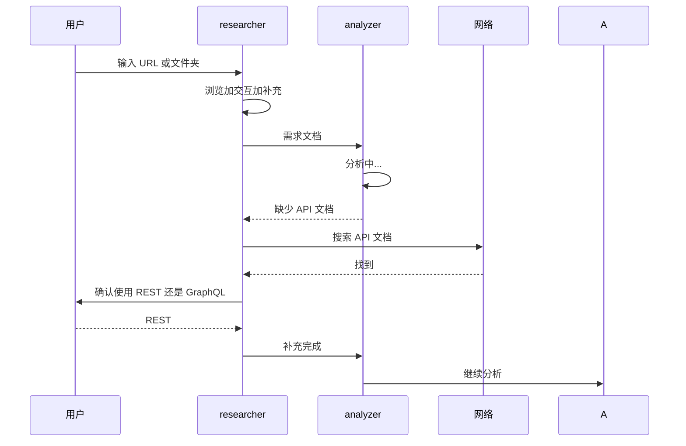

---

## 四种类型架构示例

### 类型 1：轻+薄（简单技能）

适用于：单一功能的工具类技能

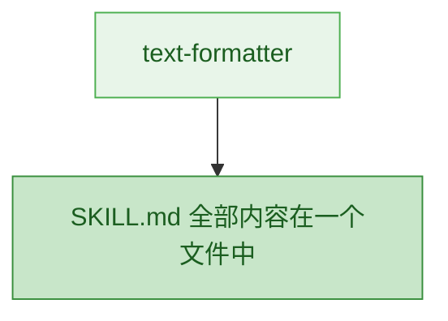

### 类型 2：重+薄（技能族-薄）

适用于：多个独立工具，每个都很简单

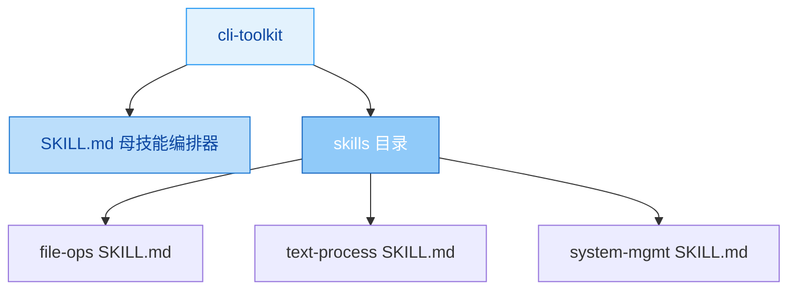

### 类型 3：轻+厚（复杂单技能）

适用于：单一主题但内容非常丰富

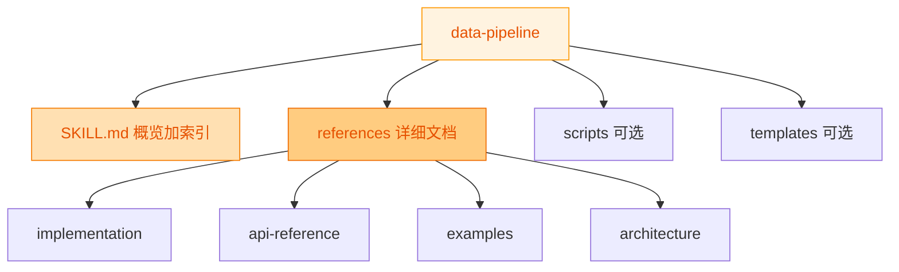

### 类型 4：重+厚（技能族-厚）⭐

适用于：大型技术栈，外层拆分，内层补充资料

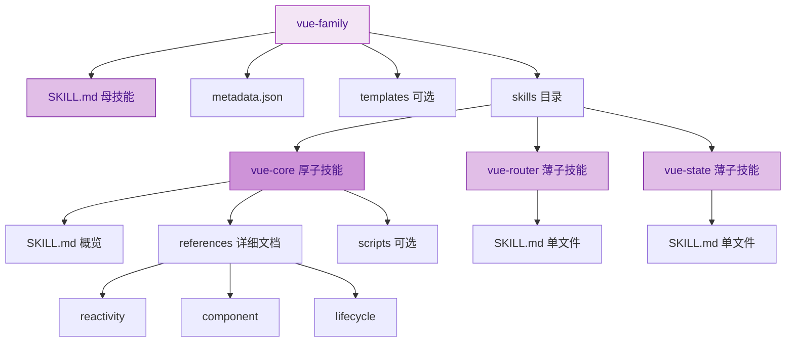

---

## 补充资源说明

当技能为**厚技能**时，除 `references/` 外还可包含：

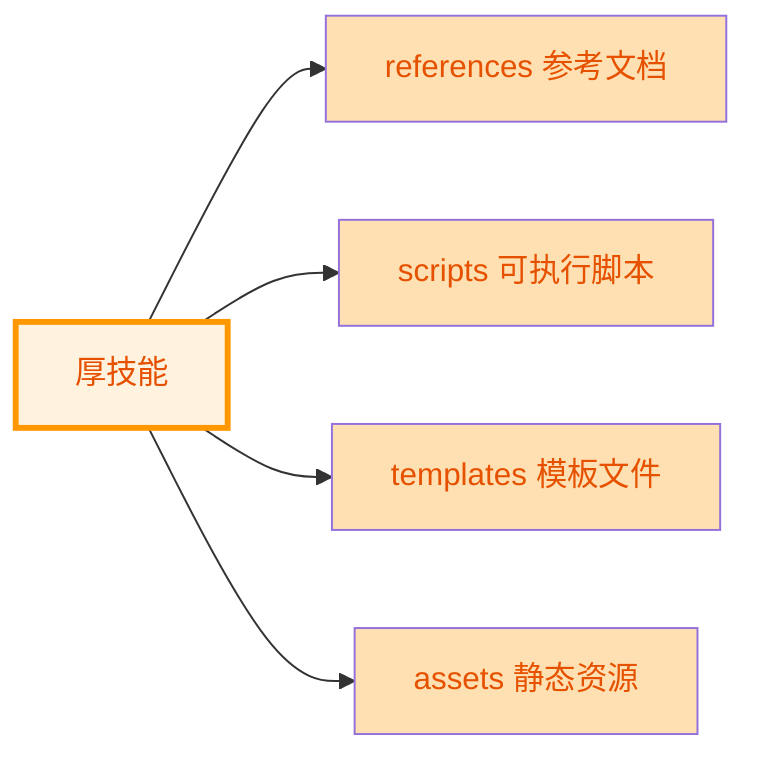

| 目录 | 用途 | 何时创建 |
|------|------|---------|
| `references/` | 参考文档（.md） | 内容 >300 行时 |
| `scripts/` | 可执行脚本 | 有自动化操作时 |
| `templates/` | 模板文件 | 有初始化模板时 |
| `assets/` | 静态资源 | 有图片/图表时 |

---

## 版本历史

| 版本 | 日期 | 变更说明 |
|------|------|----------|
| v9.2.0 | 2026-04-30 | 修复 Mermaid 渲染问题，替换不兼容的图表类型 |
| v9.1.0 | 2026-04-30 | 优化 Mermaid 语法和配色方案 |
| v9.0.0 | 2026-04-30 | 新增 researcher 信息研究阶段，支持交互和搜索 |
| v8.0.0 | 2026-04-30 | 添加 Mermaid 图表，图文并茂 |
| v7.0.0 | 2026-04-30 | 引入"轻/重/薄/厚"四维分类体系 |
