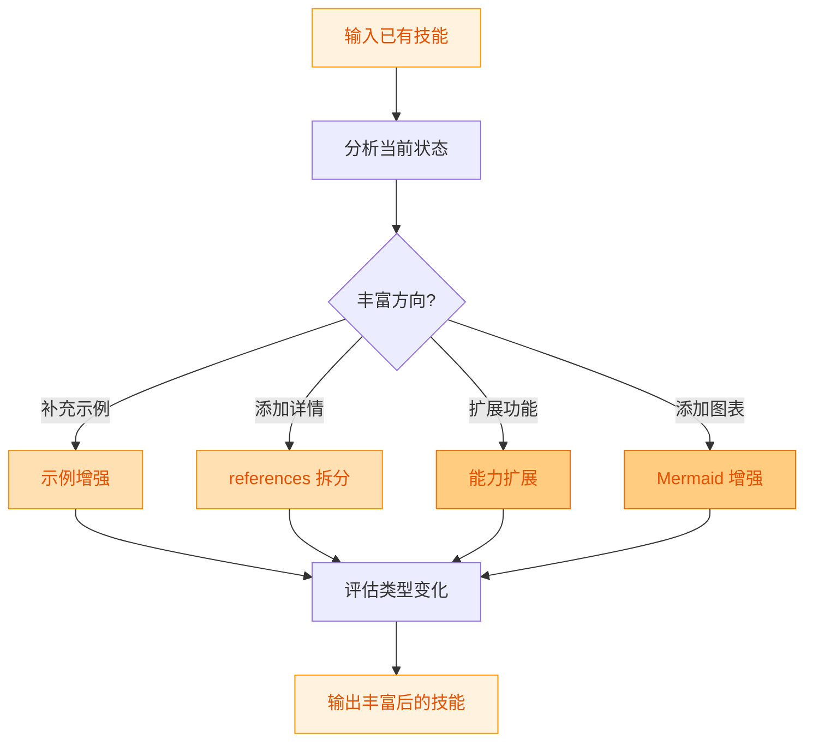
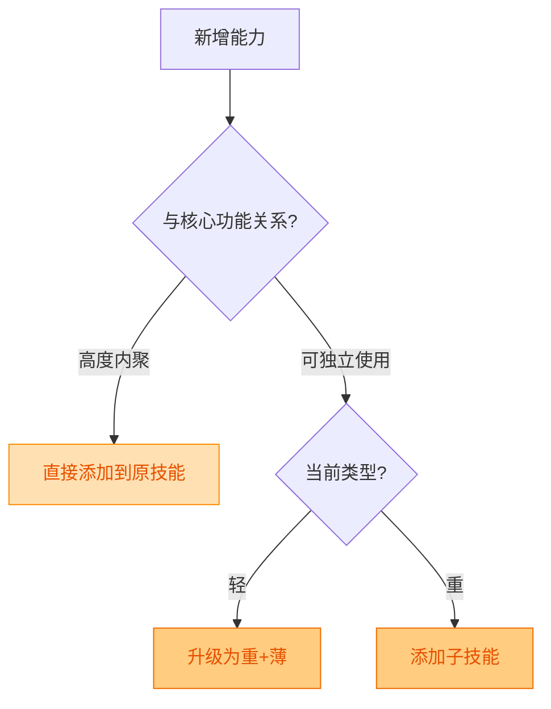
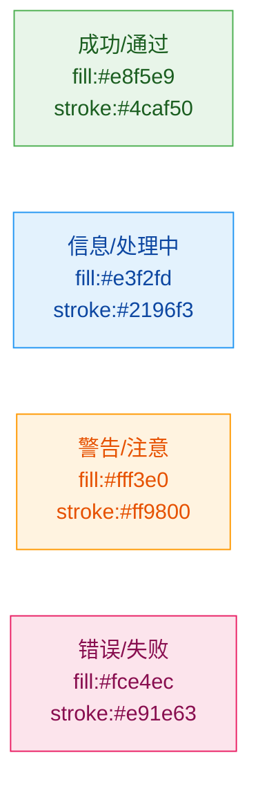

# Skill Factory Enricher - 技能丰富器

## 职责边界

**负责**: 补充技能内容，使技能更完整、更有价值
**不负责**: 类型判定（planner）、格式美化（beautifier）、规范检查（standardizer）

---

## 加工流程



---

## 操作一：示例增强

### 判定条件

- 示例数量 < 2 个
- 现有示例不完整（缺少输入/输出）
- 未覆盖主要使用场景

### 操作步骤

1. **识别缺失场景**
   - 列出技能的所有使用场景
   - 标注已有示例覆盖的场景
   - 找出未覆盖的场景

2. **生成新示例**
   - 每个缺失场景至少 1 个示例
   - 示例格式：输入 → 操作 → 输出
   - 确保示例可复制执行

3. **插入位置**
   - 放在"## 使用示例"章节
   - 或在对应操作步骤后紧跟

### 效果评估

| 变化 | 影响 |
|------|------|
| 新增 < 2 个简单示例 | 行数微增，类型不变 |
| 新增 >= 2 个或复杂示例 | 可能 薄→厚 |

---

## 操作二：References 拆分

### 判定条件

- 正文行数 > 300 行且为单文件
- 有大量代码块或详细说明混在主文件
- 内容层次不明显

### 操作步骤

1. **分析内容结构**
   - 识别可独立成章的内容块
   - 评估每个块的规模

2. **创建 references 目录**
   ```
   {name}/
   ├── SKILL.md          # 精简为概览 ~150行
   └── references/
       ├── implementation.md
       ├── examples.md
       ├── api-reference.md
       └── troubleshooting.md
   ```

3. **迁移内容**
   - 详细实现 → implementation.md
   - 完整示例 → examples.md
   - 接口文档 → api-reference.md
   - FAQ → troubleshooting.md

4. **重写主文件**
   - 保留任务目标、快速开始、内容索引
   - 添加指向 references 的链接

### 效果

**薄 → 厚** (确定升级)

---

## 操作三：能力扩展

### 判定条件

- 用户要求添加新功能
- 发现相关但缺失的能力
- 原技能范围过窄

### 操作步骤

1. **评估影响**
   - 新能力是否与核心功能内聚？
   - 是否应该拆分为独立子技能？

2. **决策**



3. **执行**
   - 内聚添加: 在操作步骤中增加新步骤
   - 升级为重: 创建 skills/ 子目录
   - 添加子技能: 在 children 中注册

### 效果

可能 **轻 → 重** (如果需要子技能)

---

## 操作四：Mermaid 增强

### 判定条件

- 流程描述文字化，缺乏直观性
- 有决策分支但没有决策图
- 多组件协作没有架构图

### 可用图表类型

| 图表类型 | 适用场景 | Mermaid 语法 |
|---------|---------|-------------|
| flowchart LR/TD/TB | 流程、步骤、决策 | `flowchart` |
| sequenceDiagram | 交互时序 | `sequenceDiagram` |
| pie | 占比分布 | `pie` |

### 配色规范



### 规则

- 节点文本不使用 `< > { }` 特殊字符
- 不使用 emoji 在节点文本内
- 每个 style 必须包含 `color:` 属性
- 优先使用 flowchart，避免 quadrantChart 和 mindmap

---

## 输出报告

```markdown
## 丰富操作报告

### 操作摘要
- 操作类型: <enrich/split/extend/diagram>
- 原类型: <轻+薄 / ...>
- 新类型: <更新后类型>

### 变更清单
| 操作 | 内容 | 行数变化 |
|------|------|---------|

### 类型变化
- 轻→重: 是/否
- 薄→厚: 是/否

### 后续建议
- 需要发布新版本: 是/否
- 推荐版本变更: minor +1
```

---

## 参考

- [skill-factory](../SKILL.md) - 工厂主文件
- [skill-factory-standardizer](../skills/skill-factory-standardizer/SKILL.md) - 规范化（丰富后建议执行）
- [skill-factory-publisher-version](../skills/skill-factory-publisher-version/SKILL.md) - 版本管理
