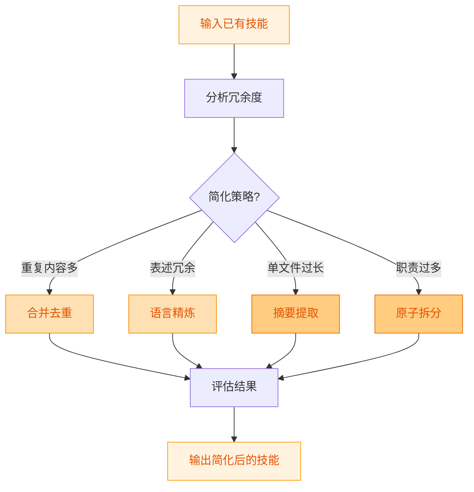

# Skill Factory Simplifier - 技能简化器

## 职责边界

**负责**: 精简冗余内容，使技能更精炼高效
**不负责**: 内容丰富（enricher）、类型判定（planner）、删除有用信息

---

## 加工流程



---

## 操作一：合并去重

### 冗余检测

| 冗余类型 | 检测方法 | 处理方式 |
|---------|---------|---------|
| 重复描述 | 同一概念多次说明 | 保留最完整的版本 |
| 重复示例 | 相似示例多个 | 合并为一个通用示例 |
| 重复章节 | 内容重叠的章节 | 合并到同一章节下 |
| 循环引用 | A 引用 B，B 又引用 A | 打破循环，单向引用 |

### 操作原则

1. **保留信息量最大的版本**
2. **合并时标注来源**（如需要追溯）
3. **验证合并后逻辑一致性**

---

## 操作二：语言精炼

### 冗余模式识别

| 冗余模式 | 示例 | 精炼后 |
|---------|------|--------|
| 同义反复 | "用户输入的用户名" | "用户名" |
| 过度限定 | "首先第一步先做的是" | "第一步：" |
| 空话套话 | "值得注意的是我们需要注意" | "注意：" |
| 重复连接词 | "并且和以及" | "和" |

### 精炼规则

1. 删除无信息的修饰语
2. 用短句替代长句
3. 用表格替代列表式描述
4. 用 Mermaid 图替代纯文字流程描述

### 目标

```
精炼后行数减少 >= 20%
语义完整性保持不变
```

---

## 操作三：摘要提取（薄化）

### 适用条件

- 当前类型为轻+厚 或 重+厚
- 主文件超过 200 行
- references 已存在或可以创建

### 操作步骤


1. **保留在主文件的内容**:
   - 任务目标（精简版）
   - 快速开始（3-5 步）
   - 内容索引表

2. **移入 references 的内容**:
   - 详细操作步骤
   - 完整使用示例
   - API 参数说明
   - 边缘情况处理

### 效果

**厚 → 薄** (主文件从厚变薄)

---

## 操作四：原子拆分（轻量化）

### 适用条件

- 核心能力 > 5 个
- 不同能力面向不同用户
- 部分能力可独立复用

### 与 enricher 的区别

| 维度 | simplifier 拆分 | enricher 扩展 |
|------|----------------|-------------|
| 方向 | 从复杂→简单 | 从简单→复杂 |
| 目标 | 每个子更轻 | 能力更全 |
| 结果 | 重→多个轻 | 轻→重 |

### 操作步骤

1. **能力盘点**
   ```yaml
   原技能:
     capabilities:
       - name: 能力A
         users: [用户群X]
         can_standalone: true
       - name: 能力B
         users: [用户群Y]
         can_standalone: true
   ```

2. **设计拆分方案**
   - 每个子技能单一职责
   - 子技能间松耦合
   - 公共部分放入协调器

3. **执行拆分**
   - 创建 skills/ 子目录
   - 编写各子技能（目标: 轻+薄）
   - 原文件改为协调器

### 效果

**重 → 多个轻** (确定类型变化)

---

## 简化效果评估

| 指标 | 简化前 | 简化后 | 变化率 |
|------|-------|-------|--------|
| 总行数 | _ | _ | _% ↓ |
| 核心能力数 | _ | _ | _ |
| 文件/目录数 | _ | _ | _ |
| 类型判定 | _ | _ | _ |

### 质量保证

简化操作必须满足：

- [ ] 信息无丢失（只是重新组织）
- [ ] 核心能力保持不变（除非主动拆分）
- [ ] 链接和引用有效
- [ ] 用户仍能找到所有信息

---

## 输出报告

```markdown
## 简化操作报告

### 操作摘要
- 操作类型: <dedup/refine/extract/split>
- 原类型: <轻+厚 / 重+厚 / ...>
- 新类型: <更新后类型>

### 量化结果
- 行数变化: -XX 行 (-XX%)
- 文件数变化: X → Y

### 类型变化
- 厚→薄: 是/否
- 重→轻: 是/否

### 后续建议
- 需要发布新版本: 是/否
- 推荐版本变更: minor +1 (类型变化时)
```

---

## 参考

- [skill-factory](../SKILL.md) - 工厂主文件
- [skill-factory-enricher](../skills/skill-factory-enricher/SKILL.md) - 丰富器（反向操作）
- [skill-factory-standardizer](../skills/skill-factory-standardizer/SKILL.md) - 规范化（简化后建议执行）
