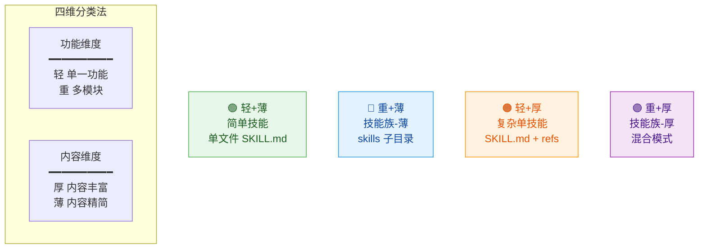
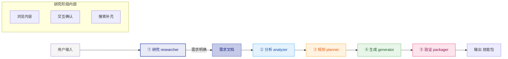
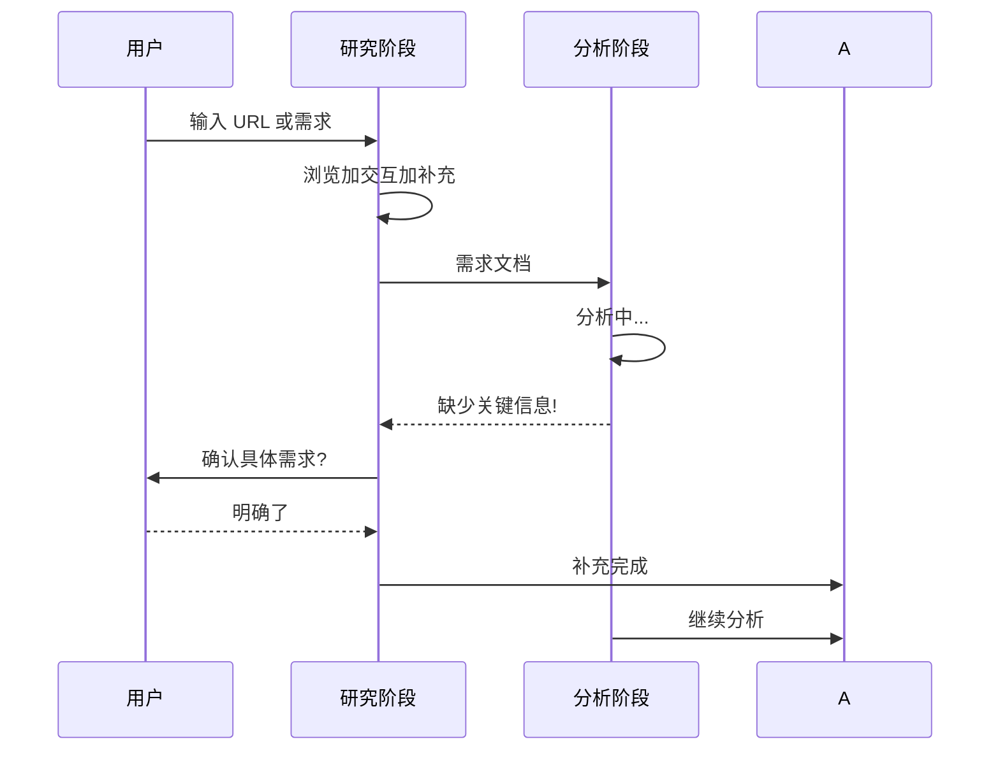
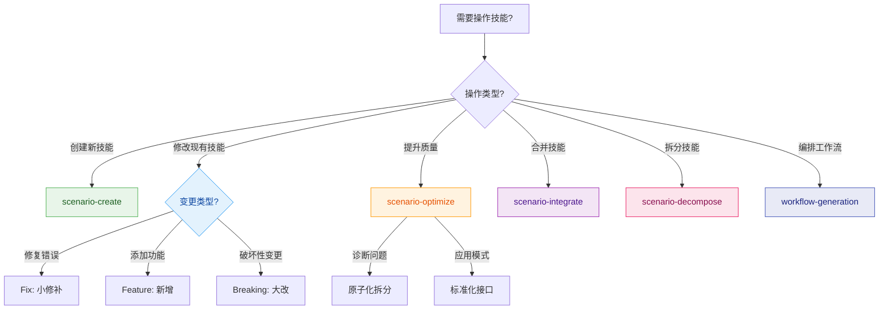
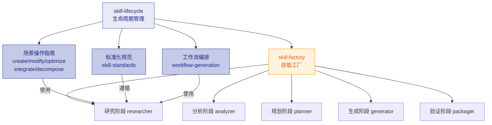

# Skill Lifecycle - 技能生命周期管理

## 任务目标

本 Skill 用于管理技能的全生命周期，从需求分析到最终交付的完整流程。

**触发条件**: 当你需要创建、修改、优化、整合或拆分技能时使用。

---

## 四维分类体系



### 维度定义

| 维度 | 定义 | 判断标准 | 输出结构 |
|------|------|---------|---------|
| **轻** | 功能单一 | 1 个核心能力，逻辑简单 | 单个 SKILL.md |
| **重** | 功能复杂 | 多个模块，可独立使用 | `skills/{子}/SKILL.md` |
| **薄** | 内容精简 | 单文件 <300 行能描述清楚 | 无需额外文件 |
| **厚** | 内容丰富 | 需要详细说明、示例、代码等 | `references/` + 可选 `scripts/` `templates/` |

### 四种组合与输出结构

| 组合 | 类型 | 目录结构 | 典型场景 |
|------|------|---------|---------|
| **轻+薄** | 简单技能 | `{name}/SKILL.md` | 工具类、格式转换 |
| **重+薄** | 技能族(薄) | `{name}-family/SKILL.md` + `skills/{子}/SKILL.md` | CLI工具集、工作流编排器 |
| **轻+厚** | 复杂单技能 | `{name}/SKILL.md` + `references/*.md` | 数据处理管道、详细教程 |
| **重+厚** | 技能族(厚) | `{name}-family/SKILL.md` + `skills/{子}/` (+ 部分 `references/`) | 大型框架学习包 |

### 组织方式决策原则

```
┌─────────────────────────────────────────────────────────────┐
│                    组织方式设计原则                             │
├─────────────────────────────────────────────────────────────┤
│                                                             │
│  子技能 (skills/)          references (/)                   │
│  ┌───────────────┐         ┌───────────────┐               │
│  │   解耦模式     │         │   内聚模式      │               │
│  │   类似: 微服务  │         │   类似: 单体分层  │               │
│  └───────────────┘         └───────────────┘               │
│                                                             │
│  ★ 优先级：子技能拆分 > references 补充                     │
│  ★ 可共存：子技能内部可有 references                        │
│                                                             │
└─────────────────────────────────────────────────────────────┘
```

| 维度 | 子技能 (skills/) | references (/) |
|------|------------------|----------------|
| 本质 | 解耦 | 内聚 |
| 类比 | 微服务 / 模块化 | 单体内部分层 |
| 适用 | 职责清晰、可独立调用 | 高度内聚、无法拆分 |
| 优先级 | ⭐ 首选 | ⭐ 兜底 |

---

## 五阶段工作流程



### 阶段职责总览

| 阶段 | 核心职责 | 关键输出 | 对应 skill-factory 子技能 |
|------|----------|---------|------------------------|
| **① 研究** | 接收输入、交互确认、补充信息 | 需求文档 | researcher |
| **② 分析** | 提取技术信息，评估功能数量和内容体量 | 分析报告 | analyzer |
| **③ 规划** | 判定轻重薄厚，选择输出结构 | 拆分计划 | planner |
| **④ 生成** | 按四种类型生成对应目录和文件 | SKILL.md 文件 | generator |
| **⑤ 验证** | 验证对应结构的完整性 | 验证报告 | packager |

### 全程回调机制

在后续任何阶段发现信息不足时，都可以回调研究阶段：



---

## 快速决策树



### 场景与四维分类映射

| 场景 | 适用情况 | 通常产出类型 | 推荐先判定 |
|------|---------|------------|-----------|
| scenario-create | 从零创建 | 先判定轻重薄厚 | 用户需求明确？ |
| scenario-modify | 修改已有 | 保持原类型或升级 | 变更影响范围？ |
| scenario-optimize | 提升质量 | 可能升级（薄→厚） | 问题根源是什么？ |
| scenario-integrate | 合并多技能 | 通常是重+薄或重+厚 | 模块间依赖关系？ |
| scenario-decompose | 拆分复杂 | 从重+厚 → 多个轻+薄 | 能否解耦？ |
| workflow-generation | 编排工作流 | 重+薄（协调器） | 流程是否固定？ |

---

## 场景索引

| 场景 | 适用情况 | 生命周期 | 输出物 | 类型判定参考 |
|------|---------|---------|--------|-------------|
| [scenario-create](skills/scenario-create/SKILL.md) | 从零创建新技能 | 设计→开发→测试→发布 | 新技能 SKILL.md | 用户输入 → researcher → 判定类型 |
| [scenario-modify](skills/scenario-modify/SKILL.md) | 修改已有技能 | 开发→测试→发布→维护 | 更新后的 SKILL.md | 变更类型 → 版本策略 |
| [scenario-optimize](skills/scenario-optimize/SKILL.md) | 提升技能质量 | 设计→开发→测试→发布 | 优化后的 SKILL.md | 问题诊断 → 优化策略 |
| [scenario-integrate](skills/scenario-integrate/SKILL.md) | 合并多个技能 | 设计→开发→测试→发布 | 整合后的 SKILL.md | 依赖分析 → 整合模式 |
| [scenario-decompose](skills/scenario-decompose/SKILL.md) | 拆分复杂技能 | 设计→开发→测试→发布 | 多个独立技能 | 能否解耦 → 拆分方案 |
| [workflow-generation](skills/workflow-generation/SKILL.md) | 编排工作流 | 设计→开发→测试→发布 | WORKFLOW.md | 流程特点 → 工作流模式 |

---

## 核心规范速查

### SKILL.md 必需结构

```yaml
---
name: <skill-name>           # 小写字母+连字符
version: v1.0.0              # v主.次.补丁
author: <作者>
description: <100-150字符描述>
tags: [tag1, tag2, tag3]    # 至少3个标签
---
```

### 正文必需章节

```markdown
## 任务目标
- 本 Skill 用于: <一句话说明>
- 核心能力: <能力要点>
- 触发条件: <何时使用>

## 操作步骤
1. <步骤1>
2. <步骤2>

## 使用示例
<示例>

## 注意事项
<注意点>
```

### 质量标准

| 检查项 | 标准 |
|-------|------|
| 正文行数 | < 500 行 |
| description | 100-150 字符 |
| tags | >= 3 个 |
| 必需章节 | 任务目标、操作步骤、示例 |

### 目录结构规范

| 类型 | 结构 | 说明 |
|------|------|------|
| **轻+薄** | `{name}/SKILL.md` | 单文件即可 |
| **重+薄** | `{name}-family/SKILL.md` + `skills/{子}/SKILL.md` | 外层解耦 |
| **轻+厚** | `{name}/SKILL.md` + `references/*.md` | 内聚分层 |
| **重+厚** | `{name}-family/SKILL.md` + `skills/(部分有references/)` | 混合模式 |

---

## 与 skill-factory 的关系



| 层次 | 定位 | 核心价值 |
|------|------|----------|
| **skill-lifecycle** | 顶层管理器 | 定义场景、提供规范、指导操作 |
| **skill-factory** | 执行引擎 | 五阶段流水线、四维分类判定、文件生成 |

---

## 版本历史

| 版本 | 日期 | 变更说明 |
|------|------|----------|
| v3.0.0 | 2026-04-30 | 整合四维分类体系、五阶段流程、与 skill-factory 对齐 |
| v2.1.0 | 2026-04-30 | 简化框架，增加决策树，移除冗余内容 |
| v2.0.0 | 2026-04-30 | 引入子技能结构 |
