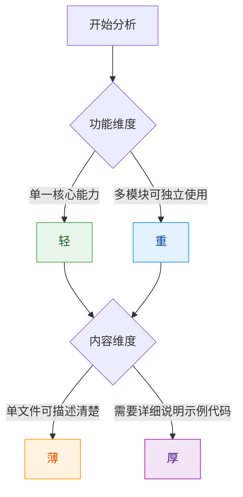

# 场景：创建新技能

## 适用场景

从零开始创建新技能，经过研究、分析、规划、生成、验证五个阶段。

---

## 完整流程概览


---

## 第一阶段：研究（Researcher）

### 目标
接收用户输入，明确需求，补充缺失信息。

### 操作步骤

| 步骤 | 操作 | 输出 |
|------|------|------|
| 1 | 接收输入（URL/需求描述/文件夹） | 原始输入 |
| 2 | 浏览内容，提取关键信息 | 初步理解 |
| 3 | 与用户交互确认细节 | 需求澄清 |
| 4 | 检测信息缺口 | 缺失清单 |
| 5 | 搜索补充或询问用户 | 补充信息 |
| 6 | 输出需求文档 | 结构化需求 |

### 准出条件

- [ ] 核心功能明确
- [ ] 目标用户清晰
- [ ] 触发场景确定
- [ ] 信息缺口已填补

---

## 第二阶段：分析（Analyzer）

### 目标
评估技能的功能数量和内容体量。

### 分析维度



### 判定标准

| 维度 | 判断问题 | 是→类型 | 否→类型 |
|------|---------|--------|--------|
| **轻重** | 是否有 2+ 个可独立使用的模块？ | 重 | 轻 |
| **薄厚** | 内容是否超过 300 行或需要详细说明？ | 厚 | 薄 |

### 准出条件

- [ ] 功能维度已判定（轻/重）
- [ ] 内容维度已判定（薄/厚）
- [ ] 组合类型已确定

---

## 第三阶段：规划（Planner）

### 目标
根据四维分类选择输出结构。

### 类型到结构映射

| 类型 | 目录结构 | 文件策略 |
|------|---------|---------|
| **轻+薄** | `{name}/SKILL.md` | 单文件包含全部内容 |
| **重+薄** | `{name}/SKILL.md` + `skills/{子}/SKILL.md` | 主文件做索引，子文件独立 |
| **轻+厚** | `{name}/SKILL.md` + `references/*.md` | 主文件做概览，详情在 refs |
| **重+厚** | `{name}/SKILL.md` + `skills/{子}/`(部分有`references/`) | 外层解耦+内层分层 |

### 规划输出

```yaml
规划结果:
  类型: <轻+薄 / 重+薄 / 轻+厚 / 重+厚>
  目录结构:
    - <文件/目录列表>
  组织方式:
    解耦模式: <是否使用 skills/>
    内聚模式: <是否使用 references/>
```

### 准出条件

- [ ] 类型判定完成
- [ ] 目录结构设计完成
- [ ] 组织方式决策完成

---

## 第四阶段：生成（Generator）

### 目标
按规划生成对应类型的文件。

### 按类型生成

#### A型：轻+薄

```markdown
---
name: <skill-name>
version: v1.0.0
description: <100-150字符>
tags: [<标签>]
---

## 任务目标
- 本 Skill 用于: <一句话>
- 核心能力: <要点>
- 触发条件: <何时使用>

## 操作步骤
1. <步骤1>
2. <步骤2>

## 使用示例
<完整示例>

## 注意事项
<注意点>
```

#### B型：重+薄

```
{name}-family/
├── SKILL.md              # 索引/协调器
└── skills/
    ├── {name}-{func-a}/SKILL.md
    ├── {name}-{func-b}/SKILL.md
    └── {name}-{func-c}/SKILL.md
```

#### C型：轻+厚

```
{name}/
├── SKILL.md              # 概览 (<200行)
└── references/
    ├── implementation.md # 实现细节
    ├── examples.md       # 使用示例
    └── api-reference.md  # 接口文档
```

#### D型：重+厚

```
{name}-family/
├── SKILL.md              # 协调器
└── skills/
    ├── {complex-sub}/
    │   ├── SKILL.md
    │   └── references/   # 仅复杂子需要
    └── {simple-sub}/
        └── SKILL.md      # 简单子无需额外文件
```

### 准出条件

- [ ] 所有必需文件已创建
- [ ] 前言区格式正确
- [ ] 正文包含必需章节
- [ ] 示例完整可执行

---

## 第五阶段：验证（Packager）

### 目标
验证生成结果的完整性和质量。

### 验证清单

#### 通用验证

- [ ] name 符合命名规范
- [ ] version 格式正确
- [ ] description 长度 100-150 字符
- [ ] tags ≥ 3 个
- [ ] 必需章节完整

#### 类型专项验证

| 类型 | 专项检查项 |
|------|-----------|
| **轻+薄** | 正文 < 300 行，无冗余 |
| **重+薄** | 子技能均可独立运行，无循环依赖 |
| **轻+厚** | references/ 链接正确，无死链 |
| **重+厚** | 层次 ≤ 2 层，混合比例合理 |

### 准出条件

- [ ] 通用验证通过
- [ ] 类型专项验证通过
- [ ] 无遗留问题

---

## 快速参考

### 决策速查表

```
用户需求 → 研究(交互+搜索) → 分析(轻?重? 薄?厚?) → 规划(选结构) → 生成(写文件) → 验证(查质量)
```

### 常见问题

**Q: 不确定是轻还是重？**
- 问自己：这个技能能否拆成多个独立使用的部分？
  - 能 → 重（用 skills/）
  - 不能 → 轻

**Q: 不确定是薄还是厚？**
- 问自己：单文件能否在 300 行内说清楚？
  - 能 → 薄
  - 不能 → 厚（用 references/）

---

## 参考文档

- [skill-standards](../skill-standards/SKILL.md) - 格式规范与四维分类
