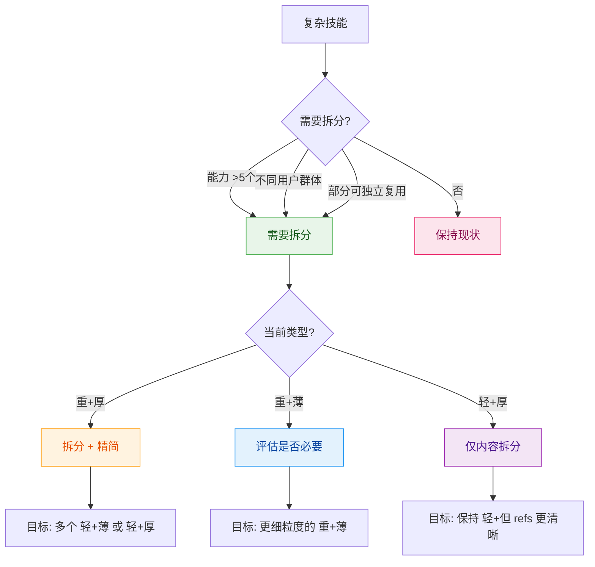
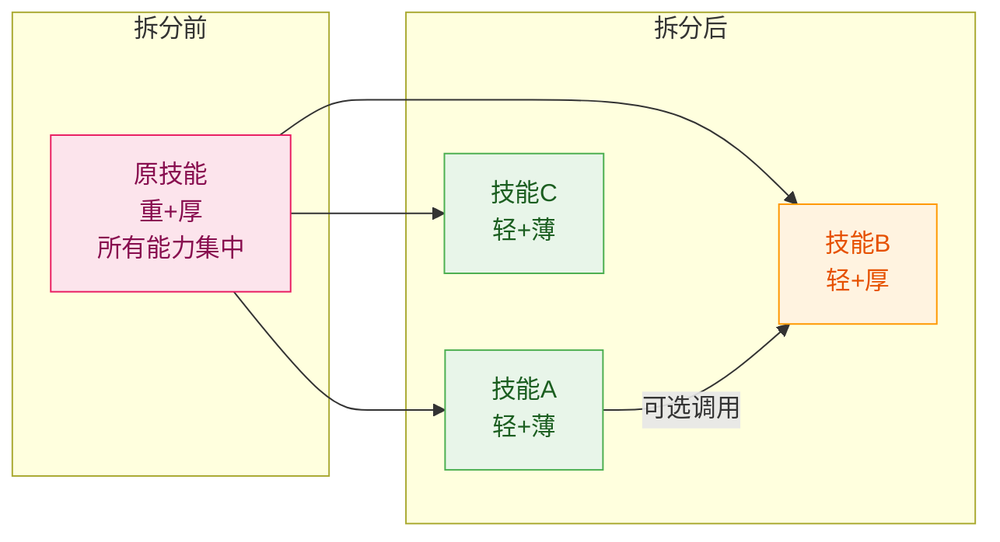

# 场景：拆分技能

## 适用场景

将复杂的重类型技能拆分为多个独立的轻类型技能。

---

## 拆分决策



### 拆分触发条件

| 条件 | 说明 | 建议 |
|------|------|------|
| 能力 >5 个 | 职责过多 | 强烈建议拆分 |
| 不同用户群体 | 面向不同场景 | 建议拆分 |
| 部分可独立复用 | 有复用价值 | 建议拆分 |
| 单子技能 >300 行 | 内容臃肿 | 考虑对该子薄→厚 |

### 拆分目标类型

| 原类型 | 拆分目标 | 典型操作 |
|--------|---------|---------|
| **重+厚** | 多个 **轻+薄** 或 **轻+厚** | 模块拆分 + 内容重组 |
| **重+薄** | 更细的 **重+薄** 或多个 **轻+薄** | 子技能再拆分 |
| **轻+厚** | 保持 **轻+厚** 但 refs 更清晰 | references 重组 |

---

## 第一步：分析原技能

### 操作

**1. 提取能力清单并标注类型**

```yaml
原技能分析:
  name: <原技能名>
  current_type: <重+厚 / 重+薄 / 轻+厚>
  capabilities:
    - name: <能力1>
      can_standalone: <是/否>
      content_size: <大约行数>
      needs_detail: <是/否>
    - name: <能力2>
      ...
```

**2. 识别拆分点**

| 拆分维度 | 说明 | 示例 |
|---------|------|------|
| 功能 | 按功能模块拆分 | 读取/清洗/分析/导出 |
| 场景 | 按使用场景拆分 | 实时处理/批处理 |
| 复杂度 | 按复杂度拆分 | 简单任务/复杂任务 |

**3. 预判每个子技能的类型**

```
对每个待拆分的子技能问：
1. 能否独立使用？ → 能=轻, 不能=需归入父技能
2. 内容能否在300行内说清楚？ → 能=薄, 不能=厚
```

---

## 第二步：设计拆分方案

### 操作

**1. 设计拆分方案**

```yaml
拆分方案:
  原技能: <原技能名>
  original_type: <原类型>
  
  拆分后:
    - name: <新技能1>
      capabilities: [<能力>]
      target_type: <轻+薄 / 轻+厚>
      structure: <目录结构>
    - name: <新技能2>
      capabilities: [<能力>]
      target_type: <轻+薄 / 轻+厚>
      structure: <目录结构>
```

**2. 设计协作关系**



**3. 制定迁移策略**

```yaml
迁移策略:
  阶段1: 创建新技能（并行维护）
  阶段2: 标记原技能为 deprecated
  阶段3: 提供迁移期（建议30天）
  阶段4: 退役原技能
```

---

## 第三步：执行拆分

### 开发阶段

**准入**: 拆分方案完成

**操作**:

1. 创建新技能目录
   ```bash
   mkdir <skill-1> <skill-2>
   ```

2. 按目标类型编写各子技能

   - **轻+薄**: 单文件 SKILL.md
   - **轻+厚**: SKILL.md + references/

3. 更新原技能为 deprecated

   ```yaml
   ---
   name: <原技能>
   version: v2.0.0
   description: "[已拆分] 请使用以下独立技能:"
   tags: [deprecated]
   ---
   
   ## 迁移指引
   
   本技能已拆分为:
   - [<skill-1>](../<skill-1>/SKILL.md): <用途>
   - [<skill-2>](../<skill-2>/SKILL.md): <用途>
   ```

### 测试阶段

**准入**: 开发阶段完成

**验证**:
- [ ] 每个技能职责单一
- [ ] 技能间无重复能力
- [ ] 技能边界清晰
- [ ] 各子技能类型判定正确
  - 轻+薄: 正文 < 300 行
  - 轻+厚: 有 references/ 且链接有效
- [ ] 功能等价（原技能 = 新技能组合）

### 发布阶段

**准入**: 测试阶段完成

```bash
git add .
git commit -m "refactor(<原技能>): 拒分为独立技能"
git tag -a <skill-1>-v1.0.0 -m "Release <skill-1> v1.0.0"
```

---

## 第四步：验收

### 拆分质量检查

- [ ] 每个技能职责单一
- [ ] 技能数量合理（建议 2-5 个）
- [ ] 依赖关系无循环
- [ ] 迁移指南完整
- [ ] 所有子技能通过类型专项检查

---

## 快速参考

### 拆分速查表

```
复杂技能要拆分？
1. 列出所有能力和它们的特性
2. 判定每个子技能的目标类型（轻/重 × 薄/厚）
3. 按目标类型设计目录结构
4. 生成对应的文件结构
5. 验证每个子技能的质量
```

### 类型映射总结

| 拆分方向 | 变化 | 操作 |
|---------|------|------|
| 重+厚 → 多个轻+薄 | 大幅简化 | 模块拆分 + 内容精简 |
| 重+厚 → 多个轻+厚 | 模块拆分 | 模块拆分 + 各自保留 refs |
| 重+薄 → 更细的重+薄 | 粒度细化 | 子技能再拆分 |
| 轻+厚 → 轻+厚（重组） | 结构优化 | references 重新组织 |

---

## 参考文档

- [skill-standards](../skill-standards/SKILL.md) - 格式规范
- [scenario-create](../scenario-create/SKILL.md) - 创建新技能
- [scenario-optimize](../scenario-optimize/SKILL.md) - 优化策略
