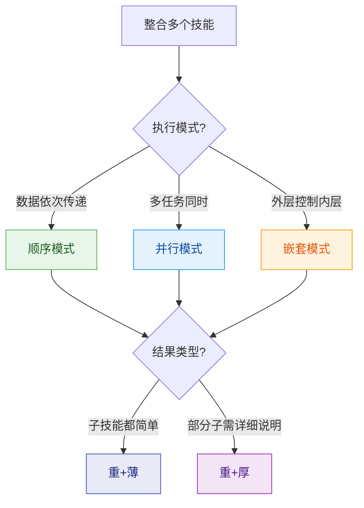

# 场景：整合技能

## 适用场景

将多个相关技能整合为一个统一的能力集合。

---

## 整合模式决策



### 模式对比

| 模式 | 执行方式 | 适用场景 | 数据流 |
|------|---------|---------|--------|
| **顺序** | 技能按序执行 | 流水线处理 | A → B → C |
| **并行** | 技能同时执行 | 独立任务 | 分支→汇聚 |
| **嵌套** | 外层调用内层 | 分层控制 | 外层→内层 |

### 整合后类型判定

| 条件 | 结果类型 | 结构 |
|------|---------|------|
| 所有子技能都是轻+薄 | **重+薄** | `skills/{子}/SKILL.md` |
| 部分子技能是轻+厚 | **重+厚** | `skills/{子}/`(部分有`references/`) |

---

## 第一步：分析源技能

### 操作

**1. 列出源技能**

```yaml
源技能:
  skill-a:
    capabilities: [能力1, 能力2]
    type: <当前类型>
  skill-b:
    capabilities: [能力3, 能力4]
    type: <当前类型>
```

**2. 检查兼容性**

- [ ] 命名无冲突
- [ ] 接口可统一
- [ ] 数据格式可转换
- [ ] 记录各源技能的四维类型

**3. 选择整合模式**

根据技能间的依赖关系选择：

```
有依赖顺序？ → 顺序模式
完全独立？   → 并行模式
有层次关系？ → 嵌套模式
```

---

## 第二步：设计整合架构

### 操作

**1. 设计整合结构**

```yaml
整合设计:
  名称: <整合技能名>
  模式: <顺序/并行/嵌套>
  预期类型: <重+薄 或 重+厚>
  组件:
    - <skill-a>: <角色>
    - <skill-b>: <角色>
```

**2. 设计数据流**

```
# 顺序模式
输入 → [skill-a] → 中间数据 → [skill-b] → 输出

# 并行模式
输入 → ├─ [skill-a] →─┐
       └─ [skill-b] →─┘ → 汇聚 → 输出

# 嵌套模式
输入 → [协调器] → 内部调用 [skill-a] → [skill-b] → 输出
```

**3. 判定输出类型**

```
整合后的技能一定是"重"（多模块）
是否需要"厚"？ → 任一子技能需要详细说明？
  是 → 重+厚
  否 → 重+薄
```

---

## 第三步：执行整合

### 开发阶段

**准入**: 整合设计完成

#### 生成重+薄结构

```
{整合名}-family/
├── SKILL.md              # 协调器
└── skills/
    ├── {skill-a}/SKILL.md
    └── {skill-b}/SKILL.md
```

#### 生成重+厚结构（当某子需要详细说明时）

```
{整合名}-family/
├── SKILL.md              # 协调器
└── skills/
    ├── {simple-skill}/SKILL.md
    └── {complex-skill}/
        ├── SKILL.md
        └── references/
            ├── detail.md
            └── examples.md
```

**协调器 SKILL.md 内容**:

```markdown
---
name: <整合名>-family
version: v1.0.0
description: <100-150字符>
tags: [<标签>]
---

## 任务目标
- 本 Skill 用于: <一句话>
- 包含子技能:
  - <skill-a>: <用途>
  - <skill-b>: <用途>
- 整合模式: <顺序/并行/嵌套>

## 子技能索引
- [<skill-a>](skills/<skill-a>/SKILL.md): <简述>
- [<skill-b>](skills/<skill-b>/SKILL.md): <简述>

## 执行流程
<根据模式的流程说明>
```

### 测试阶段

**准入**: 开发阶段完成

**验证**:
- [ ] 整合模式选择合理
- [ ] 数据流设计清晰
- [ ] 接口契约明确
- [ ] 对应类型的结构验证通过
  - 重+薄: 子技能均可独立运行
  - 重+厚: references/ 链接有效

### 发布阶段

**准入**: 测试阶段完成

```bash
git add .
git commit -m "feat(<整合名>): 整合多个技能为技能族"
git tag -a v1.0.0 -m "Release v1.0.0"
```

---

## 第四步：验收

### 整合质量检查

- [ ] 整合模式选择合理
- [ ] 数据流设计清晰
- [ ] 接口契约明确
- [ ] 依赖声明完整
- [ ] 四维类型判定正确
- [ ] 目录结构符合规范

---

## 快速参考

### 整合决策速查

```
多个技能要合并？
1. 分析各技能的类型（轻/重/薄/厚）
2. 选择执行模式（顺序/并行/嵌套）
3. 判定输出类型：
   - 全是简单子 → 重+薄
   - 有复杂子   → 重+厚
4. 按类型生成对应结构
```

### 与其他场景的关系

| 场景 | 关系 |
|------|------|
| scenario-create | 整合后 = 创建新技能族 |
| scenario-decompose | 反向操作 |
| scenario-modify | 整合后可能需要修改调整 |

---

## 参考文档

- [skill-standards](../skill-standards/SKILL.md) - 格式规范
- [scenario-create](../scenario-create/SKILL.md) - 创建技能流程
