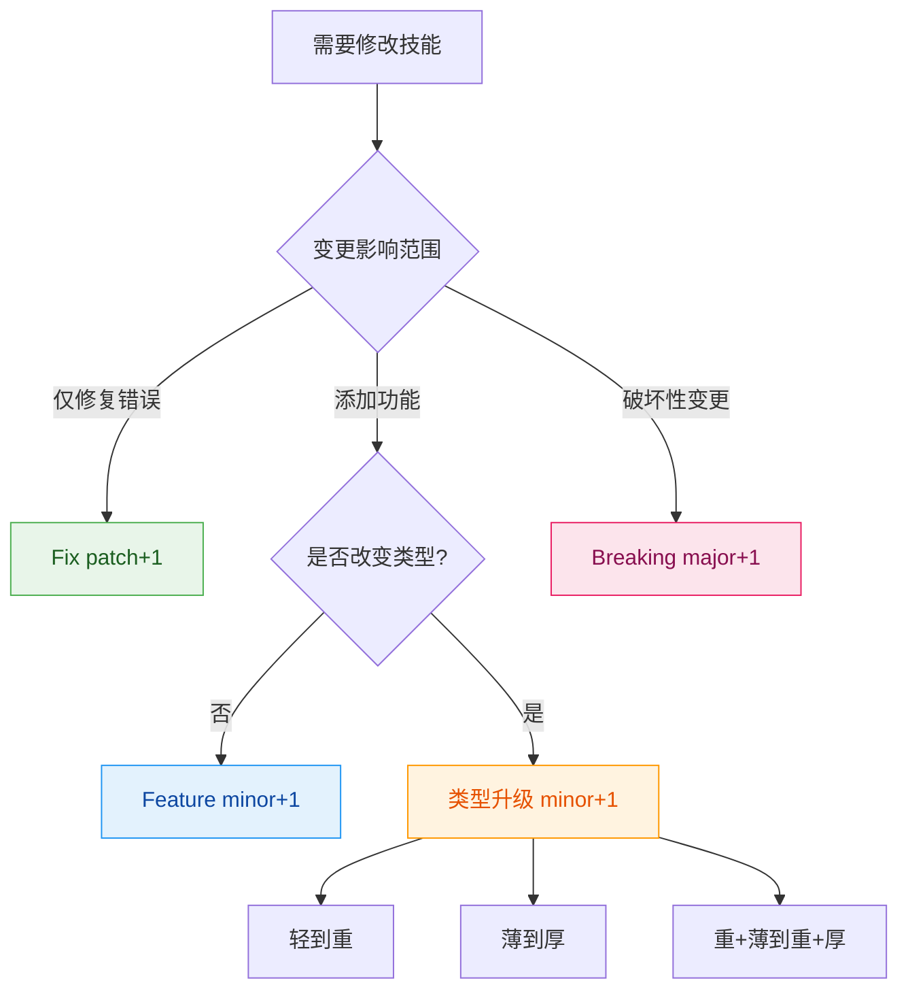
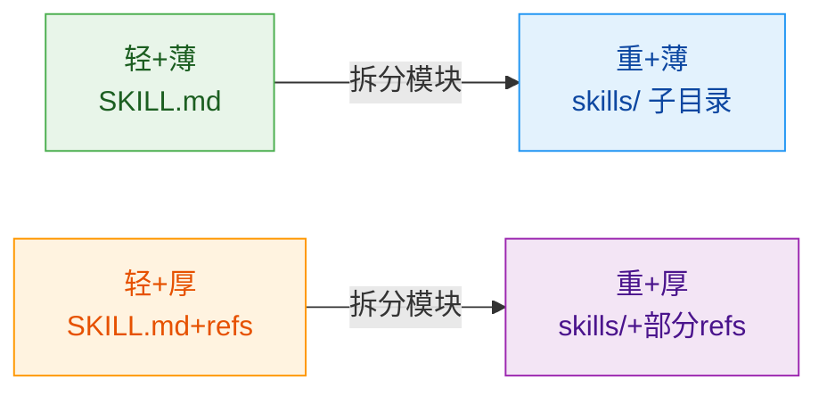
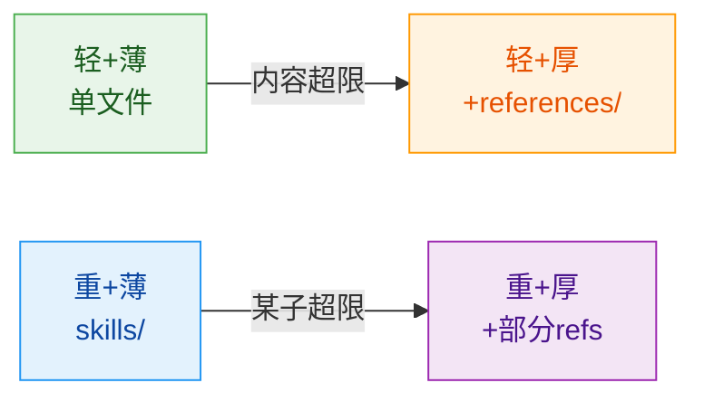

# 场景：修改技能

## 适用场景

修改已发布的技能，包括修复错误、添加功能、类型升级。

---

## 变更分类决策



### 变更类型定义

| 类型 | 说明 | 版本递增 | 示例 |
|------|------|---------|------|
| **Fix** | 修复错误，不改变结构 | patch +1 | 错别字、描述澄清 |
| **Feature** | 新增功能，保持原类型 | minor +1 | 添加能力、新示例 |
| **Type Upgrade** | 四维分类升级 | minor +1 | 轻→重、薄→厚 |
| **Breaking** | 破坏性变更 | major +1 | 接口修改、删除能力 |

---

## 第一步：分析当前状态

### 操作

**1. 检查当前类型**

```bash
head -10 SKILL.md
# 判定当前: 轻/重? 薄/厚?
```

**2. 评估变更影响**

| 检查项 | 问题 | 结果 |
|--------|------|------|
| 功能数量 | 是否新增可独立模块？ | 可能 轻→重 |
| 内容体量 | 是否超过 300 行？ | 可能 薄→厚 |
| 接口兼容 | 是否修改输入输出？ | 可能 Breaking |

**3. 确定变更类型**

```
是否有破坏性变更？
├── 是 → Breaking (major +1)
└── 否 → 是否升级类型？
    ├── 是 → Type Upgrade (minor +1)
    └── 否 → 是否有新功能？
        ├── 是 → Feature (minor +1)
        └── 否 → Fix (patch +1)
```

---

## 第二步：按类型执行

### Fix（修复）

适用：错别字、描述澄清、示例修正

```yaml
操作:
  - 直接修改目标内容
  - version: patch +1 (如 v1.0.0 → v1.0.1)
```

### Feature（新增功能）

适用：添加能力、扩展场景

```yaml
操作:
  - 在现有结构内添加内容
  - 保持原有目录结构不变
  - version: minor +1 (如 v1.0.0 → v1.1.0)
```

### Type Upgrade（类型升级）

适用：四维分类发生变化

#### 升级路径 A：轻 → 重



**操作步骤**:
1. 创建 `skills/` 目录
2. 按模块拆分为子技能
3. 原文件改为索引/协调器
4. 更新版本号

#### 升级路径 B：薄 → 厚



**操作步骤**:
1. 创建 `references/` 目录
2. 将详细内容移入 references/
3. 原文件保留概览（<200行）
4. 添加资源索引链接

#### 升级路径 C：重+薄 → 重+厚

**操作步骤**:
1. 识别需要详细说明的子技能
2. 为该子创建 `references/`
3. 其他子保持不变

### Breaking（破坏性变更）

适用：接口修改、删除核心能力

```yaml
操作:
  - 明确标记变更内容
  - 提供迁移指南
  - version: major +1 (如 v1.0.0 → v2.0.0)
```

---

## 第三步：验证与发布

### 验证清单

- [ ] 版本号已正确递增
- [ ] 变更类型与实际修改一致
- [ ] 如有类型升级，目录结构调整完成
- [ ] 所有内部链接有效
- [ ] 向后兼容性已评估（如需）

### 发布操作

```bash
git add .
git commit -m "<type>(<skill>): <变更说明>"
git tag -a v<新版本> -m "Release v<新版本>: <说明>"
```

### Commit 类型前缀

| 变更类型 | 前缀 | 示例 |
|---------|------|------|
| Fix | `fix` | `fix(skill-name): 修正示例错误` |
| Feature | `feat` | `feat(skill-name): 添加导出能力` |
| Type Upgrade | `refactor` | `refactor(skill-name): 拆分为技能族` |
| Breaking | `feat!` | `feat!(skill-name): 重构接口定义` |

---

## 快速参考

### 版本决策速查

```
破坏性？ → major
类型变了？ → minor (升级)
新功能？   → minor (feature)
仅修bug？  → patch
```

### 类型升级速查

| 当前 | 触发条件 | 目标 | 操作 |
|------|---------|------|------|
| 轻+薄 | 功能变多模块 | 重+薄 | 创建 skills/ |
| 轻+薄 | 内容超300行 | 轻+厚 | 创建 references/ |
| 重+薄 | 某子内容超限 | 重+厚 | 该子加 references/ |

---

## 参考文档

- [skill-standards](../skill-standards/SKILL.md) - 格式规范与类型检查
