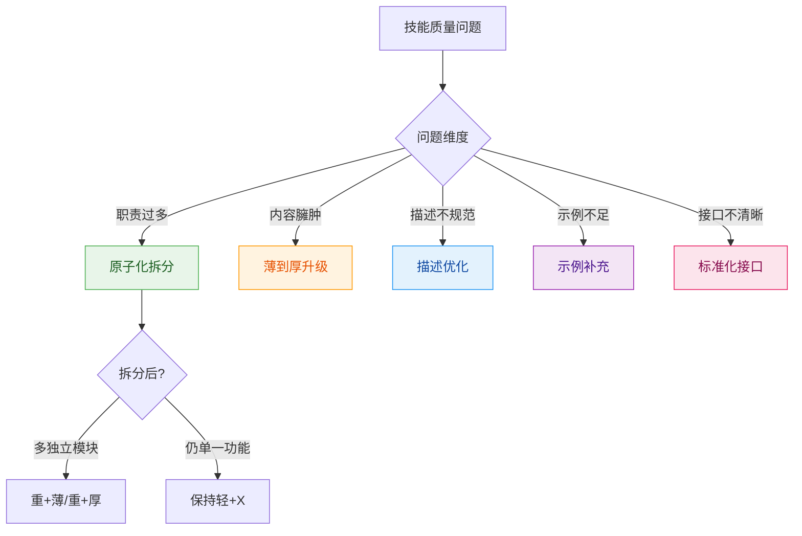

# 场景：优化技能

## 适用场景

提升现有技能质量，包括结构优化、描述优化、类型升级。

---

## 问题诊断流程



### 常见问题与策略

| 问题类型 | 症状 | 策略 | 类型影响 |
|---------|------|------|---------|
| 职责过多 | >5 个核心能力 | 原子化拆分 | 轻→重 |
| 内容臃肿 | 正文 >300 行且混杂 | 薄→厚升级 | 薄→厚 |
| 描述不规范 | description 不符合规范 | 描述优化 | 无 |
| 示例不足 | <2 个示例 | 示例补充 | 可能 薄→厚 |
| 接口混乱 | 输入输出不清晰 | 标准化 | 无 |

---

## 第一步：诊断分析

### 检查清单

```yaml
当前状态评估:
  功能维度:
    核心能力数量: <数字>
    是否可独立拆分: <是/否>
  
  内容维度:
    正文行数: <数字>
    是否需要详细说明: <是/否>
    references 是否存在: <是/否>
  
  当前类型判定: <轻+薄 / 重+薄 / 轻+厚 / 重+厚>
```

### 优化目标定义

```yaml
优化目标:
  问题类型: <识别的问题>
  优化策略: <选择的策略>
  预期类型: <优化后的四维分类>
  版本变更: <minor 或 patch>
```

---

## 第二步：执行优化

### 策略 1：原子化拆分（轻 → 重）

适用：技能职责过多（>5 个核心能力），可拆分为独立模块

**拆分原则**:
- 每个技能单一职责
- 技能间松耦合
- 可独立使用

**操作步骤**:


**示例**:

```yaml
# 拆分前 (轻+厚, 臃肿)
data-processor:
  type: 轻+厚
  capabilities: [读取, 清洗, 分析, 验证, 导出, 格式转换]

# 拆分后 (重+薄)
data-processor-family:
  type: 重+薄
  skills:
    - data-reader: [读取]      # 轻+薄
    - data-cleaner: [清洗]     # 轻+薄
    - data-analyzer: [分析]    # 轻+薄
    - data-exporter: [导出]    # 轻+薄
```

### 策略 2：薄→厚升级

适用：内容超出单文件容量（>300 行）或需要详细说明

**升级条件**:
- 正文超过 300 行
- 需要大量代码示例
- 需要详细的 API 文档
- 需要实现细节说明

**操作步骤**:


**目录变化**:

```
# 升级前
{name}/SKILL.md                    # 350行，臃肿

# 升级后
{name}/SKILL.md                    # 概览 ~150行
└── references/
    ├── implementation.md          # 实现细节 ~100行
    ├── examples.md                # 示例 ~120行
    └── api-reference.md           # API 文档 ~80行
```

### 策略 3：描述优化

适用：description 不符合规范（100-150字符）

**优化方法**:
- 补充使用场景
- 添加目标用户
- 扩展能力范围

**无类型变更** → patch +1

### 策略 4：示例补充

适用：示例少于 2 个或覆盖不全

**补充要求**:
- 每个示例包含输入→操作→输出
- 覆盖主要使用场景
- 示例可复制执行

**可能触发薄→厚** → 视内容量决定

### 策略 5：标准化接口

适用：输入输出不清晰

**标准化内容**:
- 输入参数格式
- 输出结果格式
- 错误处理方式

**无类型变更** → patch +1

---

## 第三步：验证效果

### 质量检查

- [ ] description 符合规范（100-150字符）
- [ ] 示例完整可执行
- [ ] 结构清晰合理
- [ ] 类型判定正确
- [ ] 无引入新问题

### 效果对比

| 指标 | 优化前 | 优化后 |
|------|-------|-------|
| 类型 | _ | _ |
| 核心能力数 | _ | _ |
| 正文行数 | _ | _ |
| 目录结构 | _ | _ |

---

## 快速参考

### 优化策略选择

```
问题是什么？
├── 能力太多 (>5)   → 原子化拆分 (轻→重)
├── 内容太长 (>300) → 薄→厚升级 (加 refs)
├── 描述不规范       → 描述优化 (patch)
├── 示例不够         → 示例补充 (可能升级)
└── 接口混乱         → 标准化 (patch)
```

### 类型升级汇总

| 优化策略 | 类型变化 | 版本变更 |
|---------|---------|---------|
| 原子化拆分 | 轻→重 | minor +1 |
| 薄→厚升级 | 薄→厚 | minor +1 |
| 描述优化 | 不变 | patch +1 |
| 示例补充 | 可能 薄→厚 | minor / patch |
| 接口标准化 | 不变 | patch +1 |

---

## 参考文档

- [skill-standards](../skill-standards/SKILL.md) - 格式规范与质量检查
- [scenario-decompose](../scenario-decompose/SKILL.md) - 详细拆分流程
