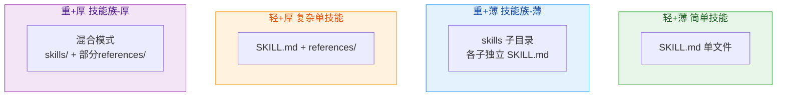

# Skill 标准规范

## 四维分类与目录结构



### 四种类型结构定义

| 类型 | 判定条件 | 目录结构 |
|------|---------|---------|
| **轻+薄** | 单一功能 + 内容<300行 | `{name}/SKILL.md` |
| **重+薄** | 多模块 + 各子内容精简 | `{name}-family/SKILL.md` + `skills/{子}/SKILL.md` |
| **轻+厚** | 单一功能 + 内容丰富需补充 | `{name}/SKILL.md` + `references/*.md` |
| **重+厚** | 多模块 + 部分子需要详细说明 | `{name}-family/SKILL.md` + `skills/{子}/`(部分有`references/`) |

### 组织方式优先级

```
┌──────────────────────────────────────┐
│  优先级决策                            │
├──────────────────────────────────────┤
│                                      │
│  1. 能否拆分为独立子技能？             │
│     是 → skills/ (解耦模式)           │
│                                      │
│  2. 内容是否超过300行？               │
│     是 → references/ (内聚分层)       │
│                                      │
│  3. 两者可共存（混合模式）              │
│                                      │
└──────────────────────────────────────┘
```

---

## SKILL.md 格式

### 前言区（必需）

```yaml
---
name: <skill-name>              # 小写+连字符，不含-skill后缀
version: v1.0.0                 # v主.次.补丁
author: <作者>
description: <100-150字符>
tags: [tag1, tag2, tag3]       # 至少3个标签
---
```

### 正文结构（必需章节）

```markdown
## 任务目标
- 本 Skill 用于: <一句话>
- 核心能力: <要点列表>
- 触发条件: <何时使用>

## 操作步骤
1. <步骤1>
2. <步骤2>

## 使用示例
<完整示例>

## 注意事项
<注意点>
```

### 可选章节

```markdown
## 资源索引
- 参考: [references/xxx.md](references/xxx.md)
```

---

## 命名规范

| 类型 | 规则 | 示例 |
|------|------|------|
| 目录名 | 小写字母+连字符 | `data-cleaner` |
| 禁止 | 不以 -skill 结尾 | ❌ `data-cleaner-skill` |
| 子技能名 | {父名}-{功能} | `factory-planner`, `factory-generator` |

---

## 质量检查清单

### 通用检查（所有类型）

- [ ] name: 小写+连字符，无 -skill 后缀
- [ ] version: v主.次.补丁 格式
- [ ] author: 存在且非空
- [ ] description: 100-150 字符
- [ ] tags: ≥ 3 个标签
- [ ] 包含必需章节（任务目标、操作步骤、示例）
- [ ] 示例完整可执行

### 轻+薄 专项检查

- [ ] 正文 < 300 行
- [ ] 无额外文件依赖
- [ ] 单一核心能力

### 重+薄 专项检查

- [ ] 主 SKILL.md 作为索引/协调器
- [ ] 每个子技能可独立使用
- [ ] 子技能间通过接口交互
- [ ] 无循环依赖

### 轻+厚 专项检查

- [ ] SKILL.md 作为概览（<200行）
- [ ] references/ 文档完整
- [ ] 内部链接引用正确
- [ ] 详细内容不重复

### 重+厚 专项检查

- [ ] 外层解耦合理
- [ ] 内层 references/ 仅用于必要子技能
- [ ] 整体层次不超过两层

---

## WORKFLOW.md 格式

### 前言区（必需）

```yaml
---
name: <workflow-name>
description: <描述>
target: <目标>
skills_required: [skill-1, skill-2]
---
```

### 正文结构

```markdown
## 目标
<工作流目标>

## 前置条件
- <条件>

## 技能清单
- <skill>: <用途>

## 执行流程
### 步骤 1: <名称>
- **使用技能**: <skill>
- **输入**: <描述>
- **操作**: <说明>
- **输出**: <描述>
- **下一步**: <下一步>

## 异常处理
- <异常>: <处理>

## 输出交付物
- <交付物>
```

---

## 版本管理

### 版本号规则

| 变更类型 | 版本递增 | 示例 |
|---------|---------|------|
| 破坏性变更 | major +1 | v1.0.0 → v2.0.0 |
| 类型升级（如 薄→厚） | minor +1 | v1.0.0 → v1.1.0 |
| 新增功能 | minor +1 | v1.0.0 → v1.1.0 |
| 错误修复 | patch +1 | v1.0.0 → v1.0.1 |

### 类型升级场景

| 升级路径 | 触发条件 | 版本变更 |
|---------|---------|---------|
| 轻→重 | 功能拆分为多模块 | minor +1 |
| 薄→厚 | 内容超出单文件容量 | minor +1 |
| 重+薄→重+厚 | 子技能需要详细文档 | minor +1 |
