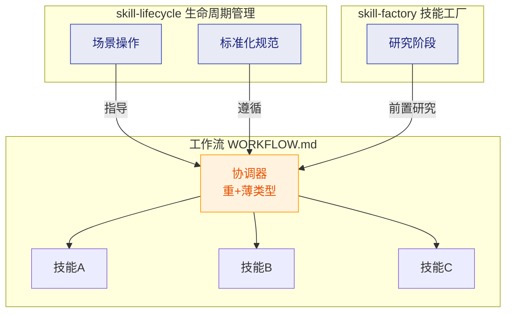
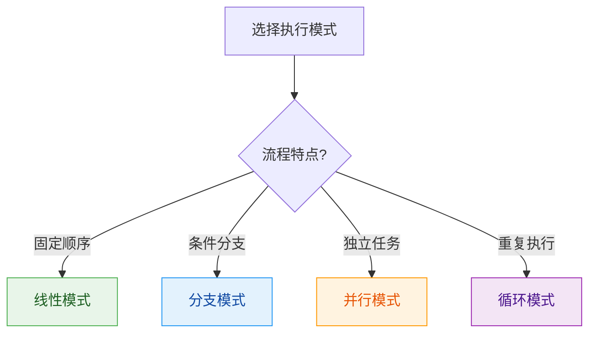

# 工作流生成

## 适用场景

编排多个技能为标准化流程，实现复杂目标自动化。

工作流本身通常是 **重+薄** 类型（协调器模式）。

---

## 工作流定位



### 工作流的四维特征

| 维度 | 特征 | 原因 |
|------|------|------|
| **重** | 多技能编排 | 工作流本质是协调器 |
| **薄** | 流程描述为主 | 步骤说明不需要太详细 |

---

## 完整流程

### 阶段 0：前置研究（可选）

当工作流需求不明确时，先进入研究阶段：

| 步骤 | 操作 |
|------|------|
| 1 | 接收用户的工作流目标描述 |
| 2 | 明确输入输出约束 |
| 3 | 识别可用技能 |
| 4 | 如信息不足，交互确认或搜索补充 |

---

### 阶段 1：理解目标

**1. 明确工作流目标**
- 最终结果是什么？
- 输出是什么？
- 成功标准是什么？

**2. 识别输入和约束**
- 输入数据/资源
- 约束条件（时间、资源、质量）

**3. 定义交付物**
- 主要交付物
- 中间产物

---

### 阶段 2：分析技能

**1. 列出可用技能**

```yaml
可用技能:
  - skill-a:
      type: <轻+薄 / 其他>
      capability: <能力>
  - skill-b:
      type: <轻+薄 / 其他>
      capability: <能力>
```

**2. 匹配技能与目标**

| 技能 | 能力 | 对工作流的贡献 |
|------|------|--------------|
| skill-a | xxx | yyy |
| skill-b | xxx | yyy |

**3. 确定依赖关系**

```
skill-a → skill-b（依赖：xxx）
skill-c 独立执行
```

---

### 阶段 3：选择模式

### 模式对比



| 模式 | 执行方式 | 适用场景 | WORKFLOW 写法 |
|------|---------|---------|---------------|
| **线性** | 顺序执行 | 标准化流水线 | 步骤1→2→3→4 |
| **分支** | 条件选择 | 多场景处理 | if/else 步骤 |
| **并行** | 同时执行 | 多维度处理 | fork→join |
| **循环** | 重复执行 | 批量处理 | for each 步骤 |

---

### 阶段 4：生成文档

### WORKFLOW.md 结构

```yaml
---
name: <workflow-name>
description: <描述>
target: <目标>
skills_required: [skill-1, skill-2]
---
```

### 正文模板

```markdown
# <工作流名称>

## 目标
<工作流目标>

## 前置条件
- <条件>

## 技能清单
- <skill>: <用途>

## 执行流程
### 步骤 1: <名称>
- **使用技能**: <skill>
- **输入**: <描述>
- **操作**: <说明>
- **输出**: <描述>
- **下一步**: <下一步>

## 异常处理
- <异常>: <处理>

## 输出交付物
- <交付物>
```

### 步骤设计原则

1. **原子性**: 每个步骤只做一件事
2. **可验证**: 有明确的完成标准
3. **独立性**: 通过接口与其他步骤交互

---

## 异常处理

### 处理策略

| 类别 | 说明 | 处理方式 |
|------|------|---------|
| 可恢复 | 临时性问题 | 重试机制 |
| 可降级 | 部分失败 | 使用默认值 |
| 致命 | 无法继续 | 记录错误，终止 |

### 异常处理示例

```markdown
## 异常处理

### 数据获取异常
- **网络失败**: 重试3次，仍失败则终止
- **权限不足**: 记录错误，终止

### 数据处理异常
- **格式错误**: 跳过错误行，继续处理
- **数据为空**: 返回空结果，标记警告
```

---

## 质量检查清单

- [ ] 目标清晰，成功标准明确
- [ ] 技能清单完整，能力匹配
- [ ] 步骤顺序合理
- [ ] 每个步骤信息完整
- [ ] 异常处理覆盖主要情况
- [ ] 符合重+薄型结构规范

---

## 快速参考

### 生成速查

```
工作流需求
  ↓
明确目标和交付物
  ↓
列出可用技能 + 分析依赖
  ↓
选择执行模式（线性/分支/并行/循环）
  ↓
生成 WORKFLOW.md
  ↓
验证完整性
```

### 与五阶段流程的关系

| 工作流阶段 | 对应 skill-factory 阶段 |
|-----------|------------------------|
| 前置研究 | researcher（如需求不明确） |
| 理解目标 | analyzer（简化版） |
| 分析技能 | planner（选择技能组合） |
| 选择模式 | planner（确定执行模式） |
| 生成文档 | generator（生成 WORKFLOW.md） |

---

## 参考文档

- [skill-standards](../skill-standards/SKILL.md) - WORKFLOW.md 格式规范
- [scenario-integrate](../scenario-integrate/SKILL.md) - 技能整合方法
