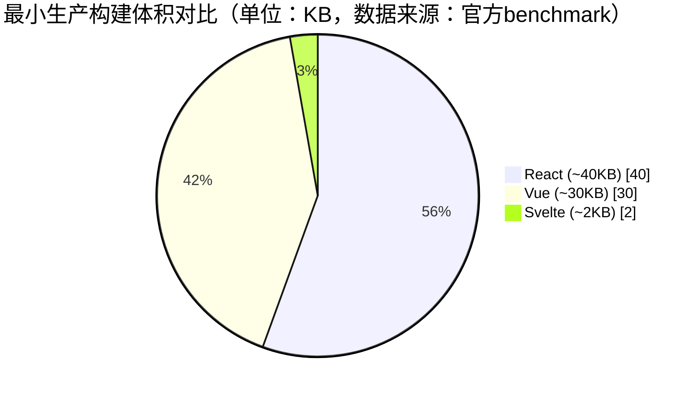

# 输出模板

## 完整报告模板

```markdown
# [技术A] vs [技术B] vs [技术C] 技术选型对比报告

> ⚠️ **知识截止时间**：本报告基于截至**2024年底**的公开技术资料生成。部分指标（如社区活跃度、性能基准）可能已发生变化，请以官方最新文档为准。

## 📊 对比表格

| 维度 | [技术A] | [技术B] | [技术C] |
|------|---------|---------|---------|
| 学习曲线 | [描述] | [描述] | [描述] |
| 性能 | [描述] | [描述] | [描述] |
| 生态成熟度 | [描述] | [描述] | [描述] |
| 社区活跃度 | [描述] | [描述] | [描述] |
| [其他维度] | [描述] | [描述] | [描述] |
| [其他维度] | [—] | [—] | [需配合其他工具] |

> 注：表格固定列顺序，缺失值统一用"—"或"需配合其他工具"，避免留空造成歧义

## 📖 分析与解释

### [维度1] 分析
[2-3段文字解释该维度下的关键差异、背后原因]

- [技术A]的特点：[解释技术优势和实现原理]
- [技术B]的特点：[解释技术优势和实现原理]
- [技术C]的特点：[解释技术优势和实现原理]

### [维度2] 分析
[2-3段文字解释关键差异]

[技术对比的深入分析，例如："React使用虚拟DOM进行渲染优化，而Svelte在编译时就完成了优化，运行时不需要虚拟DOM"]

> ⚠️ **性能结论说明**：所有性能结论均基于公开基准（如[具体benchmark名称]），实际表现取决于具体实现、配置和业务场景。

### 适用场景
- [技术A]：适用于[具体场景，如大型企业级应用、需要丰富生态的项目]
- [技术B]：适用于[具体场景，如快速原型开发、中小型项目]
- [技术C]：适用于[具体场景，如对性能有极致要求的项目]

## 💡 建议

### 根据用户需求推荐
[如果用户提供了具体需求，给出针对性推荐]

基于您的需求"[用户的具体需求]"，我推荐：
- **首选方案**：[技术名称] - 原因：[简明理由]
- **备选方案**：[技术名称] - 原因：[简明理由]

### 通用选型建议（若无明确场景）
[根据对比结果提供通用建议]

- 追求开发体验和快速上手：选择 [技术A]
- 追求生态和就业机会：选择 [技术B]
- 追求性能和极致优化：选择 [技术C]

### ⚠️ 风险提示
- [技术A]：[潜在风险，如：Vue的响应式系统在大型列表中可能内存占用较高]
- [技术B]：[潜在风险，如：Svelte生态较小，某些企业级功能（如微前端）需自行实现]
- [技术C]：[潜在风险，如：Electron资源占用较高，不适合低端设备]

## 📈 可视化（可选）

### 推荐图表类型1：饼图（适用场景：社区活跃度对比）


### 推荐图表类型2：柱状图（适用场景：打包体积/性能对比）
```mermaid
xychart-beta
    title "[维度名称]对比"
    x-axis ["[技术A]", "[技术B]", "[技术C]"]
    y-axis "[数值]" 0 --> [最大值]
    bar [数值A, 数值B, 数值C]
    line [数值A, 数值B, 数值C]
```

### 示例：打包体积对比（具体数字）


### 示例：性能对比（具体数字）
```mermaid
xychart-beta
    title js-framework-benchmark 性能对比（操作次数/秒，越高越好）
    x-axis ["Svelte", "Vue", "React"]
    y-axis "操作次数/秒" 0 --> 10000
    bar [8500, 6000, 4000]
```

> 注：图表仅为示意，实际数据需参考官方benchmark。使用Mermaid时请确认图表类型和语法正确。

## 🔗 参考文献

1. **[技术A]官方文档** - [链接]，[具体章节说明]
2. **[技术B]官方文档** - [链接]，[具体章节说明]
3. **[技术C]官方文档** - [链接]，[具体章节说明]
4. **[GitHub仓库]** - [技术名称] GitHub 仓库，查看 Stars 和 Contributors
5. **[Benchmark评测]** - [组织或个人] 的性能测试，[测试环境说明]，[发布时间]
6. **[State of JS/CSS]**（谨慎引用）- 年度调查报告，[年份]，注意数据时效性

> **数据说明**：
> - 社区活跃度数据基于GitHub 2024年快照
> - 性能数据基于 [具体测试环境] 的benchmark结果（如js-framework-benchmark）
> - 部分数据可能存在时效性，建议查询最新官方信息
> - 优先引用官方文档、GitHub仓库、MDN等长期稳定来源
```

## 报告生成规范

### 必需部分
1. **知识截止时间声明**：报告开头必须包含，标注数据截止时间
2. **对比表格**：使用Markdown表格，固定列顺序，缺失值用"—"或"需配合其他工具"
3. **分析与解释**：至少2-4段文字，解释关键差异和适用场景
4. **风险提示**：列出各技术的潜在风险和局限
5. **建议**：根据用户需求给出具体推荐，若无明确需求则提供通用建议
6. **参考文献**：至少3个可靠来源，优先官方文档、GitHub、MDN

### 可选部分
1. **可视化图表**：使用Mermaid绘制，仅在有帮助时添加
   - 饼图：适合比例对比（社区活跃度、市场份额）
   - 柱状图：适合数量对比（性能数据、打包体积）
   - 流程图：适合生态架构对比
2. **引用外部图表**：可提供公开图表链接并注明来源

### 格式要求
- **表格标准化**：固定列顺序，缺失值统一用"—"或"需配合其他工具"
- **避免过度承诺**：不声称"性能更快"，而说"在XX场景下基准测试显示更优"
- **数据来源标注**：所有数据必须注明来源
- **知识截止时间**：报告开头必须标注（2024年底）
- 避免主观臆断，所有观点需有依据
- 语言专业但易懂，适合技术决策参考

### 质量检查清单
- [ ] 报告开头是否包含知识截止时间声明
- [ ] 对比维度是否合理且完整
- [ ] 表格是否固定列顺序，缺失值是否统一用"—"
- [ ] 表格内容是否准确且易于理解
- [ ] 分析是否有深度且基于事实
- [ ] 是否包含性能结论的免责声明
- [ ] 是否包含风险提示章节
- [ ] 建议是否具体且有依据
- [ ] 参考文献是否可信且可访问（优先官方文档、GitHub、MDN）
- [ ] 是否标注了数据时效性
- [ ] 是否保持了中立客观的态度
- [ ] Mermaid图表语法是否正确（如使用）

### 单技术深度分析模式（特殊格式）

当用户仅提供单一技术时，表格可仅包含一列：

```markdown
# [技术名称] 深度分析报告

> ⚠️ **知识截止时间**：本报告基于截至**2024年底**的公开技术资料生成...

## 📊 核心特性

| 维度 | [技术名称] |
|------|------------|
| 学习曲线 | [描述] |
| 性能 | [描述] |
| 生态成熟度 | [描述] |
| ... | ... |

## 📖 核心优势与典型场景
[分析该技术的核心优势、适用场景]

### 核心优势
1. [优势1]
2. [优势2]

### 典型场景
- [场景1]
- [场景2]

### ⚠️ 潜在局限
1. [局限1]
2. [局限2]

## 💡 竞品参考

### [竞品A]
- 差异点：[与当前技术的差异]
- 适用场景：[何时选择竞品A]

### [竞品B]
- 差异点：[与当前技术的差异]
- 适用场景：[何时选择竞品B]

## 🔗 参考文献
[至少3个可靠来源]
```
