# 完整流程图

本文档使用 Mermaid 流程图展示 WXT 构建和开发的完整流程。

## 官方导航链接

- [Remote Code](https://wxt.dev/guide/essentials/remote-code.html) - 远程代码加载与安全策略
- [WXT Modules](https://wxt.dev/guide/essentials/wxt-modules.html) - WXT 模块开发与使用
- [Hooks](https://wxt.dev/guide/essentials/config/hooks.html) - 构建与运行时钩子函数

---

## 构建流程

### 构建生命周期

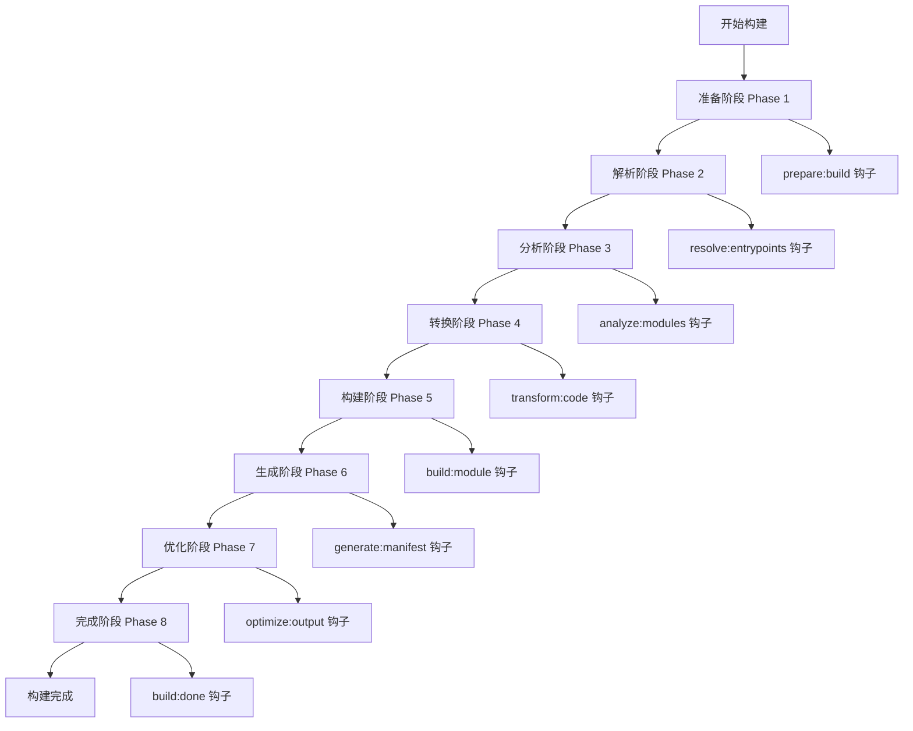

### 详细构建流程

## 开发流程

### 开发服务器生命周期

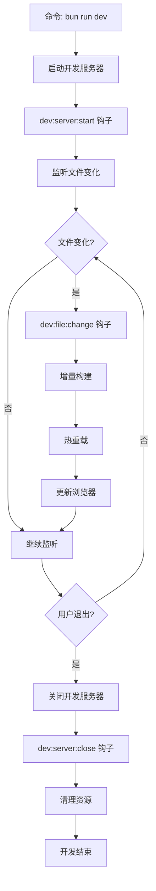

### 详细开发流程

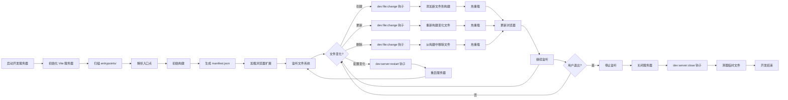

## 入口点处理流程

### Background Script

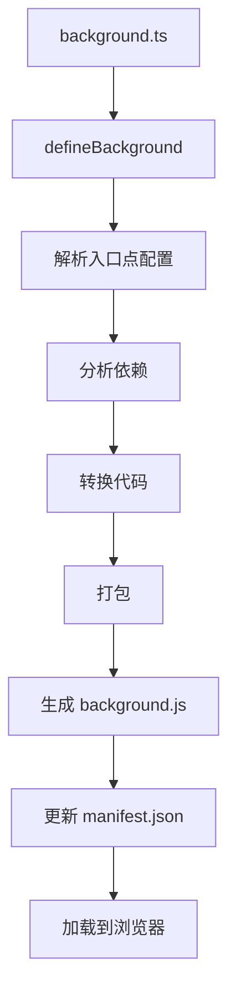

### Content Script

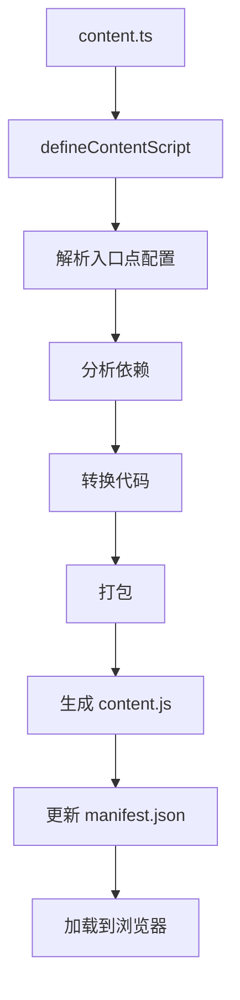

### Popup

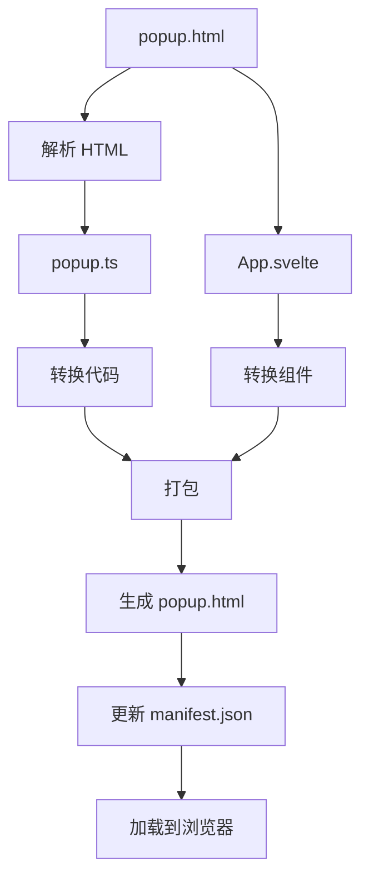

### Options

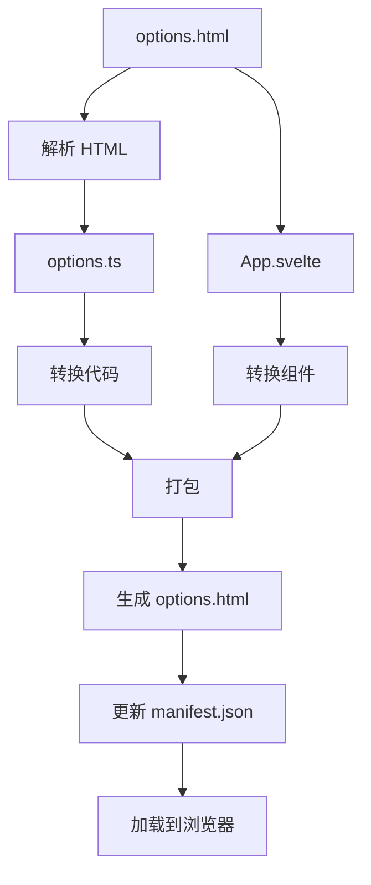

## 多浏览器构建流程

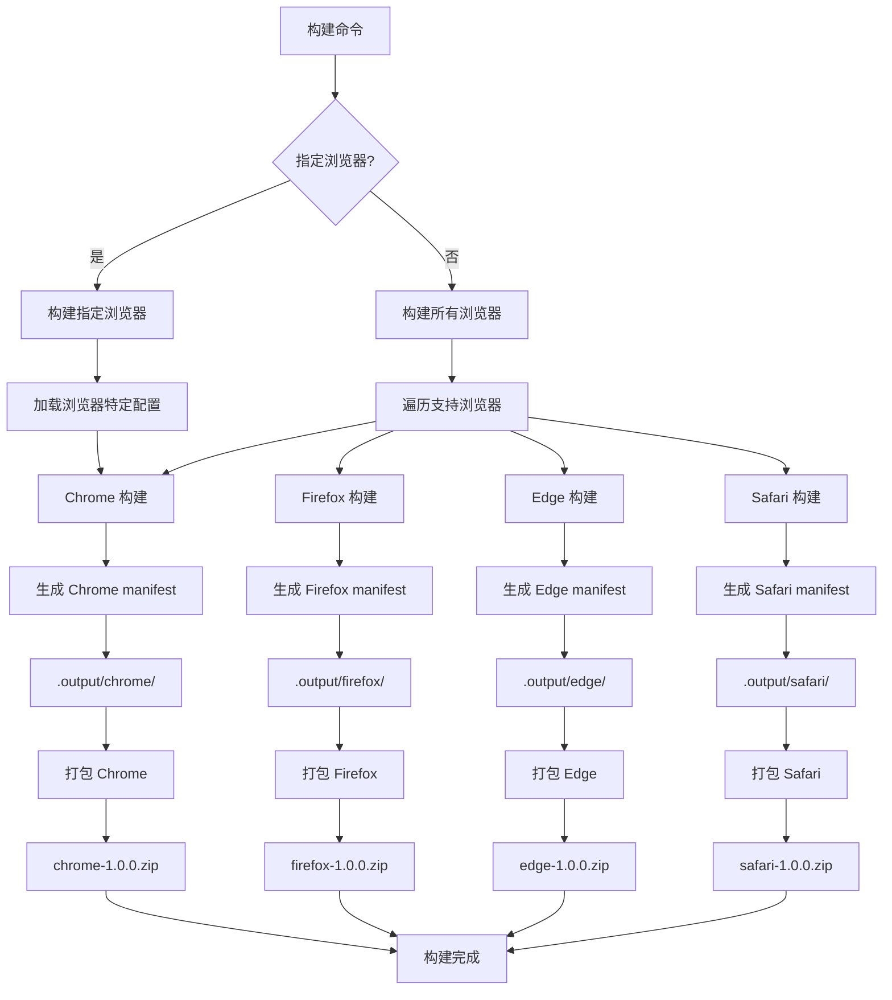

## 钩子执行顺序

### 构建钩子执行顺序

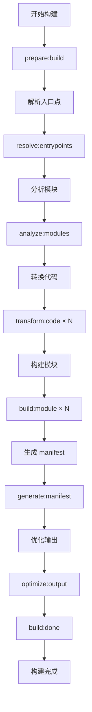

### 开发钩子执行顺序

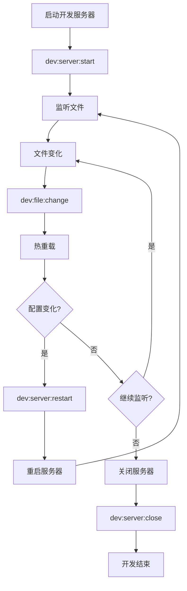

## 框架特定流程

### Svelte 项目构建

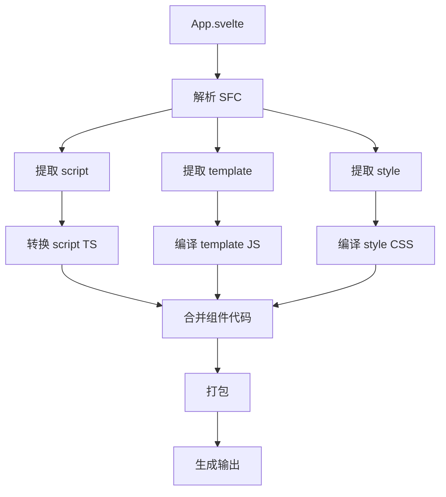

### Vue 项目构建

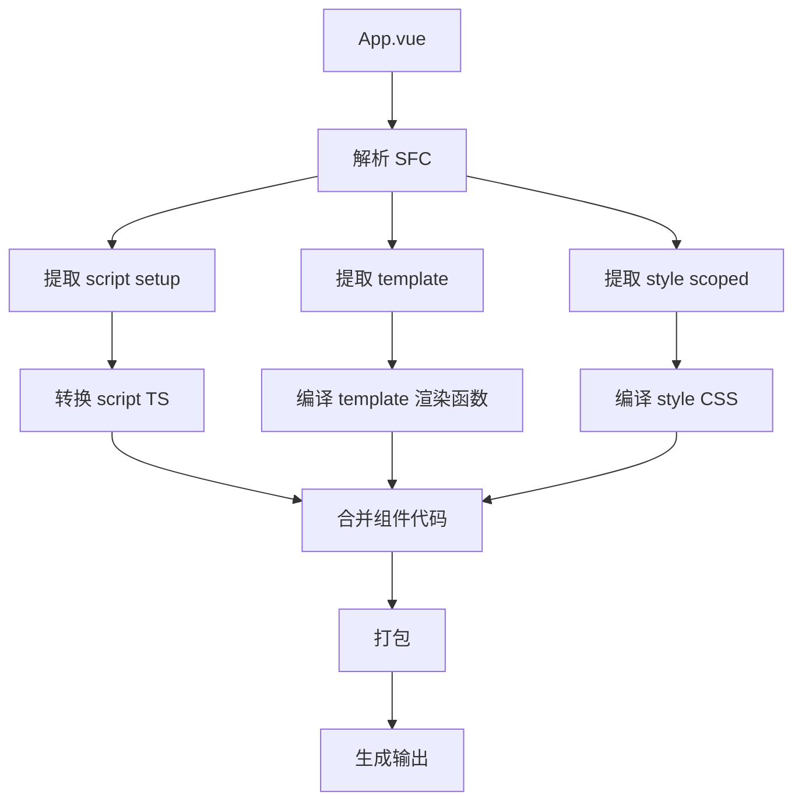

### React 项目构建

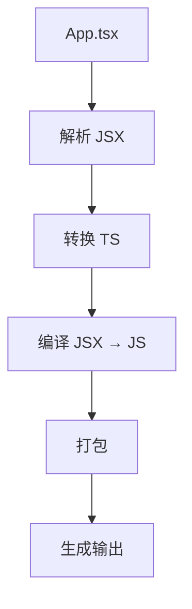

## 错误处理流程

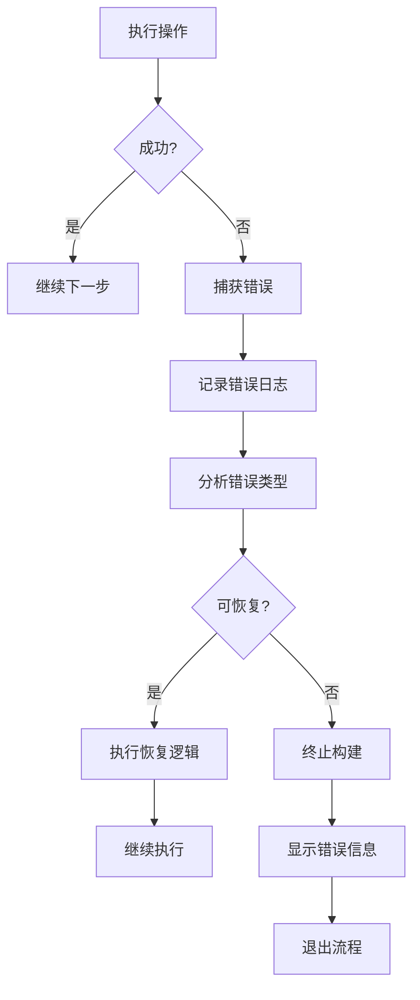

## 部署流程

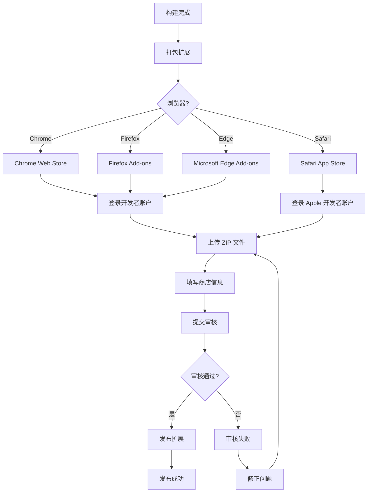

## 性能优化流程

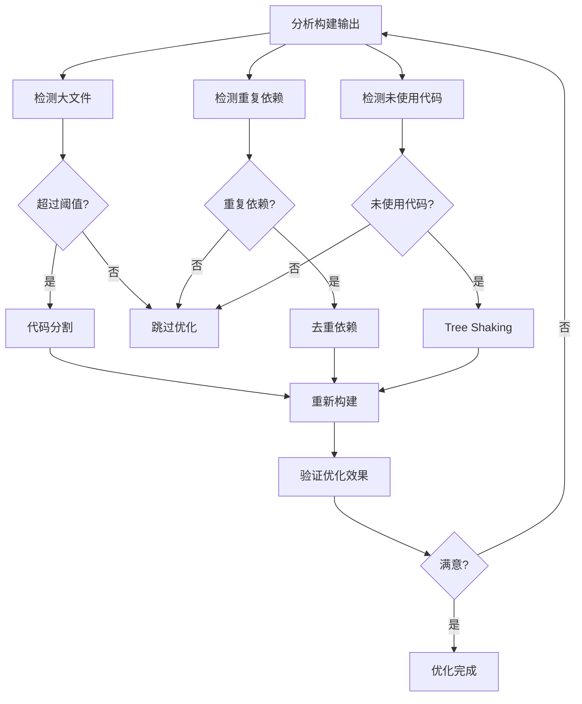

## 完整工作流程

### 从开发到部署的完整流程

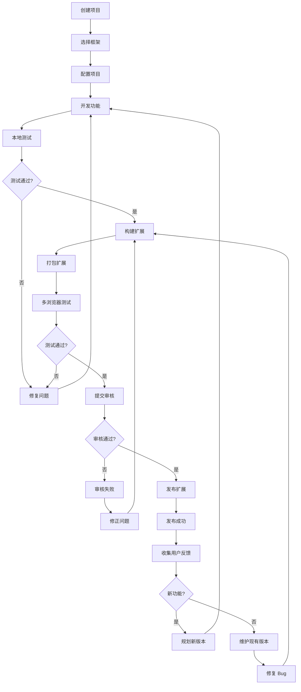

## 使用说明

### 如何查看流程图

1. **Markdown 编辑器**：支持 Mermaid 的编辑器可以渲染流程图
   - VS Code + Mermaid 插件
   - Typora
   - Obsidian
   - GitHub README（自动渲染）

2. **在线工具**：使用在线 Mermaid 编辑器
   - https://mermaid.live
   - https://mermaid-js.github.io/mermaid-live-editor

3. **导出图片**：将流程图导出为 PNG 或 SVG

### 自定义流程图

您可以根据项目需求修改流程图：

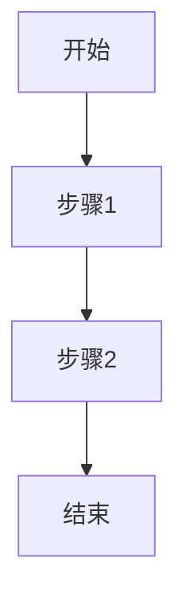

## 更多资源

- [构建阶段详解](./phases.md)：8 个构建阶段的详细说明
- [钩子函数详解](./hooks.md)：所有钩子函数的详细文档
- [命令参考](../cli/commands.md)：掌握开发和构建命令
- [入门指南](../guides/getting-started.md)：快速上手 WXT
